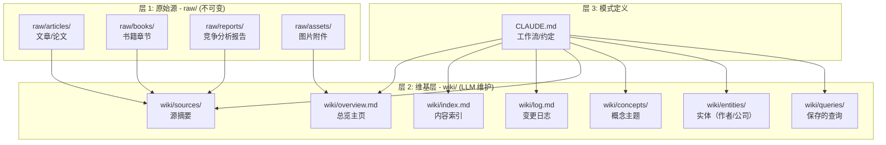
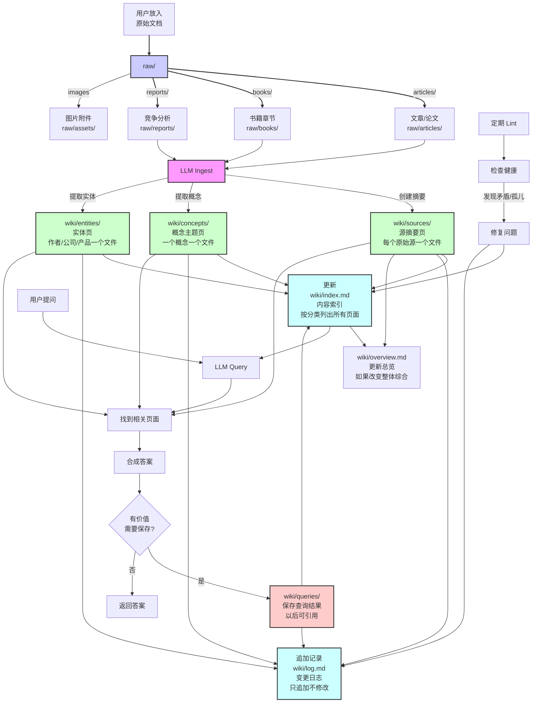
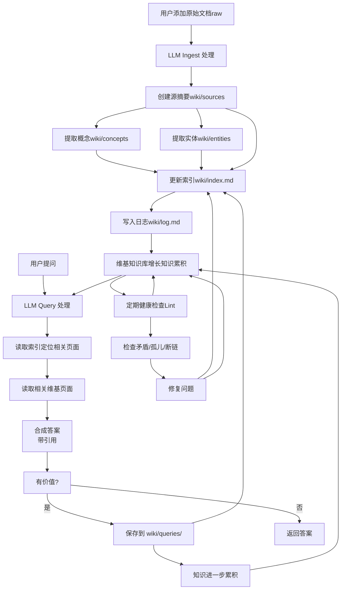

# LLM Wiki - 个人知识库

基于 Andrej Karpathy 的 LLM Wiki 模式构建的个人知识积累知识库。

## 核心思想

传统 RAG 在每次查询时都需要从原始文档重新检索和合成知识，知识不会累积。而 LLM Wiki 不同：

**LLM 会在你添加新源时增量构建和维护一个持久化、结构化的维基知识库**，而不是只在查询时检索。新知识会被整合到现有维基中：更新实体页面、修订主题摘要、标记矛盾、强化合成。知识一次编译后保持更新，不必每次查询重新推导。

关键区别：**维基是一个持久化、不断累积的工件**。交叉引用已经存在，矛盾已经标记，合成已经反映了你读过的所有内容。维基随着每个源的加入和每个问题的提问变得更加丰富。

你（人类）几乎从不自己编写维基内容，**LLM 负责所有繁琐的维护工作**：总结、交叉引用、文件整理。你只负责提供源、指导分析、提出好问题。

## 架构

### 三层架构



### 目录结构

```
base-knowledge/
├── raw/                          # 原始源层 - 永不修改
│   ├── articles/                 # 网络文章、博客、研究论文
│   ├── books/                    # 书籍章节、整书
│   ├── reports/                  # 竞争分析、行业报告
│   └── assets/                   # 图片、附件
│
├── wiki/                         # 维基层 - LLM 维护
│   ├── overview.md               # 总览/主页
│   ├── index.md                  # 内容索引（按分类）
│   ├── log.md                    # 只追加的变更日志
│   ├── sources/                  # 每个原始源对应一个摘要页
│   ├── concepts/                 # 概念/主题页
│   ├── entities/                # 实体页（作者、公司、产品）
│   └── queries/                  # 保存有价值的查询结果
│
└── CLAUDE.md                     # 模式定义 - LLM 操作指南
```

### 1. raw/ - 原始源层

**永不修改**。存放你的原始文档，是知识的最终来源。

| 目录 | 使用场景 |
|------|----------|
| `raw/articles/` | 网络文章、博客、研究论文 |
| `raw/books/` | 书籍章节、整书 |
| `raw/reports/` | 竞争分析、行业报告 |
| `raw/assets/` | 图片、附件（下载到本地供 Obsidian 使用） |

### 2. wiki/ - 维基层

**LLM 完全拥有和维护**。所有内容都是 LLM 从原始源提取和合成的。

| 文件/目录 | 用途 |
|-----------|------|
| `wiki/overview.md` | 总览/主页 - 整体概述和综合 |
| `wiki/index.md` | 内容索引 - 所有页面按分类编目，每次 ingest 更新 |
| `wiki/log.md` | 变更日志 - 只追加的时间线记录 |
| `wiki/sources/` | 源摘要 - 每个原始源对应一个摘要页 |
| `wiki/concepts/` | 概念页 - 思想、技术、理论等主题 |
| `wiki/entities/` | 实体页 - 作者、公司、产品、人物 |
| `wiki/queries/` | 查询结果 - 有价值的问答和分析保存于此 |

### 3. CLAUDE.md - 模式定义

定义了维基的约定、工作流和操作规范。这是让 LLM 成为有纪律的维基维护者的关键配置。随着使用会不断演化。

### 内容生成过程 - 从原始源到维基目录

下面展示了一个新原始源被摄入后，如何在各个维基目录中产生新内容的完整过程：



**各目录生成说明：**

| 目录                 | 何时生成新内容      | 谁创建 |
| ------------------ | ------------ | --- |
| `raw/*`            | 用户放入原始文档     | 用户  |
| `wiki/sources/`    | 每个原始源摄入后     | LLM |
| `wiki/concepts/`   | 提取到新概念时      | LLM |
| `wiki/entities/`   | 提取到新实体时      | LLM |
| `wiki/queries/`    | 用户提问且答案有价值时  | LLM |
| `wiki/index.md`    | 每次摄入/创建新页后更新 | LLM |
| `wiki/log.md`      | 每次操作后追加日志    | LLM |
| `wiki/overview.md` | 整体综合改变时更新    | LLM |

## 工作流

### 整体数据流



### 1. 摄入新源 (Ingest)

当你添加一个新源到 `raw/` 后，LLM 按以下步骤处理：

1. **读取** - 阅读完整源文档
2. **讨论** - 向你总结要点，询问需要强调什么
3. **创建源摘要** - 在 `wiki/sources/` 创建摘要页
4. **提取概念** - 识别关键概念，不存在则创建，存在则更新
5. **提取实体** - 识别关键实体（作者、公司等），不存在则创建，存在则更新
6. **更新索引** - 将新页面添加到 `wiki/index.md`
7. **记录日志** - 在 `wiki/log.md` 追加一条目
8. **更新总览** - 如果新源改变了整体综合，更新 `overview.md`

一个源通常会修改 5-15 个维基页面，这是预期的——知识需要整合，而不仅仅是索引。

### 2. 查询 (Query)

当你提问时：

1. **定位** - 读取 `index.md` 找到相关页面
2. **读取** - 阅读所有相关维基页面
3. **合成** - 回答问题，引用维基页面（进而引用原始源）
4. **保存** - 如果回答是有价值、持久的综合分析，保存为新页面到 `wiki/queries/` 并更新索引和日志

有价值的探索不应该消失在聊天记录中——让它们也成为知识积累的一部分。

### 3. 健康检查 (Lint)

定期要求 LLM 健康检查：

检查内容包括：
- 页面之间的矛盾
- 被新源取代的过时声明
- 没有入链的孤儿页面
- 被提及但还没有单独页面的概念
- 缺失的交叉引用
- 断链
- 可以进一步探索的问题和空白

## 页面格式规范

### YAML 前言

所有维基页面**必须**以 YAML 前言开头（兼容 Obsidian Dataview）：

```yaml
---
title: 页面标题
date: YYYY-MM-DD
last_updated: YYYY-MM-DD
tags: [分类, 子分类]
sources: [["链接到源", "源名称"], ...]
---
```

### 内部链接

使用 Obsidian 格式：`[[wiki/concepts/页面名|显示文本]]` 或简写 `[[concepts/页面名|显示文本]]`。

### 引用

始终引用原始源。概念/实体页引用源摘要页，源摘要页引用原始文件。

## 索引格式

`wiki/index.md` 按分类组织：

```markdown
## 源

- [[sources/xxx | 源名称]] - 一句话描述

## 概念

- [[concepts/xxx | 概念名]] - 简要定义

## 实体

- [[entities/xxx | 实体名]] - 简要描述

## 查询

- [[queries/xxx | 查询标题]] - 简要描述
```

## 日志格式

`wiki/log.md` 只追加。每条目格式：

```markdown
## [YYYY-MM-DD] 操作 | 描述

- 详情...
```

操作类型：`ingest`, `update`, `query`, `lint`。

## 设计原则

1. **raw 不可变** - 从不修改或删除 `raw/` 中的文件。如果需要替换源，添加新文件。
2. **LLM 负责维护** - 所有维护工作（更新交叉引用、索引、日志、整合新知识）自动完成。
3. **知识累积** - 每次摄入和每次查询都让维基比以前更丰富。有价值的输出被保存，不会丢失在聊天中。
4. **Obsidian 兼容** - 所有约定遵循 Obsidian 最佳实践（内部链接、前言等）。
5. **Git 版本控制** - 整个维基就是一个 Git 仓库——免费获得版本历史。

## 为什么这样有效

维护知识库最繁琐的部分不是阅读和思考，而是簿记：更新交叉引用、保持摘要最新、标记新数据和旧声明矛盾、保持几十页一致性。人类因为维护负担增长快于价值所以会放弃维基。LLM 不会感到无聊，不会忘记更新交叉引用，可以一次触及 15 个文件。**因为维护成本接近零，维基会保持维护状态**。

人类工作：策划源、指导分析、提出好问题、思考意义。LLM 工作：其他一切。

这个概念在精神上追溯到 Vannevar Bush 在 1945 年提出的 [Memex](wiki/concepts/vannevar-bush-memex.md) 愿景。

## 使用提示

- **Obsidian Web Clipper** - 浏览器扩展，可以直接把网页转换为 Markdown 保存到 `raw/articles/`
- **下载图片到本地** - Obsidian 设置 → 文件和链接 → 附件文件夹路径设置为 `raw/assets/`，可以把图片下载到本地
- **Obsidian 图视图** - 查看维基结构的最佳方式，可以看到哪些页面是中心枢纽，哪些是孤立页面
- **Dataview** - 可以基于前言的 tags、dates、sources 生成动态表格和列表
- **Marp** - Obsidian 插件，直接从维基内容生成幻灯片

## 下一步

- 添加更多源：把你的文章/书籍/报告放到 `raw/` 对应目录，然后说「请摄入这个源：`raw/path/to/file.md`」
- 提问：直接提问，我会基于维基合成答案
- 定期健康检查：一段时间后可以说「请给维基做个健康检查」

## 当前状态

- ✅ 目录结构已创建
- ✅ CLAUDE.md 模式已定义
- ✅ 第一个源已摄入：Karpathy 的 LLM Wiki 想法文件
- ✅ 1 个源摘要 + 6 个概念页 + 1 个实体页已创建
- 📈 持续累积知识中...

## Claude Code 完整操作示例

### 1. 初始设置（已完成）

```bash
# 创建目录结构
mkdir -p raw/articles raw/books raw/reports raw/assets
mkdir -p wiki/sources wiki/concepts wiki/entities wiki/queries
```

### 2. 摄入新源 - 完整流程

**第一步：你把文件放到 raw 目录**
```bash
# 比如拷贝一个文章到 raw/articles/
cp /path/to/your/article.md raw/articles/my-article.md
```

**第二步：在 Claude Code 中执行摄入**
```
请摄入这个源：raw/articles/my-article.md
```

Claude 会自动完成：
1. 读取文档
2. 总结要点和你讨论
3. 创建 `wiki/sources/my-article.md`
4. 提取关键概念到 `wiki/concepts/`
5. 提取关键实体到 `wiki/entities/`
6. 更新 `wiki/index.md`
7. 追加日志到 `wiki/log.md`
8. 如有需要更新 `wiki/overview.md`

### 3. 查询维基

**直接在 Claude Code 中提问：**
```
根据维基内容，解释一下 LLM Wiki 和 RAG 的区别？
```

Claude 会：
1. 读取 `wiki/index.md` 找到相关页面
2. 读取所有相关维基页面
3. 合成答案并引用来源
4. 如果答案有持久价值，会问你是否需要保存到 `wiki/queries/`

**如果你想保存答案：**
```
请把这个答案保存到 wiki/queries/ 目录下。
```

### 4. 健康检查（Lint）

**定期执行：**
```
请对维基做一次健康检查 (lint)。
```

Claude 会：
1. 扫描所有页面
2. 检查矛盾、过时内容、孤儿页面、缺失页面
3. 报告发现的问题
4. 经你同意后修复问题

### 5. 完整示例 - 从添加文件到完成摄入

```bash
# 1. 你自己操作：移动文件到正确目录
mv download/article.md raw/articles/attention-is-all-you-need.md
```

然后在 Claude Code 中：

```
# 2. 告诉 Claude 摄入
请摄入这个源：raw/articles/attention-is-all-you-need.md
```

Claude 处理完后：

```
# 3. 可以提问
根据这篇论文和维基中的其他内容，Transformer 架构主要解决了什么问题？
```

需要保存就说：

```
请保存这个回答到 wiki/queries/。
```

一段时间后：

```
# 4. 健康检查
请给维基做一次 lint 健康检查。
```

### 6. Git 提交示例

```bash
git add .
git commit -m "ingest: add article attention-is-all-you-need

- Created: 1 source summary
- Created: 3 new concepts (transformer, self-attention, multi-head attention)
- Created: 1 entity (Google Research)
- Updated: index.md
"
```

## 快速命令速查表

| 操作 | 你在 Claude Code 中说 |
|------|---------------------|
| 摄入新源 | `请摄入这个源：raw/articles/xxx.md` |
| 查询问题 | `根据维基，XXX 是什么？` |
| 保存查询 | `请把这个答案保存到 wiki/queries/` |
| 健康检查 | `请对维基做一次 lint 健康检查` |
| 查找页面 | `在维基中搜索关于 XXX 的内容` |

---

## Claude Code 斜杠命令（推荐）

本项目已经预定义了自定义斜杠命令，直接使用即可：

| 命令 | 作用 | 用法 |
|------|------|------|
| `/ingest` | 摄入新源 | `/ingest raw/articles/your-file.md` |
| `/query` | 查询维基 | `/query 对比 LLM Wiki 和 RAG 的区别` |
| `/save` | 保存查询结果 | `/save llm-wiki-vs-rag` |
| `/lint` | 健康检查 | `/lint` |

**一键摄入示例：**
```
/ingest raw/articles/transformer-survey.md
```

Claude 会自动完成整个摄入流程：读取 → 总结 → 创建摘要 → 提取概念实体 → 更新索引 → 记录日志。

---

## 完整跑通流程 - 一步一步

### 场景：你下载了一篇新文章 `transformer-survey.md`，想要完整摄入进维基

#### 第一步：你在终端操作，把文件放对位置
```bash
# 移动文件到对应目录
mv ~/Downloads/transformer-survey.md raw/articles/
```

#### 第二步：在 Claude Code 中复制粘贴这个提示词开始摄入
```
这是一个新的源文件：raw/articles/transformer-survey.md

请按照 CLAUDE.md 中定义的 ingest 工作流处理它：
1. 先读取完整文档
2. 给我总结关键要点，问问我需要重点强调什么
3. 创建源摘要页面到 wiki/sources/
4. 提取关键概念到 wiki/concepts/，新概念创建，已有概念更新
5. 提取关键实体到 wiki/entities/，同样新建或更新
6. 更新 wiki/index.md 添加新页面
7. 在 wiki/log.md 追加日志条目
8. 如果需要更新 wiki/overview.md 就更新
```

**如果你想简化，可以直接说：**
```
请摄入这个源：raw/articles/transformer-survey.md
```

#### 第三步：Claude 总结完要点后，你可以补充强调（如果需要）
```
请重点关注Transformer在大语言模型中的应用演进部分。
```

#### 第四步：Claude 完成摄入后，你可以开始提问查询
```
根据维基中关于 Transformer 的内容，对比一下 RNN 和 Transformer 的优缺点是什么？请引用具体来源。
```

#### 第五步：如果你觉得这个问答很有价值，想要保存进维基
```
这个回答很有价值，请把它保存到 wiki/queries/ 目录，命名为 transformer-vs-rnn-comparison，然后更新索引和日志。
```

#### 第六步：添加了几个源之后，定期做健康检查
```
请按照 CLAUDE.md 的 lint 工作流对整个维基做一次健康检查：
1. 扫描所有页面
2. 查找页面之间的矛盾、过时内容、孤儿页面
3. 查找被提及但还没有单独页面的概念
4. 检查缺失的交叉引用和断链
5. 给我报告发现的问题，列出需要修复的内容
```

#### 第七步：确认修复问题后，执行修复
```
请修复刚才发现的问题。
```

#### 第八步：提交到 Git
```bash
git add .
git commit -m "ingest: add transformer-survey article

- Created: 1 source summary
- Created: 3 new concepts
- Created: 1 entity
- Updated: index.md log.md
"
```

---

## 从零开始完整跑通 - 复制粘贴提示词汇总

```
# 1. 摄入新源（直接复制）
请摄入这个源：raw/articles/YOUR_FILE.md

# 2. 重点强调（如果需要）
请重点关注 XXXX 部分。

# 3. 查询问题
根据维基内容，XXX 是什么？请引用来源。

# 4. 保存有价值的回答
请把这个答案保存到 wiki/queries/，命名为 xxx-xxx，然后更新索引和日志。

# 5. 定期健康检查
请对维基做一次 lint 健康检查。

# 6. 修复发现的问题
请修复刚才发现的问题。
```

## 常用提示词模板

### 摄入新源模板
```
请按照 CLAUDE.md 的 ingest 工作流处理这个源：raw/articles/{file}

1. 读取文档，总结关键要点给我
2. 创建源摘要、提取概念和实体
3. 更新索引和日志
```

### 查询模板
```
根据这个维基中的内容回答我的问题：{question}

请务必引用相关的维基页面作为来源。
```

### 健康检查模板
```
请执行 lint 工作流，检查维基健康状况：
- 检查矛盾和过时内容
- 查找孤儿页面（没有入链）
- 查找被提及但未创建的概念
- 检查断链和缺失的交叉引用
- 报告发现的问题
```

## 常见问题

**Q: 我可以直接编辑维基页面吗？**
A: 可以，但尽量让 Claude 维护，它会保持交叉引用和索引更新。

**Q: raw/ 中的文件可以修改吗？**
A: 按照设计，raw/ 是不可变的。如果源更新了，建议添加新文件而不是覆盖原有文件，保留版本历史。

**Q: 多大规模适合这个模式？**
A: Karpathy 说这种带索引的方式在 ~100 个源、几百个页面的规模下工作得很好，不需要复杂的嵌入搜索基础设施。
