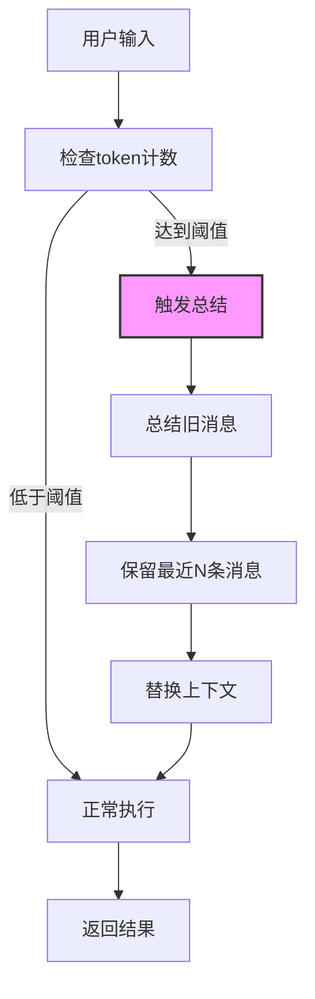
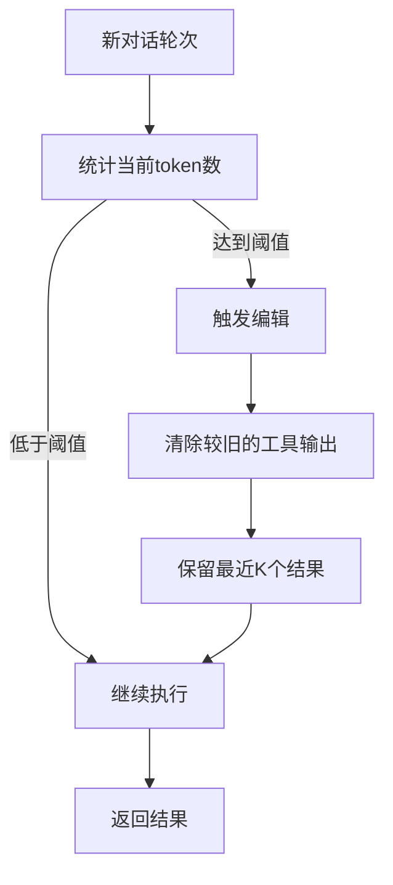
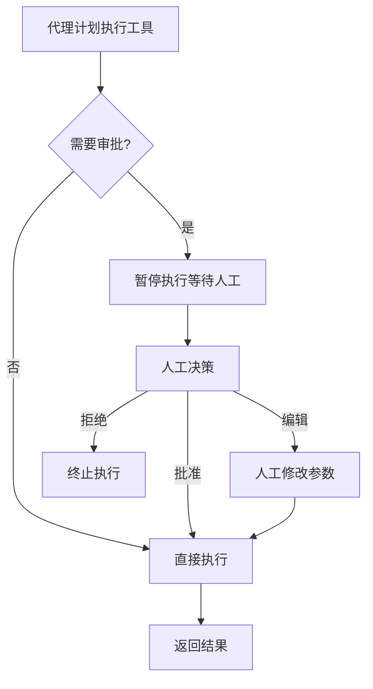
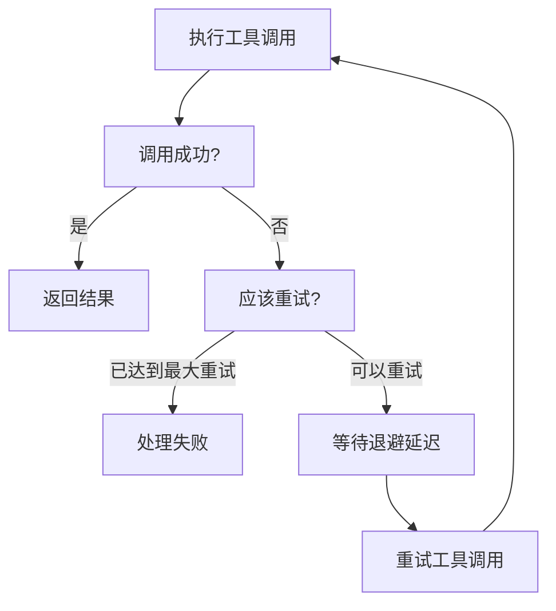
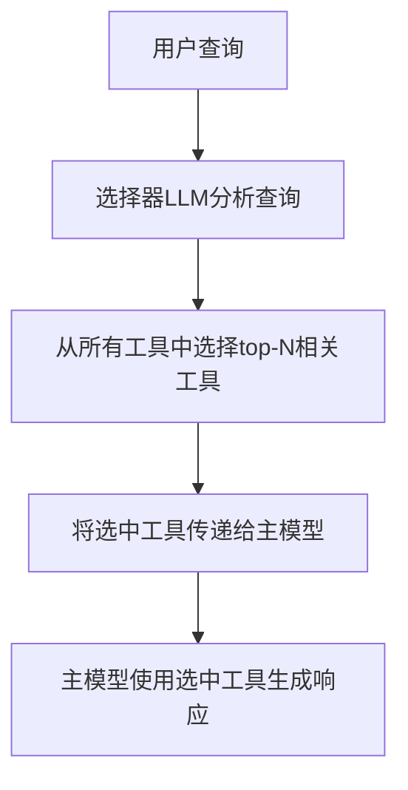
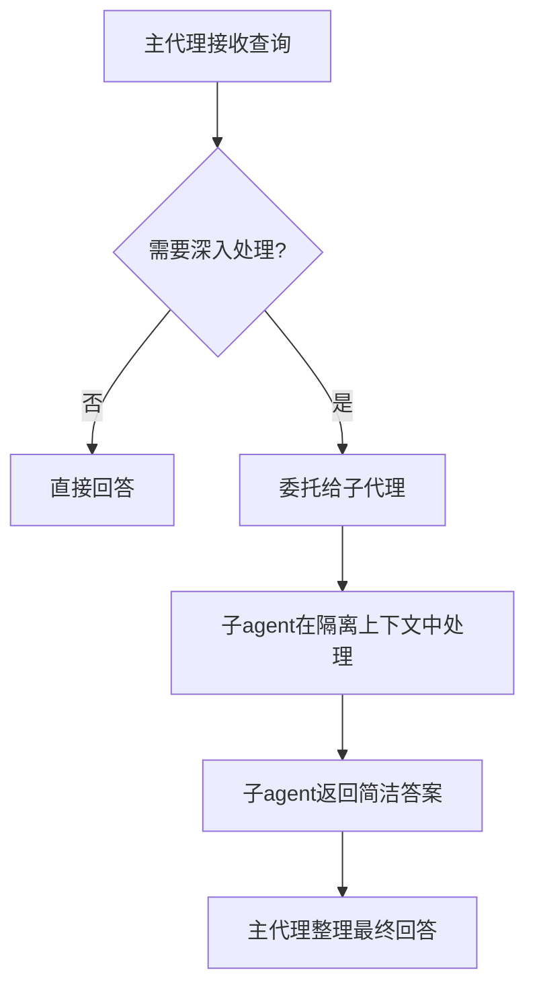

# 预置中间件

## 概述

LangChain Deep Agents 提供了多种开箱即用的预置中间件，每个中间件都为生产环境就绪，可以根据特定需求进行配置。这些中间件与任何 LLM 提供商兼容，涵盖了对话管理、安全控制、可靠性保障、性能优化和系统集成等多个方面。

## 中间件分类与范式

### 1. 对话管理类

#### 汇总中间件 (Summarization)

**核心思想**: 当对话达到 token 限制时自动总结旧的对话历史，在压缩上下文的同时保留最近消息。

**使用场景**:
- 长时间运行超过上下文窗口的对话
- 多轮对话，历史信息 extensive
- 需要保留完整对话上下文的应用程序

**流程图**:



**代码示例**:

```python
from langchain.agents import create_agent
from langchain.agents.middleware import SummarizationMiddleware
from llm_config import get_llm

# 多种触发条件方式

# 1. 单一条件: token >= 4000 时触发
agent = create_agent(
    model=get_llm("gpt-4.1"),
    tools=[weather_tool, calculator_tool],
    middleware=[
        SummarizationMiddleware(
            model=get_llm("gpt-4.1-mini"),
            trigger=("tokens", 4000),
            keep=("messages", 20),
        ),
    ],
)

# 2. 多个条件: token >= 3000 OR 消息数 >= 6 时触发 (OR逻辑)
agent2 = create_agent(
    model=get_llm("gpt-4.1"),
    tools=[weather_tool, calculator_tool],
    middleware=[
        SummarizationMiddleware(
            model=get_llm("gpt-4.1-mini"),
            trigger=[
                ("tokens", 3000),
                ("messages", 6),
            ],
            keep=("messages", 20),
        ),
    ],
)

# 3. 使用比例限制
agent3 = create_agent(
    model=get_llm("gpt-4.1"),
    tools=[weather_tool, calculator_tool],
    middleware=[
        SummarizationMiddleware(
            model=get_llm("gpt-4.1-mini"),
            trigger=("fraction", 0.8),
            keep=("fraction", 0.3),
        ),
    ],
)
```

**配置参数**:
- `model`: 用于生成摘要的模型（必填）
- `trigger`: 触发条件，可以是单个条件或条件列表，支持 `fraction`、`tokens`、`messages` 三种方式
- `keep`: 总结后保留多少上下文，同样支持三种方式
- `token_counter`: 自定义 token 计数函数
- `summary_prompt`: 自定义总结提示模板

---

#### 上下文编辑中间件 (Context Editing)

**核心思想**: 当 token 限制达到时，通过清除较早的工具输出来管理对话上下文，同时保留最近结果。

**使用场景**:
- 包含许多工具调用的长对话，超过 token 限制
- 通过移除不再相关的旧工具输出来降低 token 成本
- 在上下文中只保留最近 N 个工具结果

**流程图**:



**代码示例**:

```python
from langchain.agents import create_agent
from langchain.agents.middleware import ContextEditingMiddleware, ClearToolUsesEdit
from llm_config import get_llm

agent = create_agent(
    model=get_llm("gpt-4.1"),
    tools=[search_tool, calculator_tool, database_tool],
    middleware=[
        ContextEditingMiddleware(
            edits=[
                ClearToolUsesEdit(
                    trigger=2000,        # token达到2000时触发
                    keep=3,             # 保留最近3个工具结果
                    clear_tool_inputs=False,
                    exclude_tools=[],
                    placeholder="[cleared]",
                ),
            ],
        ),
    ],
)
```

**配置参数**:
- `edits`: 上下文编辑策略列表，默认 `[ClearToolUsesEdit()]`
- `token_count_method`: token计数方法，`approximate` 或 `model`

**ClearToolUsesEdit 选项**:
- `trigger`: 触发编辑的 token 计数阈值
- `keep`: 必须保留的最近工具结果数量
- `clear_at_least`: 需要回收的最少 token 数，默认为 0
- `clear_tool_inputs`: 是否清除 AI 消息上的工具调用参数
- `exclude_tools`: 不清除的工具名称列表
- `placeholder`: 插入已清除工具输出的占位文本

---

### 2. 安全与控制类

#### 人工介入中间件 (Human-in-the-loop)

**核心思想**: 在工具执行前暂停代理执行，允许人工批准、编辑或拒绝工具调用。

**使用场景**:
- 需要人工批准的高风险操作（数据库写入、金融交易）
- 合规工作流，必须人工监督
- 需要人工反馈指导代理的长对话

**流程图**:



**代码示例**:

```python
from langchain.agents import create_agent
from langchain.agents.middleware import HumanInTheLoopMiddleware
from langgraph.checkpoint.memory import InMemorySaver
from llm_config import get_llm

def read_email(email_id: str) -> str:
    """Read an email by ID."""
    return f"Email content for ID: {email_id}"

def send_email(recipient: str, subject: str, body: str) -> str:
    """Send an email."""
    return f"Email sent to {recipient}"

agent = create_agent(
    model=get_llm("gpt-4.1"),
    tools=[read_email, send_email],
    checkpointer=InMemorySaver(),  # 需要checkpointer保存状态
    middleware=[
        HumanInTheLoopMiddleware(
            interrupt_on={
                "send_email": {
                    "allowed_decisions": ["approve", "edit", "reject"],
                },
                "read_email": False,  # 不需要审批
            }
        ),
    ],
)
```

**注意**: 需要 checkpointer 来在中断之间维护状态。

---

#### 模型调用限制中间件 (Model Call Limit)

**核心思想**: 限制模型调用次数，防止无限循环或过度成本。

**使用场景**:
- 防止失控代理进行过多 API 调用
- 在生产部署中强制执行成本控制
- 在特定调用预算内测试代理行为

**代码示例**:

```python
from langchain.agents import create_agent
from langchain.agents.middleware import ModelCallLimitMiddleware
from langgraph.checkpoint.memory import InMemorySaver
from llm_config import get_llm

agent = create_agent(
    model=get_llm("gpt-4.1"),
    checkpointer=InMemorySaver(),  # 线程限制需要checkpointer
    tools=[],
    middleware=[
        ModelCallLimitMiddleware(
            thread_limit=10,    # 一个线程中所有运行的最大调用次数
            run_limit=5,       # 单次调用的最大调用次数
            exit_behavior="end",  # 达到限制时优雅终止
        ),
    ],
)
```

**配置参数**:
- `thread_limit`: 一个线程中所有运行的最大模型调用次数，默认无限制
- `run_limit`: 单次调用（一个用户消息->响应周期）的最大模型调用次数，默认无限制
- `exit_behavior`: 达到限制时的行为，`end`（优雅终止）或 `error`（抛出异常），默认 `end`

---

#### 工具调用限制中间件 (Tool Call Limit)

**核心思想**: 通过限制调用次数来控制代理执行，可以全局限制所有工具或对特定工具限制。

**使用场景**:
- 防止对昂贵的外部 API 过度调用
- 限制网络搜索或数据库查询次数
- 对特定工具使用强制执行速率限制
- 防止代理循环失控

**代码示例**:

```python
from langchain.agents import create_agent
from langchain.agents.middleware import ToolCallLimitMiddleware
from llm_config import get_llm

# 多个限制器可以组合使用
global_limiter = ToolCallLimitMiddleware(thread_limit=20, run_limit=10)
search_limiter = ToolCallLimitMiddleware(tool_name="search", thread_limit=5, run_limit=3)
database_limiter = ToolCallLimitMiddleware(tool_name="query_database", thread_limit=10)
strict_limiter = ToolCallLimitMiddleware(
    tool_name="scrape_webpage", run_limit=2, exit_behavior="error"
)

agent = create_agent(
    model=get_llm("gpt-4.1"),
    tools=[search_tool, database_tool, scraper_tool],
    middleware=[global_limiter, search_limiter, database_limiter, strict_limiter],
)
```

**配置参数**:
- `tool_name`: 要限制的特定工具名称，如果不提供，限制应用于所有全局工具
- `thread_limit`: 一个线程（对话）中所有运行的最大工具调用次数，需要 checkpointer，`None` 表示无限制
- `run_limit`: 单次调用的最大工具调用次数，每次新用户消息重置，`None` 表示无限制
- `exit_behavior`: 达到限制时的行为：
  - `continue`（默认）: 用错误消息阻止超出限制的调用，让代理继续决定何时结束
  - `error`: 抛出 `ToolCallLimitExceededError` 异常，立即停止执行
  - `end`: 立即停止执行，仅在限制单个工具时有效

**至少必须指定 `thread_limit` 或 `run_limit` 之一**。

---

#### PII 检测中间件 (PII Detection)

**核心思想**: 使用可配置策略检测和处理对话中的个人身份信息(PII)。

**使用场景**:
- 合规要求的医疗保健和金融应用
- 需要清理日志的客户服务代理
- 任何处理敏感用户数据的应用

**流程图**:

```mermaid
graph TD
    A[输入文本] --> B[检测PII]
    B -->|未找到| C[正常处理]
    B -->|找到PII| D[根据策略处理]
    D -->|block| E[抛出异常]
    D -->|redact| F[替换为 [REDACTED]]
    D -->|mask| G[部分掩码处理]
    D -->|hash| H[替换为确定性哈希]
    (D) --> I[继续处理]
    I --> C
    C --> J[输出]
```

**代码示例**:

```python
from langchain.agents import create_agent
from langchain.agents.middleware import PIIMiddleware
import re
from llm_config import get_llm

# 基础用法 - 使用内置PII类型
agent = create_agent(
    model=get_llm("gpt-4.1"),
    tools=[],
    middleware=[
        PIIMiddleware("email", strategy="redact", apply_to_input=True),
        PIIMiddleware("credit_card", strategy="mask", apply_to_input=True),
    ],
)

# 方法1: 自定义PII类型使用正则字符串
agent1 = create_agent(
    model=get_llm("gpt-4.1"),
    tools=[],
    middleware=[
        PIIMiddleware(
            "api_key",
            detector=r"sk-[a-zA-Z0-9]{32}",
            strategy="block",
        ),
    ],
)

# 方法2: 编译好的regex pattern
agent2 = create_agent(
    model=get_llm("gpt-4.1"),
    tools=[],
    middleware=[
        PIIMiddleware(
            "phone_number",
            detector=re.compile(r"\+?\d{1,3}[\s.-]?\d{3,4}[\s.-]?\d{4}"),
            strategy="mask",
        ),
    ],
)

# 方法3: 自定义检测函数（带验证逻辑）
def detect_ssn(content: str) -> list[dict[str, str | int]]:
    """Detect SSN with validation rules."""
    matches = []
    pattern = r"\d{3}-\d{2}-\d{4}"
    for match in re.finditer(pattern, content):
        ssn = match.group(0)
        first_three = int(ssn[:3])
        # SSN验证规则: 前三位不能是000, 666, 或900-999
        if first_three not in [0, 666] and not (900 <= first_three <= 999):
            matches.append({
                "text": ssn,
                "start": match.start(),
                "end": match.end(),
            })
    return matches

agent3 = create_agent(
    model=get_llm("gpt-4.1"),
    tools=[],
    middleware=[
        PIIMiddleware(
            "ssn",
            detector=detect_ssn,
            strategy="hash",
        ),
    ],
)
```

**配置参数**:
- `pii_type`: 要检测的PII类型，可以是内置类型（`email`, `credit_card`, `ip`, `mac_address`, `url`）或自定义类型名称（必填）
- `strategy`: 检测到PII的处理策略，默认 `redact`:
  - `block`: 抛出异常阻止处理
  - `redact`: 替换为 `[REDACTED_{PII_TYPE}]`
  - `mask`: 部分掩码（例如 `****-****-****-1234`）
  - `hash`: 替换为确定性哈希
- `detector`: 自定义检测器函数或正则模式，如果不提供，使用内置检测器
- `apply_to_input`: 检查模型调用前的用户消息，默认 `True`
- `apply_to_output`: 检查模型调用后的AI消息，默认 `False`
- `apply_to_tool_results`: 检查执行后的工具结果消息，默认 `False`

**自定义检测器函数签名**:
```python
def detector(content: str) -> list[dict[str, str | int]]:
    return [
        {"text": "matched_text", "start": 0, "end": 12},
        # ... more matches
    ]
```
必须返回字典列表，每个字典包含 `text`, `start`, `end` 键。

---

### 3. 可靠性保障类

#### 模型回退中间件 (Model Fallback)

**核心思想**: 当主模型失败时自动回退到备用模型。

**使用场景**:
- 构建具有弹性的代理，处理模型宕机
- 通过回退到更便宜的模型进行成本优化
- 在多个提供商（OpenAI、Anthropic等）之间提供提供商冗余

**代码示例**:

```python
from langchain.agents import create_agent
from langchain.agents.middleware import ModelFallbackMiddleware
from llm_config import get_llm

agent = create_agent(
    model=get_llm("gpt-4.1"),
    tools=[],
    middleware=[
        ModelFallbackMiddleware(
            "gpt-4.1-mini",
            "claude-3-5-sonnet-20241022",
        ),
    ],
)
```

**配置参数**:
- `first_model`: 主模型失败后第一个尝试的回退模型（必填）
- `*additional_models`: 按顺序尝试的额外回退模型，如果前一个失败继续尝试下一个

---

#### 工具重试中间件 (Tool Retry)

**核心思想**: 使用可配置指数退避自动重试失败的工具调用。

**使用场景**:
- 处理外部 API 调用中的瞬时故障
- 提高依赖网络的工具的可靠性
- 构建能够优雅处理临时错误的弹性代理

**流程图**:



**代码示例**:

```python
from langchain.agents import create_agent
from langchain.agents.middleware import ToolRetryMiddleware
from llm_config import get_llm

agent = create_agent(
    model=get_llm("gpt-4.1"),
    tools=[search_tool, database_tool, api_tool],
    middleware=[
        ToolRetryMiddleware(
            max_retries=3,           # 最大重试次数（初始调用后重试3次 = 总共尝试4次）
            backoff_factor=2.0,      # 指数退避乘数
            initial_delay=1.0,       # 首次重试前的初始延迟（秒）
            max_delay=60.0,          # 最大延迟秒数，限制指数增长
            jitter=True,             # 添加随机抖动避免惊群效应
            tools=["api_tool"],      # 只应用于特定工具
            retry_on=(ConnectionError, TimeoutError),  # 只重试这些异常
            on_failure="return_message",  # 所有重试失败后返回错误消息
        ),
    ],
)
```

**配置参数**:
- `max_retries`: 初始调用后的最大重试次数，默认 2（总共尝试 3 次）
- `tools`: 应用重试逻辑的工具列表，`None` 表示应用于所有工具
- `retry_on`: 要重试的异常类型元组，或可调用对象返回是否应该重试，默认 `(Exception,)`
- `on_failure`: 所有重试都耗尽时的行为:
  - `return_message`: 返回带有错误详情的 `ToolMessage`，允许 LLM 处理失败
  - `raise`: 重新抛出异常，停止代理执行
  - 自定义可调用对象: 接受异常返回 `ToolMessage` 内容的字符串
- `backoff_factor`: 指数退避乘数，每次重试等待 `initial_delay * (backoff_factor ** retry_number)` 秒，设置 `0.0` 表示恒定延迟
- `initial_delay`: 首次重试前的初始延迟（秒），默认 `1.0`
- `max_delay`: 重试之间的最大延迟秒数，默认 `60.0`
- `jitter`: 是否添加随机抖动（±25%）避免惊群效应，默认 `True`

---

#### 模型重试中间件 (Model Retry)

**核心思想**: 使用可配置指数退避自动重试失败的模型调用。

**使用场景**:
- 处理模型 API 调用中的瞬时故障
- 提高依赖网络的模型请求的可靠性
- 构建能够优雅处理临时错误的弹性代理

**代码示例**:

```python
from langchain.agents import create_agent
from langchain.agents.middleware import ModelRetryMiddleware
from llm_config import get_llm

# 基础使用 - 默认设置（2次重试，指数退避）
agent = create_agent(
    model=get_llm("gpt-4.1"),
    tools=[search_tool],
    middleware=[ModelRetryMiddleware()],
)

# 自定义异常过滤
class TimeoutError(Exception):
    """Custom timeout exception."""
    pass

class ConnectionError(Exception):
    """Custom connection exception."""
    pass

# 只重试特定异常
retry = ModelRetryMiddleware(
    max_retries=4,
    retry_on=(TimeoutError, ConnectionError),
    backoff_factor=1.5,
)

# 使用自定义过滤函数
def should_retry(error: Exception) -> bool:
    # 只重试限流错误
    if isinstance(error, TimeoutError):
        return True
    # 或者检查特定HTTP状态码
    if hasattr(error, "status_code"):
        return error.status_code in (429, 503)
    return False

retry_with_filter = ModelRetryMiddleware(
    max_retries=3,
    retry_on=should_retry,
)

# 返回错误消息而不是抛出
retry_continue = ModelRetryMiddleware(
    max_retries=4,
    on_failure="continue",  # 返回AIMessage带错误而不是抛出
)

# 自定义错误消息格式化
def format_error(error: Exception) -> str:
    return f"Model call failed: {error}. Please try again later."

retry_with_formatter = ModelRetryMiddleware(
    max_retries=4,
    on_failure=format_error,
)

# 恒定退避（无指数增长）
constant_backoff = ModelRetryMiddleware(
    max_retries=5,
    backoff_factor=0.0,  # 无指数增长
    initial_delay=2.0,   # 总是等待2秒
)

# 失败时抛出异常
strict_retry = ModelRetryMiddleware(
    max_retries=2,
    on_failure="error",  # 重新抛出异常而不是返回消息
)
```

**配置参数**与 ToolRetryMiddleware 类似，区别在于作用对象不同（模型调用 vs 工具调用）。

---

### 4. 性能优化类

#### LLM 工具选择器中间件 (LLM Tool Selector)

**核心思想**: 在调用主模型之前，使用 LLM 智能选择与当前查询相关的工具。减少 token 使用，提高模型焦点和准确性。

**使用场景**:
- 拥有许多工具（10+）的代理，大多数工具每次查询都不相关
- 通过过滤不相关工具减少 token 使用
- 提高模型焦点和准确性

**流程图**:



**代码示例**:

```python
from langchain.agents import create_agent
from langchain.agents.middleware import LLMToolSelectorMiddleware
from llm_config import get_llm

agent = create_agent(
    model=get_llm("gpt-4.1"),
    tools=[tool1, tool2, tool3, tool4, tool5, ...],
    middleware=[
        LLMToolSelectorMiddleware(
            model=get_llm("gpt-4.1-mini"),  # 用于选择的模型
            max_tools=3,                    # 最多选择3个工具
            always_include=["search"],      # 总是包含search工具
        ),
    ],
)
```

**配置参数**:
- `model`: 用于工具选择的模型，默认使用代理的主模型
- `system_prompt`: 选择模型的指令，不提供使用内置提示
- `max_tools`: 最多选择的工具数量，如果不提供没有限制
- `always_include`: 无论选择如何总是包含的工具名称列表，这些不占用 `max_tools` 配额

---

### 5. 功能增强类

#### 待办事项列表中间件 (To-do List)

**核心思想**: 为代理配备复杂多步骤任务的任务规划和跟踪能力，自动提供 `write_todos` 工具和系统提示指导有效的任务规划。

**使用场景**:
- 需要协调多个工具的复杂多步骤任务
- 需要进度可见性的长时间运行操作

**代码示例**:

```python
from langchain.agents import create_agent
from langchain.agents.middleware import TodoListMiddleware
from llm_config import get_llm

agent = create_agent(
    model=get_llm("gpt-4.1"),
    tools=[read_file, write_file, run_tests],
    middleware=[TodoListMiddleware()],
)
```

**配置参数**:
- `system_prompt`: 指导待办事项使用的自定义系统提示，不提供使用内置提示
- `tool_description`: `write_todos` 工具的自定义描述，不提供使用内置描述

---

#### LLM 工具模拟器中间件 (LLM Tool Emulator)

**核心思想**: 使用 LLM 模拟工具执行，用于测试目的，用 AI 生成的响应替换实际工具调用。

**使用场景**:
- 不执行实际工具的情况下测试代理行为
- 在外部工具不可用或昂贵时开发代理
- 在实现实际工具之前原型化代理工作流

**代码示例**:

```python
from langchain.agents import create_agent
from langchain.agents.middleware import LLMToolEmulator
from langchain.tools import tool
from llm_config import get_llm

@tool
def get_weather(location: str) -> str:
    """Get the current weather for a location."""
    return f"Weather in {location}"

@tool
def send_email(to: str, subject: str, body: str) -> str:
    """Send an email."""
    return "Email sent"

# 模拟所有工具（默认行为）
agent = create_agent(
    model=get_llm("gpt-4.1"),
    tools=[get_weather, send_email],
    middleware=[LLMToolEmulator()],
)

# 只模拟特定工具
agent2 = create_agent(
    model=get_llm("gpt-4.1"),
    tools=[get_weather, send_email],
    middleware=[LLMToolEmulator(tools=["get_weather"])],
)

# 使用自定义模型进行模拟
agent4 = create_agent(
    model=get_llm("gpt-4.1"),
    tools=[get_weather, send_email],
    middleware=[LLMToolEmulator(model="claude-sonnet-4-6")],
)
```

**配置参数**:
- `tools`: 要模拟的工具名称或 BaseTool 实例列表，如果 `None`（默认），所有工具都会被模拟
- `model`: 用于生成模拟工具响应的模型，默认使用代理的主模型

---

#### Shell 工具中间件 (Shell Tool)

**核心思想**: 向代理暴露持久化 shell 会话用于命令执行。

**使用场景**:
- 需要执行系统命令的代理
- 开发和部署自动化任务
- 测试和验证工作流
- 文件系统操作和脚本执行

**代码示例**:

```python
from langchain.agents import create_agent
from langchain.agents.middleware import (
    ShellToolMiddleware,
    HostExecutionPolicy,
    DockerExecutionPolicy,
    RedactionRule,
)
from llm_config import get_llm

# 基础使用 - 主机执行策略
agent = create_agent(
    model=get_llm("gpt-4.1"),
    tools=[search_tool],
    middleware=[
        ShellToolMiddleware(
            workspace_root="/workspace",
            execution_policy=HostExecutionPolicy(),
        ),
    ],
)

# Docker隔离 + 启动命令
agent_docker = create_agent(
    model=get_llm("gpt-4.1"),
    tools=[],
    middleware=[
        ShellToolMiddleware(
            workspace_root="/workspace",
            startup_commands=["pip install requests", "export PYTHONPATH=/workspace"],
            execution_policy=DockerExecutionPolicy(
                image="python:3.11-slim",
                command_timeout=60.0,
            ),
        ),
    ],
)

# 输出版本本化（执行后应用）
agent_redacted = create_agent(
    model=get_llm("gpt-4.1"),
    tools=[],
    middleware=[
        ShellToolMiddleware(
            workspace_root="/workspace",
            redaction_rules=[
                RedactionRule(pii_type="api_key", detector=r"sk-[a-zA-Z0-9]{32}"),
            ],
        ),
    ],
)
```

**配置参数**:
- `workspace_root`: shell 会话的基础目录，如果省略，代理启动时创建临时目录，结束时删除
- `startup_commands`: 会话启动后顺序执行的可选命令
- `shutdown_commands`: 会话关闭前执行的可选命令
- `execution_policy`: 控制超时、输出限制和资源配置的执行策略:
  - `HostExecutionPolicy`: 完全主机访问（默认），适用于信任环境
  - `DockerExecutionPolicy`: 启动独立 Docker 容器，提供更强隔离
  - `CodexSandboxExecutionPolicy`: 重用 Codex CLI sandbox 提供额外系统调用/文件系统限制
- `redaction_rules`: 可选的编辑规则，在返回给模型之前清理命令输出
- `tool_description`: 可选覆盖已注册 shell 工具描述
- `shell_command`: 可选 shell 可执行文件或启动持久会话使用的参数序列，默认 `/bin/bash`
- `env`: 提供给 shell 会话的可选环境变量，值在执行前强制转换为字符串

**安全考虑**: 使用与您的部署安全要求匹配的执行策略。

**限制**: 持久化 shell 会话目前不支持中断（human-in-the-loop）。

---

#### 文件搜索中间件 (File Search)

**核心思想**: 向代理提供 Glob 和 Grep 搜索工具，用于文件系统上的代码探索。

**使用场景**:
- 代码探索和分析
- 按名称模式查找文件
- 用 regex 搜索代码内容
- 需要文件发现的大型代码库

**代码示例**:

```python
from langchain.agents import create_agent
from langchain.agents.middleware import FilesystemFileSearchMiddleware
from langchain.messages import HumanMessage
from llm_config import get_llm

agent = create_agent(
    model=get_llm("gpt-4.1"),
    tools=[],
    middleware=[
        FilesystemFileSearchMiddleware(
            root_path="/workspace",    # 搜索根目录，必填
            use_ripgrep=True,         # 使用ripgrep加速，默认True
            max_file_size_mb=10,      # 搜索的最大文件大小（MB），默认10
        ),
    ],
)

# 代理现在可以使用 glob_search 和 grep_search 工具
result = agent.invoke({
    "messages": [HumanMessage("Find all Python files containing 'async def'")]
})

# 代理会:
# 1. 使用 glob_search(pattern="**/*.py") 查找Python文件
# 2. 使用 grep_search(pattern="async def", include="*.py") 查找async函数
```

添加了两个搜索工具:
- **Glob tool**: 快速文件模式匹配，支持 `**/*.py`、`src/**/*.ts` 等模式，返回按修改时间排序的匹配文件路径
- **Grep tool**: 使用 regex 进行内容搜索，支持完整 regex 语法，可用 `include` 参数按文件模式过滤

---

#### 文件系统中间件 (Filesystem)

**核心思想**: 为代理提供文件系统工具，用于存储上下文和长期记忆。提供四种工具与短期和长期记忆交互: `ls`、`read_file`、`write_file`、`edit_file`。

**使用场景**:
- 上下文工程，在文件系统中存储长上下文
- 长期记忆存储
- 代理需要读写文件的应用

**代码示例**:

```python
from langchain.agents import create_agent
from deepagents.middleware.filesystem import FilesystemMiddleware
from deepagents.backends import CompositeBackend, StateBackend, StoreBackend
from langgraph.store.memory import InMemoryStore
from llm_config import get_llm

# FilesystemMiddleware 默认包含在 create_deep_agent 中
# 如果构建自定义代理可以自定义配置
agent = create_agent(
    model=get_llm("claude-sonnet-4-6"),
    middleware=[
        FilesystemMiddleware(
            backend=None,  # 可选: 自定义后端，默认 StateBackend
            system_prompt="Write to the filesystem when...",  # 可选自定义系统提示
            custom_tool_descriptions={
                "ls": "Use the ls tool when...",
                "read_file": "Use the read_file tool to...",
            }  # 可选: 自定义工具描述
        ),
    ],
)

# 配置短期 vs 长期文件系统
store = InMemoryStore()

agent_persistent = create_agent(
    model=get_llm("claude-sonnet-4-6"),
    store=store,
    middleware=[
        FilesystemMiddleware(
            backend=CompositeBackend(
                default=StateBackend(),        # 默认存储在状态
                routes={"/memories/": StoreBackend()}  # /memories/ 前缀持久化存储
            ),
        ),
    ],
)
```

当配置 `CompositeBackend` 和 `StoreBackend` 用于 `/memories/` 路径时，任何以 **/memories/** 为前缀的文件都会保存到持久存储，在不同线程之间保留。没有此前缀的文件保留在临时状态存储。

---

#### 子代理中间件 (Subagent)

**核心思想**: 将任务交给子代理，隔离上下文，保持主（超级）代理上下文窗口清洁，同时仍然深入处理任务。

**使用场景**:
- 复杂任务可以分解为子任务，每个子任务需要自己的上下文
- 保持主代理上下文清洁，减少 token 占用
- 专业化不同子代理处理不同类型任务

**流程图**:



**代码示例**:

```python
from langchain.tools import tool
from langchain.agents import create_agent
from deepagents.middleware.subagents import SubAgentMiddleware
from deepagents import CompiledSubAgent
from langgraph.graph import StateGraph
from llm_config import get_llm

@tool
def get_weather(city: str) -> str:
    """Get the weather in a city."""
    return f"The weather in {city} is sunny."

# 基础用法 - 定义子代理
agent = create_agent(
    model=get_llm("claude-sonnet-4-6"),
    middleware=[
        SubAgentMiddleware(
            default_model="claude-sonnet-4-6",
            default_tools=[],
            subagents=[
                {
                    "name": "weather",
                    "description": "This subagent can get weather in cities.",
                    "system_prompt": "Use the get_weather tool to get the weather in a city.",
                    "tools": [get_weather],
                    "model": "gpt-4.1",
                    "middleware": [],
                }
            ],
        )
    ],
)

# 使用自定义预构建 LangGraph 作为子代理
def create_weather_graph():
    workflow = StateGraph(...)
    # 构建你的自定义图
    return workflow.compile()

weather_graph = create_weather_graph()

# 使用 CompiledSubAgent 包装
weather_subagent = CompiledSubAgent(
    name="weather",
    description="This subagent can get weather in cities.",
    runnable=weather_graph
)

agent_custom = create_agent(
    model=get_llm("claude-sonnet-4-6"),
    middleware=[
        SubAgentMiddleware(
            default_model="claude-sonnet-4-6",
            default_tools=[],
            subagents=[weather_subagent],
        )
    ],
)
```

除了任何用户定义的子代理之外，主代理随时可以访问 `general-purpose` 子代理。这个子代理与主代理具有相同指令和所有可访问工具。`general-purpose` 子代理的主要目的是上下文隔离 —— 主代理可以将复杂任务委托给这个子代理，返回简洁答案，不会因为中间工具调用而膨胀上下文。

## 总结对比

| 分类 | 中间件 | 核心价值 | 适用场景 |
|------|--------|----------|----------|
| **对话管理** | Summarization | 自动压缩上下文 | 长对话，超过上下文窗口 |
| **对话管理** | Context Editing | 清除旧工具输出 | 多工具调用的长对话 |
| **安全控制** | Human-in-the-loop | 人工审批 | 高风险操作，合规要求 |
| **安全控制** | Model Call Limit | 限制模型调用 | 防止失控，成本控制 |
| **安全控制** | Tool Call Limit | 限制工具调用 | API 速率限制，防止循环 |
| **安全控制** | PII Detection | 检测敏感信息 | 合规要求，数据隐私 |
| **可靠性** | Model Fallback | 模型故障转移 | 高可用性，多提供商冗余 |
| **可靠性** | Tool Retry | 工具失败重试 | 瞬时网络故障，外部 API |
| **可靠性** | Model Retry | 模型调用重试 | API 瞬时故障，网络问题 |
| **性能优化** | LLM Tool Selector | 智能工具选择 | 多工具代理，减少 token |
| **功能增强** | To-do List | 任务规划跟踪 | 复杂多步骤任务 |
| **功能增强** | LLM Tool Emulator | 工具调用模拟 | 测试开发，原型验证 |
| **系统集成** | Shell Tool | 命令执行 | 开发自动化，系统操作 |
| **系统集成** | File Search | 代码搜索 | 代码探索，大型代码库 |
| **系统集成** | Filesystem | 文件存储 | 长期记忆，上下文工程 |
| **系统集成** | Subagent | 子代理委托 | 上下文隔离，任务分解 |

## 最佳实践

1. **组合使用**: 多个中间件可以组合使用，它们按顺序应用。例如: `[ModelRetryMiddleware, PIIMiddleware, ToolRetryMiddleware, SummarizationMiddleware]`

2. **合理设置限制**: 根据您的模型上下文窗口合理设置 `ModelCallLimitMiddleware` 和 `ToolCallLimitMiddleware`，防止意外成本超支。

3. **错误处理策略**: 根据您的应用需求选择合适的 `on_failure` 策略:
   - 对关键任务使用 `raise` 立即停止
   - 对弹性任务使用 `continue`/`return_message` 让 LLM 自己处理错误

4. **指数退避**: 对于网络相关的重试，使用默认的指数退避策略（`backoff_factor=2.0`）+ 抖动可以很好地避免惊群效应。

5. **上下文管理**: 对于长对话，建议结合使用 `SummarizationMiddleware` 和 `ContextEditingMiddleware` 共同控制上下文大小。

6. **安全第一**:
   - `ShellToolMiddleware` 使用适当的执行策略，不可信输入使用 Docker 沙箱
   - `PIIMiddleware` 在处理用户数据时始终启用 `apply_to_input` 和 `apply_to_output`
   - `HumanInTheLoopMiddleware` 对高危操作强制人工审批
