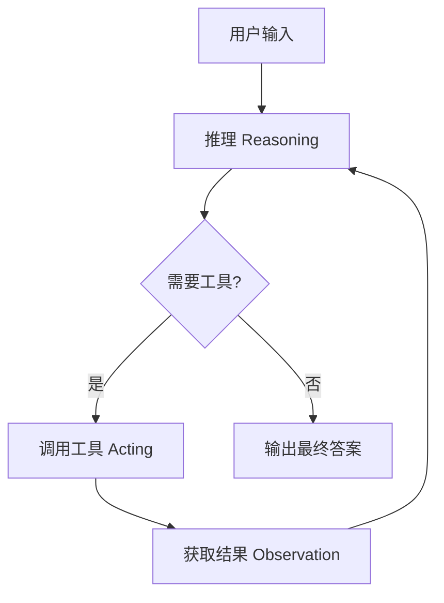

# Agents

## 概述

Agents 是 LangChain 中基于图架构的智能代理系统，它将语言模型与工具相结合，使 AI 能够自主推理任务、决定使用哪些工具，并通过迭代循环最终解决问题。Agent 基于 LangGraph 构建，通过节点（执行步骤）和边（连接关系）定义执行流程，直到满足停止条件（输出最终结果或达到迭代限制）。

## 核心范式流程



## 核心组件

### 1. 模型配置

模型是 Agent 的推理引擎，支持静态和动态两种配置方式。

#### 静态模型 - 最常用方式

**使用场景**: 大多数简单场景，整个执行过程使用同一个模型。

**代码示例**:
```python
# 方式一：使用字符串标识符自动推断
from langchain.agents import create_agent

agent = create_agent("openai:gpt-4.1-mini", tools=tools)
```

```python
# 方式二：直接使用模型实例获得完全配置控制
from langchain.agents import create_agent
from langchain_openai import ChatOpenAI

model = ChatOpenAI(
    model="gpt-4.1-mini",
    temperature=0.1,
    max_tokens=1000,
    timeout=30
)
agent = create_agent(model, tools=tools)
```

**特点**:
- 简单直接，配置一次保持不变
- 模型实例方式提供完整配置控制
- 支持所有提供商特定参数（temperature、max_tokens、base_url 等）

#### 动态模型选择

**使用场景**: 需要根据对话复杂度或成本优化选择不同模型。

**代码示例**:
```python
from langchain_openai import ChatOpenAI
from langchain.agents import create_agent
from langchain.agents.middleware import wrap_model_call, ModelRequest, ModelResponse

basic_model = ChatOpenAI(model="gpt-4.1-mini")
advanced_model = ChatOpenAI(model="gpt-4.1")

@wrap_model_call
def dynamic_model_selection(request: ModelRequest, handler) -> ModelResponse:
    """根据对话复杂度选择模型"""
    message_count = len(request.state["messages"])

    if message_count > 10:
        # 长对话使用高级模型
        model = advanced_model
    else:
        model = basic_model

    return handler(request.override(model=model))

agent = create_agent(
    model=basic_model,
    tools=tools,
    middleware=[dynamic_model_selection]
)
```

**特点**:
- 基于状态/上下文动态选择模型
- 实现成本优化：简单问题用低成本模型，复杂问题用高级模型
- 通过中间件机制实现，不侵入核心逻辑

### 2. 工具系统

工具赋予 Agent 采取行动的能力，支持顺序调用、并行调用和动态选择。

#### 静态工具定义

**使用场景**: 工具集已知且固定，整个执行过程保持不变。

**代码示例**:
```python
from langchain.tools import tool
from langchain.agents import create_agent
from llm_config import default_llm

@tool
def search(query: str) -> str:
    """搜索信息"""
    return f"Results for: {query}"

@tool
def get_weather(location: str) -> str:
    """获取天气信息"""
    return f"Weather in {location}: Sunny, 72°F"

agent = create_agent(default_llm, tools=[search, get_weather])
```

**特点**:
- 使用 `@tool` 装饰器轻松创建工具
- 自动提取函数名、描述和参数模式
- 最简单直接的方式，大多数场景使用

#### 动态工具过滤

**使用场景**: 根据权限、状态或对话阶段动态调整可用工具。

**代码示例**:
```python
from langchain.agents import create_agent
from langchain.agents.middleware import wrap_model_call, ModelRequest, ModelResponse
from langchain.tools import tool

@tool
def public_search(query: str) -> str:
    """公共搜索 - 对所有用户可用"""
    return f"Public search results: {query}"

@tool
def private_search(query: str) -> str:
    """私有搜索 - 需要认证"""
    return f"Private search results: {query}"

@tool
def advanced_search(query: str) -> str:
    """高级搜索 - 仅在对话深入后可用"""
    return f"Advanced search results: {query}"

@wrap_model_call
def state_based_tools(
    request: ModelRequest,
    handler
) -> ModelResponse:
    """基于对话状态过滤工具"""
    state = request.state
    is_authenticated = state.get("authenticated", False)
    message_count = len(state["messages"])

    if not is_authenticated:
        # 未认证只显示公开工具
        tools = [t for t in request.tools if t.name.startswith("public_")]
        request = request.override(tools=tools)
    elif message_count < 5:
        # 对话早期限制工具数量
        tools = [t for t in request.tools if t.name != "advanced_search"]
        request = request.override(tools=tools)

    return handler(request)

agent = create_agent(
    model=default_llm,
    tools=[public_search, private_search, advanced_search],
    middleware=[state_based_tools]
)
```

**特点**:
- 提前注册所有工具，运行时动态过滤
- 适合基于权限、功能开关、对话阶段的场景
- 避免模型被过多工具选项"淹没"

#### 自定义工具错误处理

**使用场景**: 需要自定义工具错误如何返回给模型。

**代码示例**:
```python
from langchain.agents import create_agent
from langchain.agents.middleware import wrap_tool_call
from langchain_core.messages import ToolMessage
from langchain.tools import tool

@tool
def divide(a: float, b: float) -> float:
    """除法计算"""
    return a / b

@wrap_tool_call
def handle_tool_errors(request, handler):
    """自定义工具错误处理"""
    try:
        return handler(request)
    except Exception as e:
        # 返回友好的错误消息给模型
        return ToolMessage(
            content=f"Tool error: Please check your input and try again. ({str(e)})",
            tool_call_id=request.tool_call["id"]
        )

agent = create_agent(
    model=default_llm,
    tools=[divide],
    middleware=[handle_tool_errors]
)
```

**特点**:
- 捕获工具执行异常并返回友好错误
- 帮助模型自我修正
- 不中断执行流程

### 3. 系统提示词

系统提示词塑造 Agent 处理任务的行为方式。

#### 动态系统提示词

**使用场景**: 需要根据运行时上下文动态生成系统提示词。

**代码示例**:
```python
from typing import TypedDict
from langchain.agents import create_agent
from langchain.agents.middleware import dynamic_prompt, ModelRequest
from langchain.tools import tool

@tool
def web_search(query: str) -> str:
    """搜索网络"""
    return f"Search results: {query}"

class Context(TypedDict):
    user_role: str

@dynamic_prompt
def user_role_prompt(request: ModelRequest) -> str:
    """根据用户角色生成系统提示词"""
    user_role = request.runtime.context.get("user_role", "user")
    base_prompt = "You are a helpful assistant."

    if user_role == "expert":
        return f"{base_prompt} Provide detailed technical responses."
    elif user_role == "beginner":
        return f"{base_prompt} Explain concepts simply and avoid jargon."

    return base_prompt

agent = create_agent(
    model=default_llm,
    tools=[web_search],
    middleware=[user_role_prompt],
    context_schema=Context
)

# 运行时传入上下文改变提示词
result = agent.invoke(
    {"messages": [{"role": "user", "content": "Explain machine learning"}]},
    context={"user_role": "expert"}
)
```

**特点**:
- 根据运行时上下文动态生成
- 支持用户角色、用户偏好等场景
- 通过中间件机制实现

### 4. 结构化输出

Agent 可以按照指定格式返回结构化输出，有两种策略。

#### ToolStrategy（工具策略）

**使用场景**: 模型不支持原生结构化输出，需要兼容所有支持工具调用的模型。

**代码示例**:
```python
from pydantic import BaseModel
from langchain.agents import create_agent
from langchain.agents.structured_output import ToolStrategy
from langchain.tools import tool
from llm_config import default_llm

class ContactInfo(BaseModel):
    name: str
    email: str
    phone: str

@tool
def search_tool(query: str) -> str:
    """搜索信息"""
    return f"Search results: {query}"

agent = create_agent(
    model=default_llm,
    tools=[search_tool],
    response_format=ToolStrategy(ContactInfo)
)

result = agent.invoke({
    "messages": [{"role": "user", "content": "Extract contact info from: John Doe, john@example.com, (555) 123-4567"}]
})

structured_result = result["structured_response"]
print(structured_result)
# ContactInfo(name='John Doe', email='john@example.com', phone='(555) 123-4567')
```

**特点**:
- 使用人工工具调用实现结构化输出
- 适用于任何支持工具调用的模型
- 兼容性好但不如原生方式可靠

#### ProviderStrategy（提供商策略）

**使用场景**: 模型提供商支持原生结构化输出，获得更可靠结果。

**代码示例**:
```python
from pydantic import BaseModel
from langchain.agents import create_agent
from langchain.agents.structured_output import ProviderStrategy
from llm_config import get_llm

class ContactInfo(BaseModel):
    name: str
    email: str
    phone: str

model = get_llm(model_name="gpt-4.1")
agent = create_agent(
    model=model,
    response_format=ProviderStrategy(ContactInfo)
)

# langchain 1.0+ 可以简写为：
# agent = create_agent(model=model, response_format=ContactInfo)
```

**特点**:
- 使用模型提供商原生结构化输出能力
- 更可靠，推荐在支持时使用
- langchain 1.0+ 默认会自动选择

### 5. 自定义状态（记忆）

Agent 通过状态维护对话历史，也可以扩展状态存储额外信息。

#### 通过中间件定义自定义状态（推荐方式）

**使用场景**: 需要在对话过程中记住额外信息，且需要中间件访问自定义状态。

**代码示例**:
```python
from langchain.agents import AgentState
from langchain.agents.middleware import AgentMiddleware
from langchain.agents import create_agent
from langchain.tools import tool
from llm_config import default_llm
from typing import Any

class CustomState(AgentState):
    user_preferences: dict

@tool
def tool1(query: str) -> str:
    return f"Result for: {query}"

@tool
def tool2(query: str) -> str:
    return f"Result for: {query}"

class CustomMiddleware(AgentMiddleware):
    state_schema = CustomState
    tools = [tool1, tool2]

    def before_model(self, state: CustomState, runtime) -> dict[str, Any] | None:
        """在模型调用前处理状态"""
        # 访问用户偏好，可能修改状态
        preferences = state.get("user_preferences", {})
        return None

agent = create_agent(
    model=default_llm,
    tools=[tool1, tool2],
    middleware=[CustomMiddleware()]
)

result = agent.invoke({
    "messages": [{"role": "user", "content": "I prefer technical explanations"}],
    "user_preferences": {"style": "technical", "verbosity": "detailed"},
})
```

**特点**:
- 作用域清晰，扩展与中间件绑定
- 推荐方式，更好的模块化
- 状态扩展对相关中间件和工具可见

#### 通过 state_schema 定义自定义状态

**使用场景**: 简单自定义状态，不需要通过中间件访问。

**代码示例**:
```python
from langchain.agents import AgentState
from langchain.agents import create_agent
from langchain.tools import tool
from llm_config import default_llm

class CustomState(AgentState):
    user_preferences: dict

@tool
def tool1(query: str) -> str:
    return f"Result for: {query}"

@tool
def tool2(query: str) -> str:
    return f"Result for: {query}"

agent = create_agent(
    model=default_llm,
    tools=[tool1, tool2],
    state_schema=CustomState
)

result = agent.invoke({
    "messages": [{"role": "user", "content": "I prefer technical explanations"}],
    "user_preferences": {"style": "technical", "verbosity": "detailed"},
})
```

**特点**:
- 快捷方式，适合简单场景
- 向后兼容保留
- 不推荐在复杂场景使用

### 6. 流式输出

**使用场景**: 需要显示中间进度，提升用户体验。

**代码示例**:
```python
from langchain.agents import create_agent
from langchain.tools import tool
from llm_config import default_llm
from langchain_core.messages import AIMessage, HumanMessage

@tool
def search_web(query: str) -> str:
    """搜索AI新闻"""
    return f"Search results for '{query}': Latest AI developments..."

agent = create_agent(default_llm, tools=[search_web])

# 流式输出显示每一步进度
for chunk in agent.stream({
    "messages": [{"role": "user", "content": "Search for AI news and summarize the findings"}]
}, stream_mode="values"):
    latest_message = chunk["messages"][-1]
    if latest_message.content:
        if isinstance(latest_message, HumanMessage):
            print(f"User: {latest_message.content}")
        elif isinstance(latest_message, AIMessage):
            print(f"Agent: {latest_message.content}")
    elif hasattr(latest_message, 'tool_calls') and latest_message.tool_calls:
        print(f"Calling tools: {[tc['name'] for tc in latest_message.tool_calls]}")
```

**特点**:
- 逐步返回状态，显示中间进度
- 改善用户体验，特别是多步任务
- 遵循 LangGraph 流式 API

## 使用场景总结

| 模式               | 使用场景           | 推荐度   |
| ---------------- | -------------- | ----- |
| 静态模型             | 大多数简单场景        | ⭐⭐⭐⭐⭐ |
| 动态模型选择           | 成本优化，复杂路由      | ⭐⭐⭐⭐  |
| 静态工具             | 工具集固定已知        | ⭐⭐⭐⭐⭐ |
| 动态工具过滤           | 权限控制，避免模型过载    | ⭐⭐⭐⭐  |
| 自定义错误处理          | 需要友好错误提示帮助模型修正 | ⭐⭐⭐   |
| 动态系统提示词          | 基于上下文改变行为      | ⭐⭐⭐   |
| ToolStrategy     | 需要兼容所有模型       | ⭐⭐⭐   |
| ProviderStrategy | 模型支持原生结构化输出    | ⭐⭐⭐⭐⭐ |
| 自定义状态中间件         | 需要存储额外会话信息     | ⭐⭐⭐⭐⭐ |
| 流式输出             | 提升用户体验显示中间进度   | ⭐⭐⭐⭐  |

## 完整示例

查看 [Agents 目录](./Agents/) 中的所有示例代码，每个文件都对应一个特定功能示例。
