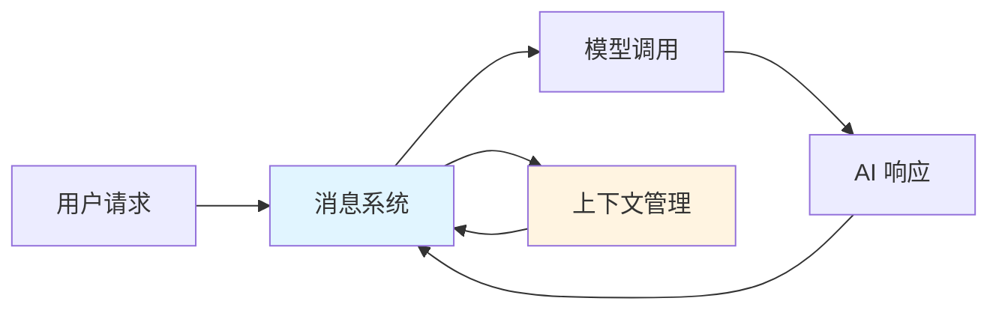
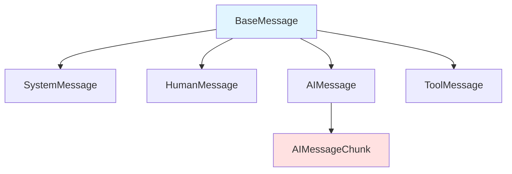
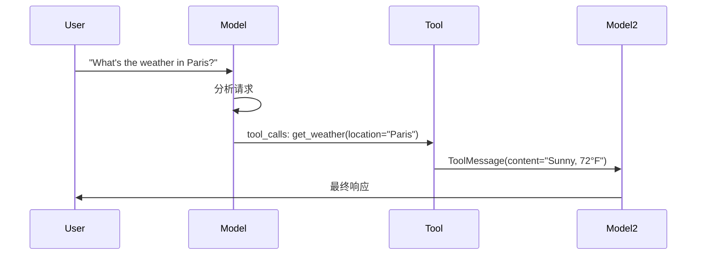
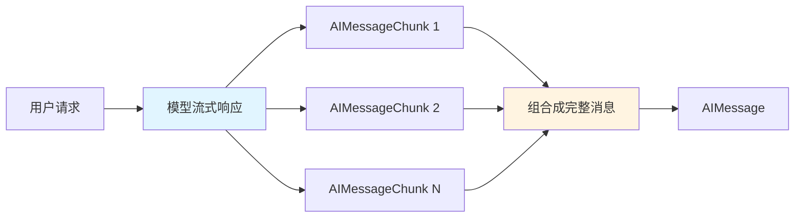

# 消息系统

消息系统是 LangChain 中与模型交互的基础单元。消息对象包含了内容、角色和元数据，用于表示对话的状态和上下文。

## 一、消息系统概述

### 1.1 消息的作用

消息是模型上下文的基础单元，代表模型的输入和输出。每个消息包含：

- **角色（Role）**：标识消息类型（system、user、assistant、tool）
- **内容（Content）**：消息的实际内容（文本、图像、音频、文档等）
- **元数据（Metadata）**：可选字段，如响应信息、消息 ID 和 token 使用情况

### 1.2 消系统的核心价值



**核心价值：**
- 统一的消息接口：跨所有模型提供商的标准消息类型
- 多模态支持：支持文本、图像、音频、视频等多种内容类型
- 上下文管理：通过消息历史维护对话状态
- 工具调用集成：原生支持函数调用和工具执行结果

## 二、消息类型详解

### 2.1 消息类型层次结构



### 2.2 SystemMessage - 系统指令消息

**作用场景：**
- 设置模型的行为准则
- 定义模型的角色和身份
- 建立响应的指导原则

**代码示例：**

```python
"""05_system_message.py
使用 SystemMessage 设置模型行为和角色
"""

from langchain.messages import SystemMessage, HumanMessage
from llm_config import default_llm

model = default_llm

# 简单系统消息
system_msg = SystemMessage("You are a helpful coding assistant.")

messages = [
    system_msg,
    HumanMessage("How do I create a REST API?")
]
response = model.invoke(messages)

# 详细系统消息
system_msg = SystemMessage("""
You are a senior Python developer with expertise in web frameworks.
Always provide code examples and explain your reasoning.
Be concise but thorough in your explanations.
""")
```

### 2.3 HumanMessage - 用户消息

**作用场景：**
- 表示用户输入和交互
- 支持多模态内容（文本、图像、音频、文件）
- 携带其他元数据（用户标识、消息 ID）

**代码示例：**

```python
"""06_human_message.py
使用 HumanMessage 处理用户输入和元数据
"""

from langchain.messages import HumanMessage
from llm_config import default_llm

model = default_llm

# 文本内容
response = model.invoke([
    HumanMessage("What is machine learning?")
])

# 带元数据的消息
human_msg = HumanMessage(
    content="Hello!",
    name="alice",  # 识别不同用户
    id="msg_123",  # 唯一标识符用于追踪
)
```

### 2.4 AIMessage - AI 响应消息

**作用场景：**
- 表示模型的输出
- 包含工具调用信息
- 访问 token 使用等元数据
- 手动创建用于构建对话历史

**代码示例：**

```python
"""07_ai_message.py
使用 AIMessage 表示模型响应
"""

from langchain.messages import AIMessage, SystemMessage, HumanMessage
from llm_config import default_llm

model = default_llm

# 获取 AI 消息响应
response = model.invoke("Explain AI")

# 手动创建 AI 消息（用于对话历史）
ai_msg = AIMessage("I'd be happy to help you with that question!")

messages = [
    SystemMessage("You are a helpful assistant"),
    HumanMessage("Can you help me?"),
    ai_msg,  # 插入对话历史
    HumanMessage("Great! What's 2+2?")
]

response = model.invoke(messages)
```

### 2.5 ToolMessage - 工具消息

**作用场景：**
- 传递工具执行结果回模型
- 包含工具调用 ID 以匹配对应的调用
- 使用 artifact 字段存储补充数据

**代码示例：**

```python
"""11_tool_message.py
使用 ToolMessage 传递工具执行结果
"""

from langchain.messages import AIMessage, HumanMessage, ToolMessage
from llm_config import default_llm

model = default_llm

# 模拟模型的工具调用
ai_message = AIMessage(
    content=[],
    tool_calls=[{
        "name": "get_weather",
        "args": {"location": "San Francisco"},
        "id": "call_123"
    }]
)

# 执行工具并创建结果消息
weather_result = "Sunny, 72°F"
tool_message = ToolMessage(
    content=weather_result,
    tool_call_id="call_123"  # 必须匹配调用 ID
)

messages = [
    HumanMessage("What's the weather in San Francisco?"),
    ai_message,  # 模型的工具调用
    tool_message,  # 工具执行结果
]

response = model.invoke(messages)
```

## 三、消息使用模式

### 3.1 文本提示模式

**使用场景：**
- 单次独立请求
- 不需要对话历史
- 追求代码简洁

**代码示例：**

```python
""""02_text_prompts.py
使用文本提示进行简单生成
"""

from llm_config import default_llm

model = default_llm

# 使用文本提示进行简单生成
response = model.invoke("Write a haiku about spring")

print(f"Response: {response.content}")
```

**优势：**
- 代码简洁
- 适合一次性任务
- 无需管理消息历史

### 3.2 消息列表模式

**使用场景：**
- 多轮对话管理
- 多模态内容处理
- 包含系统指令

**代码示例：**

```python
"""03_message_prompts.py
使用消息列表处理复杂对话
"""

from langchain.messages import SystemMessage, HumanMessage, AIMessage
from llm_config import default_llm

model = default_llm

messages = [
    SystemMessage("You are a poetry expert"),
    HumanMessage("Write a haiku about spring"),
    AIMessage("Cherry blossoms bloom\nPink petals dance in breeze\nNature wakes from sleep"),
    HumanMessage("Now write one about winter")
]

response = model.invoke(messages)
```

**优势：**
- 完整的对话上下文
- 支持复杂的多轮交互
- 灵活的消息组合

### 3.3 字典格式模式

**使用场景：**
- 与 OpenAI API 兼容
- 需要原始格式的消息
- 跨框架的消息传递

**代码示例：**

```python
"""04_dictionary_format.py
使用字典格式的消息
"""

from llm_config import default_llm

model = default_llm

messages = [
    {"role": "system", "content": "You are a poetry expert"},
    {"role": "user", "content": "Write a haiku about spring"},
    {"role": "assistant", "content": "Cherry blossoms bloom..."},
    {"role": "user", "content": "Now write one about winter"}
]

response = model.invoke(messages)
```

## 四、高级特性

### 4.1 工具调用

**流程图：**



**代码示例：**

```python
"""08_tool_calls.py
使用 AIMessage 处理工具调用
"""

from langchain.tools import tool
from langchain_openai import ChatOpenAI
import os
from dotenv import load_dotenv

load_dotenv()

model = ChatOpenAI(
    model=os.getenv("model"),
    temperature=float(os.getenv("temperature") or 0.1),
    max_tokens=1000,
    timeout=30,
    api_key=os.getenv("OPENAI_API_KEY"),
    base_url=os.getenv("OPENAI_BASE_URL") if os.getenv("OPENAI_BASE_URL") else None,
)

@tool
def get_weather(location: str) -> str:
    """Get that weather at a location."""
    return f"The weather in {location} is sunny, 72°F"

# 绑定工具到模型
model_with_tools = model.bind_tools([get_weather])

response = model_with_tools.invoke("What's the weather in Paris?")

for tool_call in response.tool_calls:
    print(f"Tool: {tool_call['name']}")
    print(f"Args: {tool_call['args']}")
    print(f"ID: {tool_call['id']}")
```

### 4.2 Token 使用追踪

**代码示例：**

```python
"""09_token_usage.py
访问 token 使用元数据
"""

from llm_config import default_llm

model = default_llm

response = model.invoke("Hello!")

if response.usage_metadata:
    print("Token usage:")
    print(f"  Input tokens: {response.usage_metadata.get('input_tokens', 'N/A')}")
    print(f"  Output tokens: {response.usage_metadata.get('output_tokens', 'N/A')}")
    print(f"  Total tokens: {response.usage_metadata.get('total_tokens', 'N/A')}")
```

### 4.3 流式响应

**流程图：**



**代码示例：**

```python
"""10_streaming.py
使用流式响应实时获取输出
"""

from llm_config import default_llm

model = default_llm

chunks = []
full_message = None

print("Streaming response:")
for chunk in model.stream("Tell me a short joke"):
    chunks.append(chunk)
    print(chunk.text, end="", flush=True)
    full_message = chunk if full_message is None else full_message + chunk
```

### 4.4 Artifact 字段

**作用：**
- 存储不会发送给模型的补充数据
- 用于文档标识符、调试信息等下游处理
- 不增加模型的上下文负担

**代码示例：**

```python
"""12_tool_message_artifact.py
使用 ToolMessage 的 artifact 字段
"""

from langchain.messages import ToolMessage

artifact = {"document_id": "doc_123", "page": 0}
message_content = "It was the best of times, it was the worst of times."

tool_message = ToolMessage(
    content=message_content,
    tool_call_id="call_123",
    name="search_books",
    artifact=artifact,
)

print(f"Message content (sent to model): {tool_message.content}")
print(f"Artifact (downstream only): {tool_message.artifact}")
```

## 五、最佳实践总结

### 5.1 消息选择指南

| 场景 | 推荐模式 | 示例 |
|------|---------|------|
| 简单单次请求 | 文本提示 | `model.invoke("Write a haiku")` |
| 多轮对话 | 消息列表 | `[System, Human, AI, Human]` |
| API 兼容性 | 字典格式 | `[{"role": "user", "content": "..."}]` |
| 工具调用 | 绑定工具 | `model.bind_tools([tool])` |
| 实时输出 | 流式响应 | `for chunk in model.stream()` |
| 对话历史 | 手动创建 | `AIMessage(content="...")` |

### 5.2 消息管理建议

1. **保持消息历史简洁**：定期清理或总结旧消息
2. **使用系统消息定义角色**：明确设定模型的行为准则
3. **利用元数据进行追踪**：为关键消息添加 ID 和标识
4. **合理使用工具消息**：通过 artifact 字段存储补充数据
5. **监控 token 使用**：及时获取 usage_metadata 避免超限

### 5.3 常见陷阱

- **忘记匹配 tool_call_id**：ToolMessage 的 ID 必须与 AIMessage 中的工具调用 ID 匹配
- **过度使用流式响应**：对于需要完整响应的场景，流式可能增加复杂度
- **忽视元数据**：usage_metadata 等元数据对于成本控制和调试很重要
- **混乱的消息历史**：维护清晰的消息顺序，避免重复或丢失消息

## 六、完整工作流程示例

以下是一个完整的消息系统工作流程，展示了从用户输入到模型响应的完整过程：

```python
"""完整消息系统工作流程示例
"""

from langchain.messages import SystemMessage, HumanMessage, AIMessage, ToolMessage
from langchain.tools import tool
from llm_config import default_llm

model = default_llm

# 定义工具
@tool
def search_database(query: str) -> str:
    """Search database for information."""
    return "Database search results for: " + query

# 绑定工具
model_with_tools = model.bind_tools([search_database])

# 系统指令
system_msg = SystemMessage("You are a helpful assistant with access to a database.")

# 用户请求
user_msg = HumanMessage("Find information about Python")

# 模型响应（可能包含工具调用）
ai_msg = model_with_tools.invoke([system_msg, user_msg])

print(f"AI Response: {ai_msg.content}")

# 处理工具调用
if ai_msg.tool_calls:
    for tool_call in ai_msg.tool_calls:
        print(f"\nTool called: {tool_call['name']}")
        print(f"Arguments: {tool_call['args']}")

        # 模拟工具执行
        if tool_call['name'] == 'search_database':
            result = search_database.invoke(tool_call['args'])

            # 创建工具消息
            tool_msg = ToolMessage(
                content=result,
                tool_call_id=tool_call['id']
            )

            # 继续对话
            messages = [system_msg, user_msg, ai_msg, tool_msg]
            final_response = model_with_tools.invoke(messages)
            print(f"\nFinal response: {final_response.content}")
```

这个完整示例展示了消息系统的核心功能：消息创建、工具调用、消息组合和对话管理。
