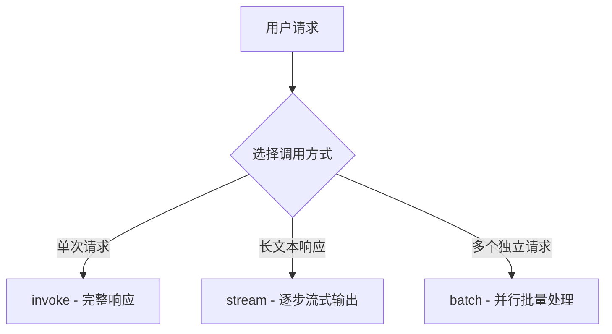
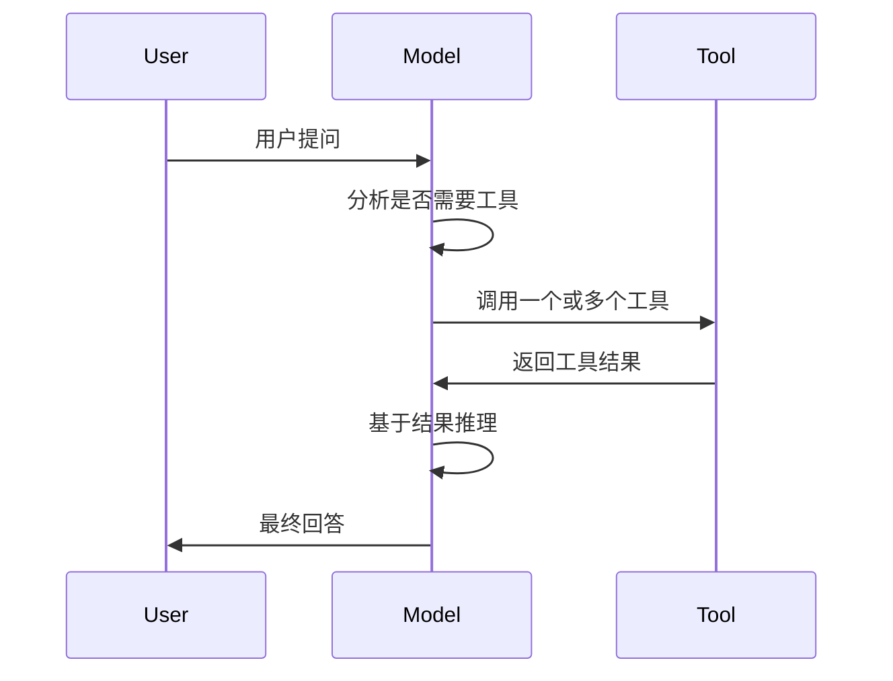

# Models

## 概述

Models 是 LangChain 对大型语言模型的抽象层，提供统一接口访问所有主流 LLM 提供商。核心设计理念是**统一接口，提供商无关**，可以轻松切换不同模型而无需重写代码。支持三种调用方式：同步调用、流式输出、批量处理，以及工具调用、结构化输出等高级功能。

## 核心调用方式

### 三种调用方法



### 1. invoke - 同步调用

**使用场景**: 简单问答，不需要 incremental 输出，等待完整回复。

**代码示例**:
```python
from llm_config import default_llm

# 单消息调用
response = default_llm.invoke("Why do parrots have colorful feathers?")
print(response)

# 带对话历史 - 字典格式
conversation = [
    {"role": "system", "content": "You are a helpful assistant that translates English to French."},
    {"role": "user", "content": "Translate: I love programming."},
    {"role": "assistant", "content": "J'adore la programmation."},
    {"role": "user", "content": "Translate: I love building applications."}
]
response = default_llm.invoke(conversation)

# 带对话历史 - 消息对象格式
from langchain_core.messages import HumanMessage, AIMessage, SystemMessage

conversation = [
    SystemMessage("You are a helpful assistant that translates English to French."),
    HumanMessage("Translate: I love programming."),
    AIMessage("J'adore la programmation."),
    HumanMessage("Translate: I love building applications.")
]
response = default_llm.invoke(conversation)
```

**特点**:
- 最简单直接，大多数场景使用
- 返回完整的 `AIMessage` 对象
- 等待模型生成完成才返回

### 2. stream - 流式输出

**使用场景**: 需要显示进度，提升用户体验，长文本生成。

**代码示例**:
```python
from llm_config import default_llm

# 基础流式输出
for chunk in default_llm.stream("Why do parrots have colorful feathers?"):
    print(chunk.text, end="|", flush=True)

# 累积片段获得完整消息
full = None
for chunk in default_llm.stream("What color is the sky?"):
    full = chunk if full is None else full + chunk
    print(full.text)

print(full.content_blocks)
```

**特点**:
- 逐步返回结果，改善用户体验
- 每个片段支持加法累积
- 累积后可当作普通消息使用

### 3. batch - 批量处理

**使用场景**: 多个独立请求并行处理，提高吞吐量。

**代码示例**:
```python
from llm_config import default_llm

# 基础批量处理
responses = default_llm.batch([
    "Why do parrots have colorful feathers?",
    "How do airplanes fly?",
    "What is quantum computing?"
])
for response in responses:
    print(response)

# 控制最大并发
model.batch(
    list_of_inputs,
    config={
        'max_concurrency': 5,  # 限制 5 个并行调用
    }
)

# 流式输出，结果完成一个返回一个
for response in default_llm.batch_as_completed([
    "Why do parrots have colorful feathers?",
    "How do airplanes fly?",
    "What is quantum computing?"
]):
    print(response)
```

**特点**:
- 客户端并行处理，提高效率
- 可控制最大并发数
- `batch_as_completed` 支持流式输出，乱序返回

## 工具调用

工具调用允许模型请求执行外部代码获取信息，是 Agent 的基础能力。



**使用场景**: 需要获取实时信息、调用外部 API、计算等。

**基础工具调用代码示例**:
```python
from langchain.tools import tool
from llm_config import default_llm

# 1. 定义工具
@tool
def get_weather(location: str) -> str:
    """Get the weather at a location."""
    return f"It's 72°F and sunny in {location}."

# 2. 绑定工具到模型
model_with_tools = default_llm.bind_tools([get_weather])

# 3. 手动执行循环
messages = [{"role": "user", "content": "What's the weather in Boston?"}]
ai_msg = model_with_tools.invoke(messages)
messages.append(ai_msg)

# 执行工具
for tool_call in ai_msg.tool_calls:
    tool_result = get_weather.invoke(tool_call)
    messages.append(tool_result)

# 获取最终回答
final_response = model_with_tools.invoke(messages)
print(final_response.text)
```

**并行工具调用**:
```python
# 模型可以同时调用多个工具
response = model_with_tools.invoke(
    "What's the weather in Boston and Tokyo?"
)

# 输出多个工具调用
print(response.tool_calls)
# [
#   {'name': 'get_weather', 'args': {'location': 'Boston'}, 'id': 'call_1'},
#   {'name': 'get_weather', 'args': {'location': 'Tokyo'}, 'id': 'call_2'},
# ]

# 可以并行执行所有工具
results = []
for tool_call in response.tool_calls:
    result = get_weather.invoke(tool_call)
    results.append(result)
```

**流式工具调用**:
```python
# 流式逐步获取工具调用
for chunk in model_with_tools.stream("What's the weather in Boston and Tokyo?"):
    for tool_chunk in chunk.tool_call_chunks:
        if name := tool_chunk.get("name"):
            print(f"Tool: {name}")
        if id_ := tool_chunk.get("id"):
            print(f"ID: {id_}")
        if args := tool_chunk.get("args"):
            print(f"Args: {args}")

# 累积完整工具调用
gathered = None
for chunk in model_with_tools.stream("What's the weather in Boston?"):
    gathered = chunk if gathered is None else gathered + chunk
    print(gathered.tool_calls)
```

**特点**:
- 模型自动决定是否调用工具、调用哪个工具
- 原生支持并行调用多个工具
- 支持流式逐步输出工具调用
- `parallel_tool_calls=False` 可禁用并行

## 结构化输出

强制模型输出按照预定义 Schema 格式化，便于后续程序解析。

**使用场景**: 信息提取、结构化数据生成、API 参数生成等。

### Pydantic 基础使用

```python
from pydantic import BaseModel, Field
from llm_config import default_llm

# 定义输出 Schema
class Movie(BaseModel):
    """A movie with details."""
    title: str = Field(description="The title of the movie")
    year: int = Field(description="The year the movie was released")
    director: str = Field(description="The director of the movie")
    rating: float = Field(description="The movie's rating out of 10")

# 获取结构化输出模型
model_with_structure = default_llm.with_structured_output(Movie)
response = model_with_structure.invoke("Provide details about the movie Inception")
print(response)  # Movie(title="Inception", year=2010, director="Christopher Nolan", rating=8.8)
```

### 包含原始响应

```python
# 包含原始 AIMessage 以访问元数据（token 计数等）
model_with_structure = default_llm.with_structured_output(Movie, include_raw=True)
response = model_with_structure.invoke("Provide details about the movie Inception")

# 输出格式:
# {
#     "raw": AIMessage(...),
#     "parsed": Movie(title=..., year=..., ...),
#     "parsing_error": None,
# }
```

### 嵌套 Schema

```python
from pydantic import BaseModel, Field

class Actor(BaseModel):
    name: str
    role: str

class MovieDetails(BaseModel):
    title: str
    year: int
    cast: list[Actor]
    genres: list[str]
    budget: float | None = Field(None, description="Budget in millions USD")

model_with_structure = default_llm.with_structured_output(MovieDetails)
response = model_with_structure.invoke("Provide details for The Dark Knight")
```

**特点**:
- 支持 Pydantic、TypedDict、JSON Schema
- 自动验证，嵌套结构支持
- 两种策略：ProviderStrategy（使用原生能力）和 ToolStrategy（工具调用模拟）

## 模型能力配置 (Profile)

模型 profile 描述模型支持的能力，langchain 根据这些信息动态调整行为。

**使用场景**: 动态适配不同模型能力，例如根据上下文窗口决定是否摘要，检查工具调用支持。

```python
from langchain.chat_models import init_chat_model

# 查看已有 profile
model = init_chat_model("gpt-4.1-mini")
print(model.profile)
# {
#   "max_input_tokens": 400000,
#   "image_inputs": True,
#   "reasoning_output": True,
#   "tool_calling": True,
#   ...
# }

# 自定义 profile
custom_profile = {
    "max_input_tokens": 100_000,
    "tool_calling": True,
    "structured_output": True,
}
model = init_chat_model("...", profile=custom_profile)

# 更新已有 profile
new_profile = model.profile | {"key": "value"}
updated_model = model.model_copy(update={"profile": new_profile})
```

## 运行时可配置模型

允许在调用时动态改变模型参数，支持同一个流水线中切换不同模型。

**使用场景**: 应用允许用户选择模型，比较不同模型输出。

**代码示例**:
```python
from langchain.chat_models import init_chat_model

# 基础可配置模型
configurable_model = init_chat_model(temperature=0)

# 运行时切换不同模型
configurable_model.invoke(
    "what's your name",
    config={"configurable": {"model": "gpt-5-nano"}},
)
configurable_model.invoke(
    "what's your name",
    config={"configurable": {"model": "claude-sonnet-4-6"}},
)

# 多参数配置带前缀
first_model = init_chat_model(
        model="gpt-4.1-mini",
        temperature=0,
        configurable_fields=("model", "model_provider", "temperature", "max_tokens"),
        config_prefix="first",
)

# 运行时配置
first_model.invoke(
    "what's your name",
    config={
        "configurable": {
            "first_model": "claude-sonnet-4-6",
            "first_temperature": 0.5,
            "first_max_tokens": 100,
        }
    },
)
```

**结合工具调用**:
```python
from pydantic import BaseModel, Field

class GetWeather(BaseModel):
    location: str = Field(description="The city and state")

class GetPopulation(BaseModel):
    location: str = Field(description="The city and state")

model = init_chat_model(temperature=0)
model_with_tools = model.bind_tools([GetWeather, GetPopulation])

# 不同模型产生工具调用
result_gpt = model_with_tools.invoke(
    "what's bigger in 2024 LA or NYC",
    config={"configurable": {"model": "gpt-4.1-mini"}}
).tool_calls

result_claude = model_with_tools.invoke(
    "what's bigger in 2024 LA or NYC",
    config={"configurable": {"model": "claude-sonnet-4-6"}}
).tool_calls
```

## 高级配置选项

### 限流控制

**使用场景**: 避免超过提供商限流限制。

```python
from langchain_core.rate_limiters import InMemoryRateLimiter
from langchain.chat_models import init_chat_model

rate_limiter = InMemoryRateLimiter(
    requests_per_second=0.1,  # 每 10 秒 1 个请求
    check_every_n_seconds=0.1,  # 每 100ms 检查一次
    max_bucket_size=10,  # 控制最大突发大小
)

model = init_chat_model(
    model="gpt-5",
    model_provider="openai",
    rate_limiter=rate_limiter
)
```

### 自定义 Base URL

**使用场景**: 使用兼容 OpenAI API 的第三方服务（Together AI、vLLM、OpenRouter 等）。

```python
from langchain.chat_models import init_chat_model

model = init_chat_model(
    model="MODEL_NAME",
    model_provider="openai",
    base_url="BASE_URL",
    api_key="YOUR_API_KEY",
)
```

### HTTP 代理

```python
from langchain_openai import ChatOpenAI

model = ChatOpenAI(
    model="gpt-4.1",
    openai_proxy="http://proxy.example.com:8080"
)
```

### 令牌对数概率

```python
from langchain.chat_models import init_chat_model

model = init_chat_model(
    model="gpt-4.1",
    model_provider="openai"
).bind(logprobs=True)

response = model.invoke("Why do parrots talk?")
print(response.response_metadata["logprobs"])
```

### 聚合令牌使用统计

```python
from langchain.chat_models import init_chat_model
from langchain_core.callbacks import UsageMetadataCallbackHandler

callback = UsageMetadataCallbackHandler()

model_1 = init_chat_model(model="gpt-4.1-mini")
model_2 = init_chat_model(model="claude-haiku-4-5-20251001")

result_1 = model_1.invoke("Hello", config={"callbacks": [callback]})
result_2 = model_2.invoke("Hello", config={"callbacks": [callback]})

print(callback.usage_metadata)
# 按模型聚合使用统计
```

## 使用场景总结

| 功能 | 使用场景 | 推荐度 |
|------|----------|--------|
| `invoke()` | 单次请求，简单问答 | ⭐⭐⭐⭐⭐ |
| `stream()` | 长文本，需要显示进度 | ⭐⭐⭐⭐⭐ |
| `batch()` | 多个独立请求并行 | ⭐⭐⭐⭐ |
| `bind_tools()` | 工具调用，Agent 基础 | ⭐⭐⭐⭐⭐ |
| `with_structured_output()` | 信息提取，结构化数据 | ⭐⭐⭐⭐⭐ |
| 可配置模型 | 动态切换模型比较 | ⭐⭐⭐⭐ |
| 模型 profile | 动态适配能力特性 | ⭐⭐⭐ |
| 限流控制 | 避免超过速率限制 | ⭐⭐⭐ |
| 自定义 base URL | 第三方兼容 API | ⭐⭐⭐⭐ |

## 完整代码

查看 [Models 目录](./Models/) 中的所有示例代码，每个文件都对应一个特定功能示例。
