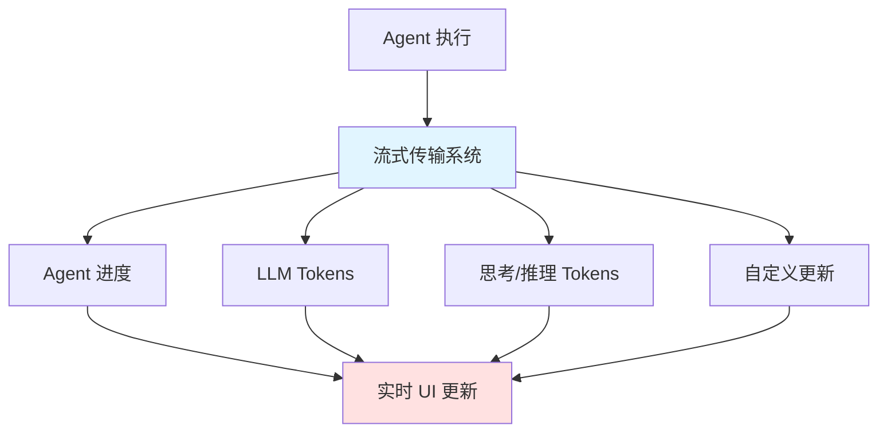
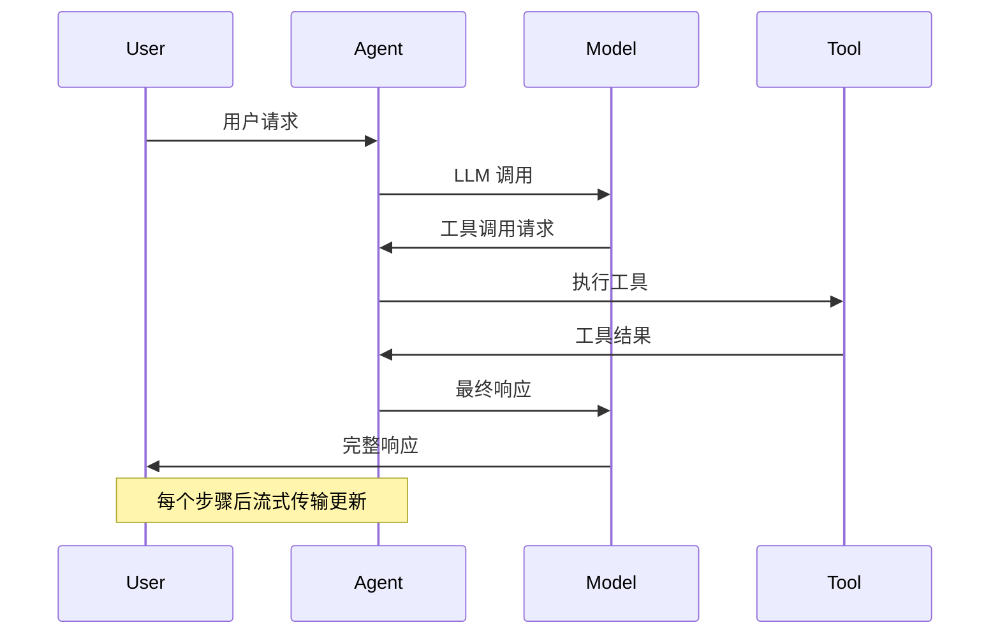
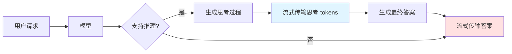

# 流式传输

流式传输系统让应用程序能够实时地显示 LLM Agent 运行的更新。通过在完整响应准备好之前逐步显示输出，流式传输显著改善了用户体验（UX），特别是在处理 LLM 的延迟时。

## 一、流式传输概述

### 1.1 流式传输的价值

对于基于 LLM 构建的应用来说，流式传输至关重要：
- **改善响应性**：在完整响应准备好之前显示输出
- **减少感知延迟**：在模型执行期间显示实时反馈
- **提升用户参与度**：具有实时更新的交互体验
- **更好的错误处理**：能够早期检测和报告问题

### 1.2 流式传输的核心能力



**可能的流式传输内容：**
- **Agent 进度**：在每个 Agent 步骤之后获取状态更新
- **LLM Tokens**：流式传输生成的语言模型 tokens
- **思考/推理 Tokens**：表生成模型的推理过程
- **自定义更新**：发出用户定义的信号（例如，"已获取 10/100 条记录"）

### 1.3 v2 流式传输格式

LangChain >= 1.1 引入了统一的 v2 流式传输格式。每个流式块是一个 `StreamPart` 字典，包含：
- `type`：流式传输模式（"updates"、"messages"、"custom"）
- `ns`：命名空间（可选）
- `data`：有效负载

**优势：**
- 统一的输出格式，无论流式传输模式或模式数量如何
- 改进的 `invoke()` 返回值，返回 `GraphOutput` 对象
- 清晰地分离状态和中断元数据

## 二、支持的流模式

| 模式 | 描述 | 使用场景 |
|------|------|---------|
| `updates` | 在每个 Agent 步骤之后流式传输状态更新 | 显示工具执行进度、状态变化 |
| `messages` | 流式传输从任何调用 LLM 的图节点的 (token, metadata) 元组 | 实时显示生成文本、工具调用 |
| `custom` | 流式传输使用 stream writer 从图节点内部流式传输的自定义数据 | 显示自定义进度、工具执行细节 |

## 三、Agent 进度流式传输

### 3.1 基本使用

**场景：** 在每个 Agent 步骤之后获取状态更新

**流程图：**



**代码示例：**

```python
"""01_agent_progress.py
使用 stream_mode="updates" 流式传输 Agent 进度
"""

from langchain.agents import create_agent
from langchain.tools import tool
from llm_config import default_llm

@tool
def get_weather(city: str) -> str:
    """Get weather for a given city."""
    return f"It's always sunny in {city}!"

agent = create_agent(
    default_llm,
    tools=[get_weather],
)

print("Streaming agent progress:")
for chunk in agent.stream(
    {"messages": [{"role": "user", "content": "What is the weather in SF?"}]},
    stream_mode="updates",
    version="v2",
):
    if chunk["type"] == "updates":
        for step, data in chunk["data"].items():
            print(f"Step: {step}")
            print(f"Content: {data['messages'][-1].content[:100]}")
            print()
```

**输出示例：**
```
Step: model
Content: [{'type': 'tool_call', 'name': 'get_weather', 'args': {'city': 'San Francisco'}}]

Step: tools
Content: [{'type': 'text', 'text': "It's always sunny in San Francisco!"}]

Step: model
Content: [{'type': 'text', 'text': 'San Francisco weather: It's always sunny in San Francisco!'}]
```

## 四、LLM Tokens 流式传输

### 4.1 基本使用

**场景：** 流式传输 LLM 生成的 tokens

**代码示例：**

```python
"""02_llm_tokens.py
使用 stream_mode="messages" 流式传输 LLM tokens
"""

from langchain.agents import create_agent
from langchain.tools import tool
from llm_config import default_llm

@tool
def get_weather(city: str) -> str:
    """Get weather for a given city."""
    return f"It's always sunny in {city}!"

agent = create_agent(
    default_llm,
    tools=[get_weather],
)

print("Streaming LLM tokens:")
for chunk in agent.stream(
    {"messages": [{"role": "user", "content": "What is the weather in SF?"}]},
    stream_mode="messages",
    version="v2",
):
    if chunk["type"] == "messages":
        token, metadata = chunk["data"]
        print(f"Node: {metadata['langgraph_node']}")
        print(f"Content: {token.content_blocks}")
        print()
```

**输出示例：**
```
Node: model
Content: [{'type': 'tool_call_chunk', 'name': 'get_weather', 'args': ''}]

Node: model
Content: [{'type': 'tool_call_chunk_chunk', 'args': 'city'}]

Node: model
Content: [{'type': 'tool_call_chunk_chunk', 'args': 'San Francisco'}]

Node: model
Content: []

Node: tools
Content: [{'type': 'text', 'text': "It's always sunny in San Francisco!"}]

Node: model
Content: [{'type': 'text', 'text': 'Here'}]
Content: [{'type': 'text', 'text': "'s"}]
...
```

## 五、自定义更新

### 5.1 基本使用

**场景：** 从工具流式传输更新

**代码示例：**

```python
"""03_custom_updates.py
使用 stream writer 流式传输自定义更新
"""

from langchain.agents import create_agent
from langgraph.config import get_stream_writer
from langchain.tools import tool
from llm_config import default_llm

@tool
def get_weather(city: str) -> str:
    """Get weather for a given city."""
    writer = get_stream_writer()
    # Stream any arbitrary data
    writer(f"Looking up data for city: {city}")
    writer(f"Acquired data for city: {city}")
    return f"It's always sunny in {city}!"

agent = create_agent(
    default_llm,
    tools=[get_weather],
)

print("Streaming custom updates:")
for chunk in agent.stream(
    {"messages": [{"role": "user", "content": "What is the weather in SF?"}]},
    stream_mode="custom",
    version="v2",
):
    if chunk["type"] == "custom":
        print(chunk["data"])
```

**输出示例：**
```
Looking up data for city: San Francisco
Acquired data for city: San Francisco
```

**注意：** 如果在工具内部添加 `get_stream_writer()`，您将无法在 LangGraph 执行上下文之外调用工具。

## 六、多种流模式

### 6.1 同时使用多种模式

**场景：** 同时流式传输 Agent 进度、LLM tokens 和自定义更新

**代码示例：**

```python
"""04_multiple_modes.py
同时使用多种流模式
"""

from langchain.agents import create_agent
from langgraph.config import get_stream_writer
from langchain.tools import tool
from llm_config import default_llm

@tool
def get_weather(city: str) -> str:
    """Get weather for a given city."""
    writer = get_stream_writer()
    writer(f"Looking up data for city: {city}")
    writer(f"Acquired data for city: {city}")
    return f"It's always sunny in {city}!"

agent = create_agent(
    default_llm,
    tools=[get_weather],
)

print("Streaming multiple modes:")
for chunk in agent.stream(
    {"messages": [{"role": "user", "content": "What is the weather in SF?"}]},
    stream_mode=["updates", "custom"],
    version="v2",
):
    print(f"Stream mode: {chunk['type']}")
    print(f"Content: {chunk['data']}")
    print()
```

## 七、思考/推理 Tokens 流式传输

### 7.1 概述

一些模型在产生最终答案之前执行内部推理。您可以通过为类型 `"reasoning"` 过滤标准内容块来流式传输这些思考/推理 tokens。

**流程图：**



**代码示例：**

```python
"""05_thinking_tokens.py
流式传输思考/推理 tokens
"""

from langchain.agents import create_agent
from langchain.messages import AIMessageChunk
from langchain.tools import tool
from llm_config import default_llm

@tool
def get_weather(city: str) -> str:
    """Get weather for a given city."""
    return f"It's always sunny in {city}!"

# Create model with thinking enabled
model = get_llm()
if hasattr(model, 'with_config'):
    try:
        model = model.with_config({"thinking": {"type": "enabled", "budget_tokens": 5000}})
    except:
        pass

agent = create_agent(
    model,
    tools=[get_weather],
)

print("Streaming thinking tokens:")
for token, metadata in agent.stream(
    {"messages": [{"role": "user", "content": "What is the weather in SF?"}]},
    stream_mode="messages",
    version="v2",
):
    if not isinstance(token, AIMessageChunk):
        continue

    # Extract reasoning and (text blocks
    reasoning = [b for b in token.content_blocks if b.get("type") == "reasoning"]
    text = [b for b in token.content_blocks if b.get("type") == "text"]

    if reasoning:
        print(f"[thinking] {reasoning[0].get('reasoning', '')[:100]}...", end="")
    if text:
        print(text[0].get("text", ''), end="")
```

**输出示例：**
```
[thinking] The user is asking about weather in San Francisco. I have a tool
[thinking] available to get this information. Let me call the get_weather tool
[thinking]  with "San Francisco" as the city parameter.
The weather in San Francisco is: It's always sunny in San Francisco!
```

**跨提供商标准化：**
- Anthropic `thinking` 块
- OpenAI `reasoning` 摘要
- LangChain 通过 `content_blocks` 属性将提供商特定格式标准化为标准的 `"reasoning"` 内容块类型

## 八、工具调用流式传输

### 8.1 流式传输工具调用

**场景：** 流式传输部分工具调用 JSON 和已完成的工具调用

**代码示例：**

```python
"""06_streaming_tool_calls.py
流式传输工具调用和响应
"""

from typing import Any
from langchain.agents import create_agent
from langchain.messages import AIMessage, AIMessageChunk, AnyMessage, ToolMessage
from langchain.tools import tool
from llm_config import default_llm

@tool
def get_weather(city: str) -> str:
    """Get weather for a given city."""
    return f"It's always sunny in {city}!"

agent = create_agent(
    default_llm,
    tools=[get_weather],
)

def _render_message_chunk(token: AIMessageChunk) -> None:
    if token.text:
        print(token.text, end="|")
    if token.tool_call_chunks:
        print(token.tool_call_chunks)

def _render_completed_message(message: AnyMessage) -> None:
    if isinstance(message, AIMessage) and hasattr(message, 'tool_calls') and message.tool_calls:
        print(f"\nTool calls: {message.tool_calls}")
    if isinstance(message, ToolMessage):
        print(f"Tool response: {message.content_blocks}")

print("Streaming tool calls:")
input_message = {"role": "user", "content": "What is the weather in Boston?"}
for chunk in agent.stream(
    {"messages": [input_message]},
    stream_mode=["messages", "updates"],
    version="v2",
):
    if chunk["type"] == "messages":
        token, metadata = chunk["data"]
        if isinstance(token, AIMessageChunk):
            _render_message_chunk(token)
    elif chunk["type"] == "updates":
        for source, update in chunk["data"].items():
            if source in ("model", "tools"):
"):
                _render_completed_message(update["messages"][-1])
```

**输出示例：**
```
Tool calls: [{'name': 'get_weather', 'args': {'city': 'Boston'}}]
Tool response: [{'type': 'text', 'text': "It's always sunny in Boston!"}]
The| weather| in| **|Boston|**| is| **|sun|ny|**|.
```

### 8.2 访问已完成的工具调用

如果已完成的消息在 Agent 的状态中跟踪，可以使用 `stream_mode=["messages", "updates"]` 来通过状态更新访问已完成的工具调用。

## 九、人机协同循环

### 9.1 流式传输中断处理

**场景：** 在人机协同循环中流式传输 Agent 进度，并处理工具调用的用户批准

**代码示例：**

```python
"""07_human_in_the_loop.py
处理人机协同循环中断
"""

from typing import Any
from langchain.agents import create_agent
from langchain.agents.middleware import HumanInTheLoopMiddleware
from langchain.messages import AIMessage, AIMessageChunk, AnyMessage, ToolMessage
from langgraph.checkpoint.memory import InMemorySaver
from langgraph.types import Command, Interrupt
from langchain.tools import tool
from llm_config import default_llm

@tool
def get_weather(city: str) -> str:
    """Get weather for a given city."""
    return f"It's always sunny in {city}!"

checkpointer = InMemorySaver()

agent = create_agent(
    default_llm,
    tools=[get_weather],
    middleware=[
        HumanInTheLoopMiddleware(interrupt_on={"get_weather": True}),
    ],
    checkpointer=checkpointer,
)

def _render_message_chunk(token: AIMessageChunk) -> None:
    if token.text:
        print(token.text, end="")
    if token.tool_call_chunks:
        print(token.tool_call_chunks)

def _render_completed_message(message: AnyMessage) -> None:
    if isinstance(message, AIMessage) and hasattr(message, 'tool_calls') and message.tool_calls:
        print(f"\nTool calls: {message.tool_calls}")
    if isinstance(message, ToolMessage):
        print(f"Tool response: {message.content_blocks}")

def _render_interrupt(interrupt: Interrupt) -> None:
    interrupts = interrupt.value if hasattr(interrupt, 'value') else {}
    if "action_requests" in interrupts:
        for request in interrupts["action_requests"]:
            print(f"\nInterrupt: {request.get('description', str(request))}")

input = "Can you look up weather in Boston and San Francisco?"
config = {"configurable": {"thread_id": "some_id"}}
interrupts = []

print("Streaming with human-in-the-loop:")
for chunk in agent.stream(
    {"messages": [{"role": "user", "content": input}]},
    config=config,
    stream_mode=["messages", "updates"],
    version="v2",
):
    if chunk["type"] == "messages":
        token, metadata = chunk["data"]
        if isinstance(token, AIMessageChunk):
            _render_message_chunk(token)
    elif chunk["type"] == "updates":
        for source, update in chunk["data"].items():
            if source in ("model", "tools"):
                _render_completed_message(update["messages"][-1])
            elif source == "__interrupt__":
                if isinstance(update, list) and update:
                    interrupts.extend(update)
                    _render_interrupt(update[0])
```

**输出示例：**
```
Tool execution requires approval

Tool: get_weather
Args: {'city': 'Boston'}

Tool execution requires approval

Tool: get_weather
Args: {'city': 'San Francisco'}
```

### 9.2 响应中断

收集每个中断的决定，然后使用 `Command(resume=decisions)` 恢复执行：

```python
# 收集中断决定
def _get_interrupt_decisions(interrupt: Interrupt) -> list[dict]:
    return [
        {
            "type": "edit",
            "edited_action": {
                "name": "get_weather",
                "args": {"city": "Boston, U.K."},
            },
        }
        if "boston" in request.get('description', '').lower()
        else {"type": "approve"}
        for request in interrupt.value.get("action_requests", [])
    ]

decisions = {}
for interrupt in interrupts:
    decisions[interrupt.id] = {
        "decisions": _get_interrupt_decisions(interrupt)
    }

# 恢复执行
for chunk in agent.stream(
    Command(resume=decisions),
    config=config,
    stream_mode=["messages", "updates"],
    version="v2",
):
    # 流式传输循环保持不变
    ...
```

## 十、从子代理流式传输

### 10.1 识别子代理

**场景：** 在多代理系统中，识别哪个代理正在生成 tokens

**代码示例：**

```python
"""08_streaming_from_sub_agents.py
从子代理流式传输
"""

from typing import Any
from langchain.agents import create_agent
from langchain.tools import tool
from llm_config import default_llm

@tool
def get_weather(city: str) -> str:
    """Get weather for a given city."""
    return f"It's always sunny in {city}!"

# 创建天气代理
weather_agent = create_agent(
    default_llm,
    tools=[get_weather],
    name="weather_agent",
)

def call_weather_agent(query: str) -> str:
    """Query weather agent."""
    result = weather_agent.invoke({
        "messages": [{"role": "user", "content": query}]
    })
    return result["messages"][-1].text

# 创建主管代理
agent = create_agent(
    default_llm,
    tools=[call_weather_agent],
    name="supervisor",
)

print("Streaming from sub-agents:")
input_message = {"role": "user", "content": "What is the weather in Boston?"}
current_agent = None

for chunk in agent.stream(
    {"messages": [input_message]},
    stream_mode=["messages", "updates"],
    subgraphs=True,
    version="v2",
):
    if chunk["type"] == "messages":
        token, metadata = chunk["data"]
        agent_name = metadata.get("lc_agent_name")
        if agent_name and agent_name != current_agent:
            print(f"\n🤖 {agent_name}: ")
            current_agent = agent_name
        if hasattr(token, 'content_blocks'):
            print(token.content_blocks[0].get("text", ''), end="")
```

**输出示例：**
```
🤖 supervisor:
Boston| weather| right| now|:| **|Sunny|**|.

🤖 weather_agent:
Today's forecast for Boston: **Sunny all day**.

🤖 supervisor:
Boston weather right now: **Sunny**.

Today's forecast for Boston: **Sunny all day**.
```

**设置子代理：**
1. 为每个代理设置 `name` 参数
2. 在 `stream()` 或 `astream()` 中设置 `subgraphs=True`
3. 使用 `lc_agent_name` 元数据键识别代理

## 十一、禁用流式传输

### 11.1 禁用特定模型的流式传输

**场景：** 不希望流式传输特定模型的 tokens

**代码示例：**

```python
from langchain_openai import ChatOpenAI

model = ChatOpenAI(
    model=os.getenv("model"),
    temperature=float(os.getenv("temperature") or 0.1),
    max_tokens=1000,
    timeout=30,
    api_key=os.getenv("OPENAI_API_KEY"),
    base_url=os.getenv("OPENAI_BASE_URL") if os.getenv("OPENAI_BASE_URL") else None,
    streaming=False
)
```

**使用场景：**
- 使用多代理系统控制哪些代理流式传输输出
- 混合支持流式传输和不支持流式传输的模型
- 部署到 LangSmith) 并希望防止某些模型输出被流式传输到客户端

### 11.2 禁用不支持流式传输的模型

如果模型不支持 `streaming` 参数，使用 `disable_streaming=True`：

```python
model = ChatOpenAI(
    ...,
    disable_streaming=True
)
```

## 十二、v2 流式传输格式优势

### 12.1 统一格式

所有流式块使用相同的形状：`StreamPart` 字典，包含 `type`、`ns` 和 `data` 键。

### 12.2 改进的 invoke() 返回值

```python
result = agent.invoke(
    {"messages": [{"role": "user", "content": "Hello"}]},
    version="v2",
)

print(result.value)       # 状态（dict、Pydantic 模型或数据类）
print(result.interrupts)  # Interrupt 对象的元组（如果没有则为空）
```

**优势：**
- 清晰地分离状态和中断元数据
- 支持类型提示和 Pydantic 模型
- 更好的 IDE 支持和自动完成

## 十三、最佳实践与常见陷阱

### 13.1 流式传输模式选择

| 模式 | 适用场景 | 输出内容 |
|------|---------|---------|
| **updates** | 需要查看 Agent 执行步骤 | 状态更新、工具执行 |
| **messages** | 需要实时显示生成文本 | LLM tokens、工具调用、思考 |
| **custom** | 需要显示自定义进度信息 | 工具执行细节、自定义状态 |

### 13.2 流式传输使用指南

| 情况 | 推荐模式 | 原因 |
|------|---------|------|
| **显示实时进度** | `updates` | 提供工具执行反馈 |
| **实时文本显示** | `messages` | 显示正在生成的文本 |
| **自定义进度信息** | `custom` | 显示工具特定的进度 |
| **完整实时体验** | `["updates", "messages"]` | 结合进度和文本 |
| **所有更新** | `["updates", "messages", "custom"]` | 获取所有流式传输数据 |

### 13.3 常见陷阱

- **忘记设置 version="v2"**：使用 v2 格式时必须指定
- **混合不同模型**：混合支持和不支持流式传输的模型时需要小心
- **过度流式传输思考 tokens**：思考 tokens 可能会很长，考虑如何显示
- **阻塞 UI**：确保流式传输更新不会阻塞主线程
- **内存泄漏**：长时间运行的流式传输循环可能导致内存问题

### 13.4 性能考虑

- **流式传输开销**：流式传输有一些开销，避免过于频繁的小更新
- **批处理更新**：考虑批处理 UI 更新以减少重绘
- **限制缓冲**：限制内存中保存的 tokens 数量
- **错误恢复**：确保流式传输错误不会导致应用程序崩溃

## 十四、完整工作流程示例

以下是一个完整的流式传输工作流程，展示了从配置到使用的全过程：

```python
"""完整流式传输工作流程示例
"""

from typing import Any
from langchain.agents import create_agent
from langchain.agents.middleware import HumanInTheLoopMiddleware
from langgraph.config import get_stream_writer
from langchain.messages import AIMessage, AIMessageChunk, AnyMessage, ToolMessage
from langgraph.checkpoint.memory import InMemorySaver
from langgraph.types import Command, Interrupt
from langchain.tools import tool
from llm_config import default_llm

# 定义工具
@tool
def get_weather(city: str) -> str:
    """Get weather for a given city."""
    writer = get_stream_writer()
    writer(f"Fetching weather data for {city}...")
    return f"It's always sunny in {city}!"

@tool
def get_news(topic: str) -> str:
    """Get news about a topic."""
    writer = get_stream_writer()
    writer(f"Searching for news about {topic}...")
    return f"Latest news about {topic}: AI advances continue!"

# 配置 Agent
checkpointer = InMemorySaver()

agent = create_agent(
    default_llm,
    tools=[get_weather, get_news],
    middleware=[
        HumanInTheLoopMiddleware(interrupt_on={"get_weather": True}),
    ],
    checkpointer=checkpointer,
    name="main_agent",
)

# 定义渲染函数
def _render_message_chunk(token: AIMessageChunk) -> None:
    """Render streaming message chunks."""
    if token.text:
        print(token.text, end="", flush=True)
    if token.tool_call_chunks:
        for chunk in token.tool_call_chunks:
            if chunk.get('name'):
                print(f"\n[Calling tool: {chunk['name']}]", flush=True)
            if chunk.get('args'):
                print(f"  Args: {chunk['args']}", flush=True)

def _render_completed_message(message: AnyMessage) -> None:
    """Render completed messages."""
    if isinstance(message, AIMessage) and hasattr(message, 'tool_calls') and message.tool_calls:
        print(f"\n[Tool calls completed: {message.tool_calls}]", flush=True)
    if isinstance(message, ToolMessage):
        print(f"[Tool result]: {message.content[:100]}", flush=True)

def _render_interrupt(interrupt: Interrupt) -> None:
    """Render interrupt for human approval."""
    interrupts = interrupt.value if hasattr(interrupt, 'value') else {}
    if "action_requests" in interrupts:
        for request in interrupts["action_requests"]:
            print(f"\n⚠️  Action required: {request.get('description', '')}", flush=True)

# 流式传输循环
input_message = "What's the weather in Boston and get some news about AI?"
config = {"configurable": {"thread_id": "session_123"}}
interrupts = []

print("=== Starting agent with streaming ===\n")
for chunk in agent.stream(
    {"messages": [{"role": "user", "content": input_message}]},
    config=config,
    stream_mode=["updates", "messages", "custom"],
    version="v2",
):
    if chunk["type"] == "updates":
        for source, update in chunk["data"].items():
            if source == "main_agent":
                if "messages" in update:
                    message = update["messages"][-1]
                    _render_completed_message(message)
            elif source == "__interrupt__":
                if isinstance(update, list) and update:
                    interrupts.extend(update)
                    _render_interrupt(update[0])
    elif chunk["type"] == "messages":
        token, metadata = chunk["data"]
        if isinstance(token, AIMessageChunk):
            _render_message_chunk(token)
    elif chunk["type"] == "custom":
        print(f"[Custom update]: {chunk['data']}", flush=True)

print("\n=== Agent execution completed ===")
```

这个完整示例展示了流式传输系统的核心功能：
1. 多种流式模式同时使用
2. 工具调用和响应流式传输
3. 人机协同循环集成
4. 自定义更新和进度信息
5. 实时 UI 渲染
6. v2 统一格式

流式传输系统是创建响应式、用户友好的 AI 应用的基础，通过合理地使用不同的流式模式，可以提供卓越的用户体验。
