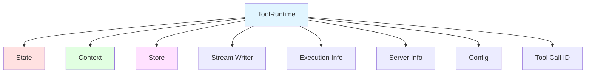

# 工具系统

工具系统扩展了 Agent 的能力，使其能够获取实时数据、执行代码、查询外部数据库并执行现实世界的操作。工具是具有明确定义输入输出的可调用函数，通过对话上下文传递给聊天模型，由模型决定何时调用工具以及提供什么输入参数。

## 一、工具系统概述

### 1.1 工具的作用

工具是 Agent 的能力扩展器，让模型能够：
- 获取实时数据（天气、股票、新闻等）
- 执行代码和计算
- 查询外部数据库和 API
- 与外部系统交互（文件系统、网络服务等）
- 执行现实世界的操作

### 1.2 工作流程

```mermaid
graph LR
    A[用户请求] --> B[LLM 分析]
    B --> C{需要工具?}
}
    C -->|是| D[生成工具调用]
    C -->|否| F[直接响应]
    D --> E[执行工具]
    E --> G[返回结果]
    G --> B
    F --> H[最终输出]

    style B fill:#e1f5ff
    style E fill:#e1f5ff
    style G fill:#fff4e1
```

### 1.3 核心价值

- **统一接口**：通过装饰器模式提供一致的工具定义方式
- **类型安全**：使用类型提示和 Pydantic 模型确保输入验证
- **运行时上下文**：工具可以访问状态、上下文、存储等运行时信息
- **灵活返回**：支持字符串、对象、命令等多种返回类型
- **并行执行**：ToolNode 支持并行执行多个工具调用

## 二、工具定义

### 2.1 基本工具定义

**场景：** 简单的工具，使用装饰器模式

**代码示例：**

```python
"""01_basic_tool_definition.py
基本工具定义使用 @tool 装饰器
"""

from langchain.tools import tool

@tool
def search_database(query: str, limit: int = 10) -> str:
    """Search customer database for records matching query.

    Args:
        query: Search terms to look for
        limit: Maximum number of results to return
    """
    return f"Found {limit} results for '{query}'"

# 使用工具
result = search_database.invoke({"query": "premium", "limit": 5})
print(f"Tool result: {result}")
```

**关键要点：**
- 类型提示是必需的，定义工具的输入模式
- 文档字符串会自动成为工具的描述
- 默认参数可以在工具调用中省略

### 2.2 自定义工具属性

**场景：** 需要更描述性的工具名称和说明

**代码示例：**

```python
"""02_custom_tool_properties.py
自定义工具名称和描述
"""

from langchain.tools import tool

# 自定义工具名称
@tool("web_search")  # 自定义名称
def search(query: str) -> str:
    """Search web for information."""
    return f"Results for: {query}"

# 自定义工具描述
@tool("calculator", description="Performs arithmetic calculations. Use this for any math problems.")
def calc(expression: str) -> str:
    """Evaluate mathematical expressions."""
    return str(eval(expression))

result = calc.invoke({"expression": "2 + 2 * 3"})
print(f"Calculation result: {result}")
```

**最佳实践：**
- 使用 `snake_case` 命名（如 `web_search` 而非 `Web Search`）
- 避免使用空格或特殊字符
- 提供清晰、简洁的工具描述

### 2.3 高级模式定义

**场景：** 复杂的输入验证和约束

**代码示例：**

```python
"""03_advanced_schema_definition.py
使用 Pydantic 模型定义复杂输入
"""

from pydari import BaseModel, Field
from typing import Literal
from langchain.tools import tool

class WeatherInput(BaseModel):
    """Input for weather queries."""
    location: str = Field(description="City name or coordinates")
    units: Literal["celsius", "fahrenheit"] = Field(
        default="celsius",
        description="Temperature unit preference"
    )
    include_forecast: bool = Field(
        default=False,
        description="Include 5-day forecast"
    )

@tool(args_schema=WeatherInput)
def get_weather(location: str, units: str = "celsius", include_forecast: bool = False) -> str:
    """Get current weather and optional forecast."""
    temp = 22 if units == "celsius" else 72
    result = f"Current weather in {location}: {temp} degrees {units[0].upper()}"
    if include_forecast:
        result += "\nNext 5 days: Sunny"
    return result

# 使用默认值
print(get_weather.invoke({"location": "Beijing"}))

# 使用所有参数
result = get_weather.invoke({
    "location": "New York",
    "units": "fahrenheit",
    "include_forecast": True
})
print(result)
```

**优势：**
- 强类型验证
- 默认值管理
- 枚举类型约束
- 详细的字段描述

### 2.4 保留参数名

以下参数名是保留的，不能用作工具参数：
- `config`：用于内部传递 RunnableConfig
- `runtime`：用于 ToolRuntime 参数

## 三、运行时上下文

### 3.1 上下文架构



**上下文组件：**

| 组件 | 描述 | 使用场景 |
|------|------|---------|
| **State** | 短期记忆 - 当前对话的可变数据 | 访问对话历史、跟踪工具调用次数 |
| **Context** | 调用时传递的不可变配置 | 基于用户身份个性化响应 |
| **Store** | 长期记忆 - 跨对话的持久数据 | 保存用户偏好、维护知识库 |
| **Stream Writer** | 工具执行期间发出实时更新 | 为长时间运行的操作显示进度 |
| **Execution Info** | 当前执行的标识和重试信息 | 访问线程/运行 ID、根据重试状态调整行为 |
|) Server Info** | LangGraph Server 的服务器特定元数据 | 访问助手 ID、图 ID 或经过身份验证的用户信息 |
| **Config** | RunnableConfig 用于执行 | 访问回调、标签和元数据 |
| **Tool Call ID** | 当前工具调用的唯一标识符 | 关联工具调用以进行日志和模型调用 |

### 3.2 短期记忆（State）

**场景：** 访问和更新当前对话状态

**代码示例：**

```python
"""04_access_state.py
从工具访问对话状态
"""

from langchain.tools import tool, ToolRuntime
from langchain.messages import HumanMessage

@tool
def get_last_user_message(runtime: ToolRuntime) -> str:
    """Get most recent message from user."""
    messages = runtime.state["messages"]

    # 查找最后一条人类消息
    for message in reversed(messages):
        if isinstance(message, HumanMessage):
            return message.content

    return "No user messages found"

# 访问自定义状态字段
@tool
def get_user_preference(
    pref_name: str,
    runtime: ToolRuntime
) -> str:
    """Get a user preference value."""
    preferences = runtime.state.get("user_preferences", {})
    return preferences.get(pref_name, "Not set")
```

**更新状态：**

```python
"""05_update_state.py
使用 Command 更新代理状态
"""

from langgraph.types import Command
from langchain.tools import tool

@tool
def set_user_name(new_name: str) -> Command:
    """Set user's name in conversation state."""
    return Command(update={"user_name": new_name})

@tool
def increment_counter(runtime: ToolRuntime) -> Command:
    """Increment a counter in state."""
    current = runtime.state.get("counter", 0)
    return Command(update={"counter": current + 1})
```

**注意：** 当工具更新状态变量时，考虑为这些字段定义 reducer。由于 LLM 可以并行调用多个工具，reducer 决定了当相同的状态字段被并发工具调用更新时如何解决冲突。

### 3.3 上下文（Context）

**场景：** 传递不可变的配置数据（用户 ID、会话信息等）

**代码示例：**

```python
"""06_context_example.py
使用上下文传递不可变配置
"""

from dataclasses import dataclass
from langchain_openai import ChatOpenAI
from langchain.agents import create_agent
from langchain.tools import tool, ToolRuntime
import os
from dotenv import load_dotenv

load_dotenv()

USER_DATABASE = {
    "user123": {
        "name": "Alice Johnson",
        "account_type": "Premium",
        "balance": 5000,
        "email": "alice@example.com"
    },
    "user456": {
        "name": "Bob Smith",
        "account_type": "Standard",
        "balance": 1200,
        "email": "bob@example.com"
    }
}

@dataclass
class UserContext:
    user_id: str

@tool
def get_account_info(runtime: ToolRuntime[UserContext]) -> str:
    """Get current user's account information."""
    user_id = runtime.context.user_id

    if user_id in USER_DATABASE:
        user = USER_DATABASE[user_id]
        return f"Account holder: {user['name']}\nType: {user['account_type']}\nBalance: ${user['balance']}"
    return "User not found"

model = ChatOpenAI(
    model=os.getenv("model"),
    temperature=float(os(os.getenv("temperature") or 0.1),
    max_tokens=1000,
    timeout=30,
    api_key=os.getenv("OPENAI_API_KEY"),
    base_url=os.getenv("OPENAI_BASE_URL") if os.getenv("OPENAI_BASE_URL") else None,
)

# 创建具有上下文的代理
agent = create_agent(
    model,
    tools=[get_account_info],
    context_schema=UserContext,
    system_prompt="You are a financial assistant."
)

# 使用上下文调用代理
result = agent.invoke(
    {"messages": [{"role": "user", "content": "What's my current balance?"]},
    context=UserContext(user_id="user123123")
)
```

### 3.4 长期记忆（Store）

**场景：** 跨会话的持久数据存储

**代码示例：**

```python
"""07_long_term_memory.py
使用持久存储进行长期记忆
"""

from typing import Any
from langgraph.store.memory import InMemoryStore
from langchain.tools import tool, ToolRuntime

# 访问记忆
@tool
def get_user_info(user_id: str, runtime: ToolRuntime) -> str:
    """Look up user info."""
    store = runtime.store
    user_info = store.get(("users",), user_id)
    return str(user_info.value) if user_info else "Unknown user"

# 更新记忆
@tool
def save_user_info(user_id: str, user_info: dict[str, Any], runtime: ToolRuntime) -> str:
    """Save user info."""
    store = runtime.store
    store.put(("users",), user_id, user_info)
    return "Successfully saved user info."

# 设置
store = InMemoryStore()
agent = create_agent(
    model,
    tools=[get_user_info, save_user_info],
    store=store
)

# 第一次会话：保存用户信息
agent.invoke({
    "messages": [{"role": "user", "content": "Save user: userid: abc123, name: Foo, age: 25, email: foo@langchain.dev"}]
})

# 第二次会话：获取用户信息
agent.invoke({
    "messages": [{"role": "user", "content": "Get user info for user with id 'abc123'"}]
})
```

**注意：** 对于生产部署，使用持久存储实现（如 `PostgresStore`）而不是 `InMemoryStore`。

### 3.5 流式写入器

**场景：** 为长时间运行的操作提供进度反馈

**代码示例：**

```python
"""08_stream_writer.py
从工具流式传输实时更新
"""

from langchain.tools import tool, ToolRuntime

@tool
def get_weather(city: str, runtime: ToolRuntime) -> str:
    """Get weather for a given city."""
    writer = runtime.stream_writer

    # 在工具执行时流式传输自定义更新
    writer(f"Looking up data for city: {city}")
    writer(f"Acquired data for city: {city}")

    return f"It's always sunny in {city}!"
```

**注意：** 如果在工具内部使用 `runtime.stream_writer`，工具必须在 LangGraph 执行上下文中调用。

### 3.6 执行信息

**场景：** 访问线程 ID、运行 ID 和重试状态

**代码示例：**

```python
"""09_execution_info.py
从工具访问执行上下文
"""

from langchain.tools import tool, ToolRuntime

@tool
def log_execution_context(runtime: ToolRuntime) -> str:
    """Log execution identity information."""
    info = runtime.execution_info
    print(f"Thread: {info.thread_id}, Run: {info.run_id}")
    print(f"Attempt: {info.node_attempt}")
    return "done"
```

**要求：** `deepagents>=0.5.0` 或 `langgraph>=1.1.5`

### 3.7 服务器信息

**场景：** 在 LangGraph Server 上运行时访问元数据

**代码示例：**

```python
"""10_server_info.py
从工具访问 LangGraph Server 信息
"""

from langchain.tools import tool, ToolRuntime

@tool
def get_assistant_scoped_data(runtime: ToolRuntime) -> str:
    """Fetch data scoped to current assistant."""
    server = runtime.server_info
    if server is not None:
        print(f"Assistant: {server.assistant_id}, Graph: {server.graph_id}")
        if server.user is not None:
            print(f"User: {server.user.identity}")
    return "done"
```

**注意：** 当工具不在 LangGraph Server 上运行时（例如，在本地开发或测试期间），`server_info` 为 `None`。

## 四、工具返回类型

### 4.1 返回字符串

**场景：** 工具应提供纯文本供模型读取并在其下一个响应中使用

**代码示例：**

```python
"""12_tool_return_string.py
工具返回字符串用于人类可读的结果
"""

from langchain.tools import tool

@tool
def get_weather(city: str) -> str:
    """Get weather for a city."""
    return f"It is currently sunny in {city}."

# 使用工具
result = get_weather.invoke({"city": "Beijing"})
print(f"Tool result: {result}")
```

**行为：**
- 返回值被转换为 `ToolMessage`
- 模型看到该文本并决定下一步做什么
- 除非模型或另一个工具稍后这样做，否则不会更改代理状态字段

**使用场景：** 当结果自然是可读文本时使用

### 4.2 返回对象

**场景：** 工具生成结构化数据供模型检查

**代码示例：**

```python
"""13_tool_return_object.py
工具返回对象用于结构化结果
"""

from langchain.tools import tool

@tool
def get_weather_data(city: str) -> dict:
    """Get structured weather data for a city."""
    return {
        "city": city,
        "temperature_c": 22,
        "conditions": "sunny",
    }

# 使用工具
result = get_weather_data.invoke({"city": "Shanghai"})
print(f"Temperature: {result['temperature_c']}")
```

**行为：**
- 对象被序列化并作为工具输出发送回
- 模型可以读取特定字段并对它们进行推理
- 像字符串返回一样，这不会直接更新图状态

**使用场景：** 当下游推理受益于显式字段而不是自由格式文本时使用

### 4.3 返回 Command

**场景：** 工具需要更新图状态（例如，设置用户偏好或应用状态）

**代码示例：**

```python
"""14_tool_return_command.py
工具返回 Command 以更新状态
"""

from langchain.messages import ToolMessage
from langchain.tools import ToolRuntime, tool
from langgraph.types import Command

@tool
def set_language(language: str, runtime: ToolRuntime) -> Command:
    """Set preferred response language."""
    return Command(
        update={
                "preferred_language": language,
                "messages": [
                    ToolMessage(
                        content=f"Language set to {language}.",
                        tool_call_id=runtime.tool_call_id,
                    )
                ],
            }
    )
```

**行为：**
- 命令使用 `update` 更新状态
- 更新的状态在同一运行的后续步骤中可用
- 对可能被并行工具调用更新的字段使用 reducer

**使用场景：** 当工具不仅返回数据，而且还更改代理状态时使用

## 五、ToolNode

### 5.1 ToolNode 概述

`ToolNode` 是在 LangGraph 工作流中执行工具的预构建节点。它自动处理并行工具执行、错误处理和状态注入。

**流程图：**

```mermaid
graph LR
    A[LLM 响应] --> B{包含工具调用?}
}
    B -->|是| C[ToolNode]
    B -->|否| F[继续]
    C --> D[并行执行工具]
    D --> E[返回工具结果]
    E --> F

    style C fill:#e1f5ff
    style D fill:#ffe1e1
```

**何时使用：**
- 需要精细控制工具执行模式的自定义工作流
- 创建自定义代理架构
- 需要特定的错误处理逻辑

### 5.2 基本用法

**代码示例：**

```python
"""11_tool_node_basic.py
ToolNode 的基本使用
"""

from langchain.tools import tool
from langgraph.prebuilt import ToolNode
from langgraph.graph import StateGraph, MessagesState, START, END

@tool
def search(query: str) -> str:
    """Search for information."""
    return f"Results for: {query}"

@tool
def calculator(expression: str) -> str:
    """Evaluate a math expression."""
    try:
        return str(eval(expression))
    except:
        return "Invalid expression"

# 创建 ToolNode
tool_node = ToolNode([search, calculator])

# 在图中使用
builder = StateGraph(MessagesState)
builder.add_node("tools", tool_node)
# ... 添加其他节点和边
```

### 5.3 错误处理

**代码示例：**

```python
"""15_error_handling.py
在 ToolNode 中配置错误处理
"""

from langgraph.prebuilt import ToolNode
from langchain.tools import tool

@tool
def risky_tool(input_str: str) -> str:
    """A tool that might fail."""
    if "error" in input_str.lower():
        raise ValueError("Simulated error")
    return f"Processed: {input_str}"

# 默认：捕获调用错误，重新引发执行错误
tool_node_default = ToolNode([risky_tool])

# 捕获所有错误并将错误消息返回给 LLM
tool_node_catch_all = ToolNode([risky_tool], handle_tool_errors=True)

# 自定义错误消息
tool_node_custom_msg = ToolNode(
    [risky_tool],
    handle_tool_errors="Something went wrong, please try again."
)

# 自定义错误处理程序
def handle_error(e: ValueError) -> str:
    return f"Invalid input: {e}"

tool_node_custom_handler = ToolNode([risky_tool], handle_tool_errors=handle_error)

# 仅捕获特定异常类型
tool_node_specific = ToolNode([risky_tool], handle_tool_errors=(ValueError, TypeError))
```

### 5.4 条件路由

**场景：** 基于 LLM 是否进行了工具调用进行条件路由

**代码示例：**

```python
"""16_tools_condition.py
使用 tools_condition 进行条件路由
"""

from langgraph.prebuilt import ToolNode, tools_condition
from langchain.tools import tool
from langgraph.graph import StateGraph, MessagesState, START, END

@tool
def search(query: str) -> str:
    """Search for information."""
    return f"Results for: {query}"

@tool
def calculator(expression: str) -> str:
    """Evaluate a math expression."""
    try:
        return str(eval(expression))
    except:
        return "Invalid expression"

# 定义调用 LLM 的函数
def call_llm(state: MessagesState):
    """Call LLM with current messages."""
    from llm_config import default_llm
    model_with_tools = default_llm.bind_tools([search, calculator])
    return {"messages": [model_with_tools.invoke(state["messages"]))}

# 创建具有条件路由的图
builder = StateGraph(MessagesState)
builder.add_node("llm", call_llm)
builder.add_node("tools", ToolNode([search, calculator]))

builder.add_edge(START, "llm")
builder.add_conditional_edges("llm", tools_condition)  # 路由到 "tools" 或 END
builder.add_edge("tools", "llm")

graph = builder.compile()
```

**流程图：**

```mermaid
graph TD
    A[START] --> B[LLM]
    B --> C{tools_condition}
    C -->|有工具调用| D[ToolNode]
    C -->|无工具调用| E[END]
    D --> B

   与其他节点一起构成完整的 Agent 执行流程
```

## 六、最佳实践与场景

### 6.1 工具设计原则

| 原则 | 说明 |
|------|------|
| **单一职责** | 每个工具应执行单一、明确定义的任务 |
| **清晰的命名** | 使用描述性的 snake_case 名称（如 `get_weather`） |
| **类型安全** | 始终使用类型提示和 Pydantic 模型 |
| **详细的文档** | 提供清晰的工具描述和参数说明 |
| **错误处理** | 在工具内部处理预期错误，将意外错误传递给 ToolNode |

### 6.2 返回类型选择

| 返回类型 | 使用场景 | 示例 |
|---------|---------|------|
| **String** | 人类可读的结果 | 天气查询、搜索结果 |
| **Object** | 结构化数据供模型分析 | JSON 数据库响应、API 结果 |
| **Command** | 需要更新状态 | 设置用户偏好、更新计数器 |

### 6.3 上下文使用指南

| 上下文类型 | 生命周期 | 使用场景 |
|-----------|---------|---------|
| **State** | 当前对话 | 对话历史、临时计数器 |
| **Context** | 单次调用 | 用户 ID、会话配置 |
| **Store** | 跨会话持久 | 用户偏好、知识库 |

### 6.4 常见陷阱

- **保留参数名**：避免使用 `config` 或 `runtime` 作为工具参数
- **状态冲突**：并行工具调用可能冲突，使用 reducer 解决
- **错误掩盖**：不要在工具内部捕获所有错误，让 ToolNode 处理
- **过度使用 Command**：只在需要更新状态时使用，否则返回字符串或对象
- **忘记 tool_call_id**：返回包含 ToolMessage 的 Command 时，必须提供 tool_call_id

## 七、完整工作流程示例

以下是一个完整的工具系统工作流程，展示了从定义工具到在代理中使用的全过程：

```python
"""完整工具系统工作流程示例
"""

from dataclasses import dataclass
from typing import Any, Literal
from pydantic import BaseModel, Field
from langchain.tools import tool, ToolRuntime
from langchain_openai import ChatOpenAI
from langchain.agents import create_agent
from langgraph.store.memory import InMemoryStore
from langchain.messages import ToolMessage
from langgraph.types import Command
from dotenv import load_dotenv
import os

load_dotenv()

# 定义用户上下文
@dataclass
class UserContext:
    user_id: str

# 定义工具
@tool
def get_weather(
    location: str,
    units: Literal["celsius", "fahrenheit"] = "celsius",
    include_forecast: bool = False
) -> str:
    """Get current weather and optional forecast."""
    temp = 22 if units == "celsius" else 72
    result = f"Current weather in {location}: {temp} degrees {units[0].upper()}"
    if include_forecast:
        result += "\nNext 5 days: Sunny"
    return result

@tool
def save_user_preference(
    pref_name: str,
    pref_value: str,
    runtime: ToolRuntime
) -> str:
    """Save user preference to long-term memory."""
    store = runtime.store
    store.put(("preferences",), pref_name, {"value": pref_value})
    return f"Preference {pref_name} saved."

@tool
def get_user_preference(
    pref_name: str,
    runtime: ToolRuntime
) -> str:
    """Get user preference from long-term memory."""
    store = runtime.store
    pref = store.get(("preferences",), pref_name)
    return str(pref.value.get("value", "Not set")) if pref else "Not set"

@tool
def set_notification_enabled(
    enabled: bool,
    runtime: ToolRuntime
) -> Command:
    """Set notification preference in state."""
    return Command(
        update={
                "notifications_enabled": enabled,
                "messages": [
                    ToolMessage(
                        content=f"Notifications {'enabled' if enabled else 'disabled'}.",
                        tool_call_id=runtime.tool_call_id,
                    )
                ],
            }
    )

# 配置模型
model = ChatOpenAI(
    model=os.getenv("model"),
    temperature=float(os.getenv("temperature") or 0.1) or 0.1),
    max_tokens=1000,
    timeout=30,
    api_key=os.getenv("OPENAI_API_KEY"),
    base_url=os.getenv("OPENAI_BASE_URL") if os.getenv("OPENAI_BASE_URL") else None,
)

# 配置存储
store = InMemoryStore()

# 创建代理
agent = create_agent(
    model,
    tools=[get_weather, save_user_preference, get_user_preference, set_notification_enabled],
    store=store,
    context_schema=UserContext,
    system_prompt="""You are a helpful personal assistant with access to:
1. Weather information
2. User preferences (long-term memory)
3. Notification settings (short-term state)

Help users with their requests and remember their preferences.
"""
)

# 使用示例
result = agent.invoke(
    {
        "messages": [
                {"role": "user", "content": "What's the weather in Beijing?"}
            ]
    },
    context=UserContext(user_id="user123")
)

print(result["messages"][-1].content)
```

这个完整示例展示了工具系统的核心功能：
1. 多种工具定义方式（基本、带约束、更新状态）
2. 运行时上下文访问（State、Context、Store）
3. 多种返回类型（字符串、Command）
4. 长期记忆集成
5. 上下文传递

工具系统是 LangChain Agent 能力的核心扩展，通过它，Agent 可以与外部世界交互，执行复杂的任务，并维护持久状态。
