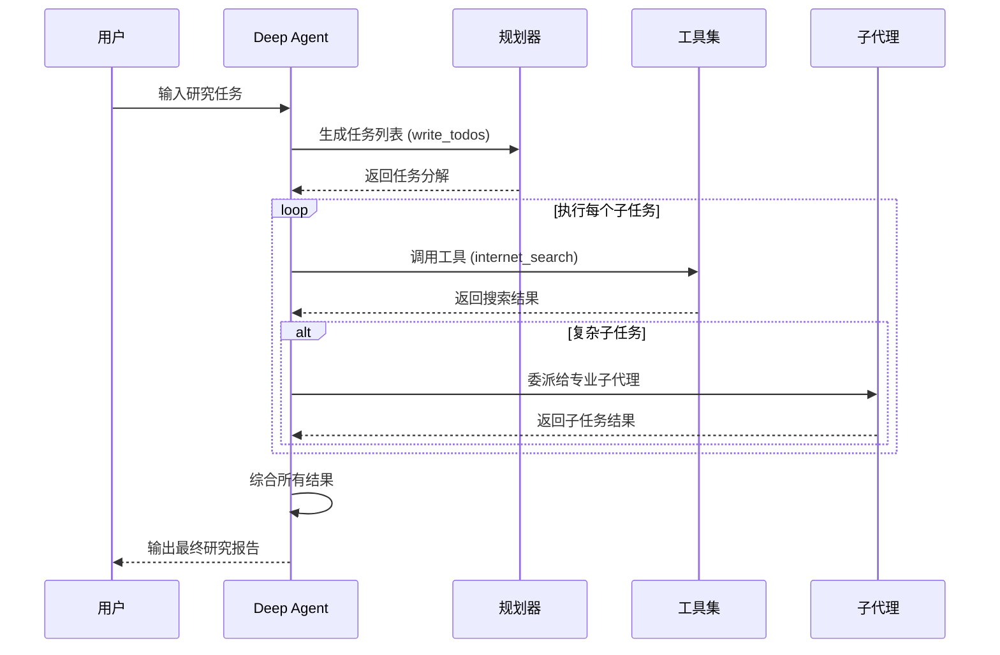

# 快速入门 - 代码摘要

## 1. 工具定义范式

### 核心代码

```python
# 01_search_tool.py
from typing import Literal
from tavily import TavilyClient

tavily_client = TavilyClient(api_key=os.environ["TAVILY_API_KEY"])

def internet_search(
    query: str,
    max_results: int = 5,
    topic: Literal["general", "news", "finance"] = "general",
    include_raw_content: bool = False,
):
    """Run an internet search using Tavily API."""
    return tavily_client.search(
        query,
        max_results=max_results,
        include_raw_content=include_raw_content,
        topic=topic,
    )
```

### 使用的范式

- **类型注解驱动 Schema 生成**: 利用 Python 类型注解（`Literal`、`str`、`int`、`bool`）自动生成工具调用 schema
- **外部 API 封装**: 将 Tavily Search API 封装为 Agent 可调用的工具
- **文档字符串即描述**: 函数的 docstring 作为工具描述，帮助 Agent 理解工具用途

### 使用场景

| 场景    | 说明                |
| ----- | ----------------- |
| 互联网搜索 | 获取实时信息、新闻、研究资料    |
| 信息收集  | 为复杂研究任务收集背景资料     |
| 事实验证  | 验证 Agent 生成内容的真实性 |

---

## 2. 代理创建范式

### 核心代码

```python
# 02_create_agent.py
from deepagents import create_deep_agent

# 系统提示设计
research_instructions = """You are an expert researcher. Your job is to conduct thorough research and then write a polished report.

You have access to an internet search tool as your primary means of gathering information.

## `internet_search`

Use this to run an internet search for a given query...
"""

# 创建代理
agent = create_deep_agent(
    model="google_genai:gemini-3.1-pro-preview",
    tools=[internet_search],
    system_prompt=research_instructions,
)
```

### 使用的范式

- **系统提示工程**: 通过结构化提示词定义代理角色和工作流程
- **工具注入**: 将自定义工具传递给代理
- **模型配置策略**: 支持字符串格式（`provider:model`）或模型实例两种方式

### 使用场景

| 场景   | 说明          |
| ---- | ----------- |
| 研究代理 | 执行市场调研、竞品分析 |
| 信息聚合 | 收集多来源信息并整合  |
| 报告生成 | 自动生成结构化研究报告 |

---

## 3. 代理调用范式

### 核心代码

```python
# 03_invoke_agent.py - 基础调用
result = agent.invoke({"messages": [{"role": "user", "content": "What is LangChain?"}]})
print(result["messages"][-1].content)

# 03_invoke_agent.py - 流式调用
for chunk in agent.stream({"messages": [{"role": "user", "content": "What is LangGraph?"}]}):
    if "messages" in chunk and chunk["messages"]:
        message = chunk["messages"][-1]
        if hasattr(message, 'content') and message.content:
            print(message.content, end="")

# 03_invoke_agent.py - 事件流
async for event in agent.astream_events({...}, version="v2"):
    event_type = event.get("event")
    if event_type == "on_tool_start":
        print(f"🔧 Tool Called: {event_name}")
    elif event_type == "on_tool_end":
        print(f"✓ Tool Completed: {event_name}")
```

### 使用的范式

- **同步调用**: 简单场景，一次性获取结果
- **流式输出**: 长时间任务的实时反馈
- **事件驱动调试**: 观察代理内部行为（工具调用、子代理活动）

### 使用场景

| 场景     | 推荐模式    | 说明        |
| ------ | ------- | --------- |
| CLI 工具 | 流式输出    | 用户体验更佳    |
| API 服务 | 同步调用    | 简化实现      |
| 调试监控   | 事件流     | 观察内部状态    |
| 生产环境   | 同步 + 日志 | 平衡性能与可观测性 |

---

## 流程图



---

## 完整流程代码

```python
# 完整示例：从 0 到 1 创建并运行研究代理

import os
from typing import Literal
from tavily import TavilyClient
from deepagents import create_deep_agent

# 1. 配置 API Key
os.environ["TAVILY_API_KEY"] = "your-tavily-api-key"
os.environ["GOOGLE_API_KEY"] = "your-google-api-key"

# 2. 定义搜索工具
tavily_client = TavilyClient(api_key=os.environ["TAVILY_API_KEY"])

def internet_search(
    query: str,
    max_results: int = 5,
    topic: Literal["general", "news", "finance"] = "general",
    include_raw_content: bool = False,
):
    """Run an internet search using Tavily API."""
    return tavily_client.search(
        query,
        max_results=max_results,
        include_raw_content=include_raw_content,
        topic=topic,
    )

# 3. 定义系统提示
research_instructions = """You are an expert researcher. Your job is to conduct thorough research and then write a polished report.

You have access to an internet search tool as your primary means of gathering information.

## `internet_search`

Use this to run an internet search for a given query. You can specify the max number of results to return, the topic, and whether raw content should be included.
"""

# 4. 创建代理
agent = create_deep_agent(
    model="google_genai:gemini-3.1-pro-preview",
    tools=[internet_search],
    system_prompt=research_instructions,
)

# 5. 运行代理
result = agent.invoke({
    "messages": [{"role": "user", "content": "Research the latest developments in AI agents and write a summary report."}]
})

# 6. 输出结果
print(result["messages"][-1].content)
```

---

## 范式使用场景总结

| 范式      | 适用场景         | 优势                     |
| ------- | ------------ | ---------------------- |
| 工具定义    | 需要扩展代理能力时    | 类型注解自动生成 schema，减少手动配置 |
| 系统提示设计  | 需要引导代理行为时    | 灵活定义角色、流程、约束           |
| 字符串模型配置 | 快速原型开发       | 简洁，无需导入额外依赖            |
| 模型实例配置  | 需要精细控制模型参数   | 支持温度、max_tokens 等高级配置  |
| 同步调用    | 简单任务、API 服务  | 实现简单，易于集成              |
| 流式输出    | 长时间任务、CLI 工具 | 实时反馈，用户体验好             |
| 事件流     | 调试、监控、可观测性   | 完整追踪代理内部状态             |
