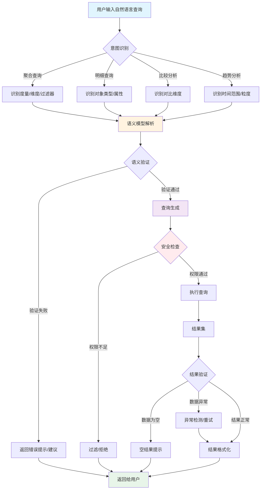
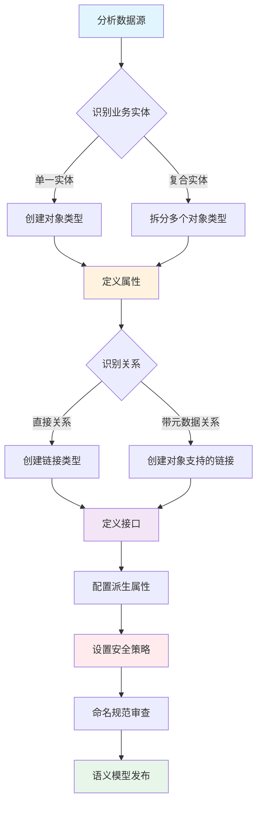
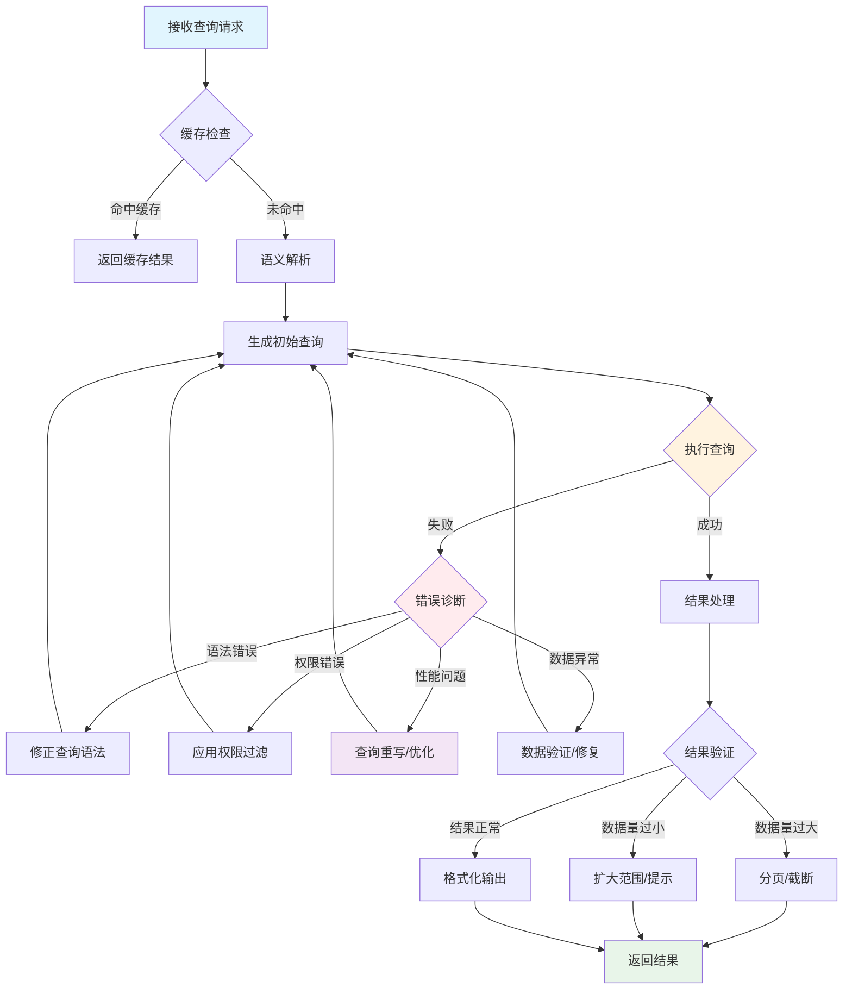
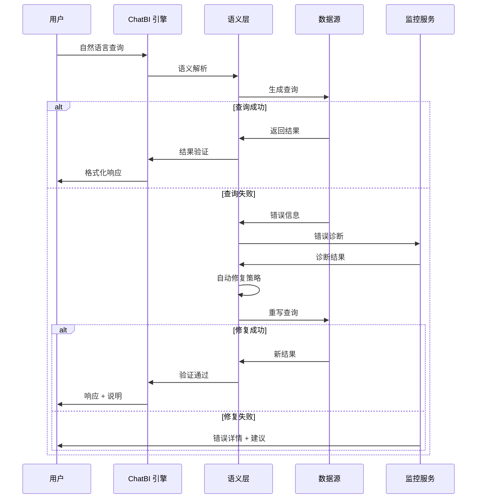

# ChatBI 语义层设计文档

> 本设计基于 Palantir Ontology 的四大核心原则（数据、逻辑、行动、安全），借鉴其领域驱动设计思想，构建一个以决策为中心的 ChatBI 语义层。

## 1. 设计目标

ChatBI 语义层的核心目标是：**让自然语言查询能够理解业务语义并生成正确的数据分析结果**。

关键设计原则：
- **领域驱动设计**：语义层建模现实业务实体和关系，而非简单映射数据库表
- **数据与逻辑分离**：语义概念独立于物理存储结构
- **可扩展性**：通过接口和组合实现语义层扩展
- **安全治理**：细粒度访问控制集成到语义层

## 2. 总体架构

ChatBI 语义层采用 Ontology-first 架构，包含以下核心组件：

```
┌─────────────────────────────────────────────────────────────┐
│                    自然语言查询层                              │
│                 (User Input / LLM Interface)                 │
└─────────────────────┬───────────────────────────────────────┘
                      │
                      ▼
┌─────────────────────────────────────────────────────────────┐
│                   语义理解层                                   │
│  ┌─────────────┐  ┌─────────────┐  ┌─────────────────────┐  │
│  │ 意图识别     │  │ 实体抽取     │  │ 关系推理引擎         │  │
│  │ Intent Parse│  │ Entity Extract│  │ Relationship Engine │  │
│  └─────────────┘  └─────────────┘  └─────────────────────┘  │
└─────────────────────┬───────────────────────────────────────┘
                      │
                      ▼
┌─────────────────────────────────────────────────────────────┐
│                   语义模型层 (Ontology)                        │
│  ┌─────────────┐  ┌─────────────┐  ┌─────────────────────┐  │
│  │ 对象类型     │  │ 链接类型     │  │ 动作类型             │  │
│  │ Object Types│  │ Link Types  │  │ Action Types        │  │
│  └─────────────┘  └─────────────┘  └─────────────────────┘  │
│  ┌─────────────┐  ┌─────────────┐  ┌─────────────────────┐  │
│  │ 属性映射     │  │ 派生属性     │  │ 接口定义             │  │
│  │ Properties  │  │ Derived Prop│  │ Interfaces          │  │
│  └─────────────┘  └─────────────┘  └─────────────────────┘  │
└─────────────────────┬───────────────────────────────────────┘
                      │
                      ▼
┌─────────────────────────────────────────────────────────────┐
│                   查询生成层                                   │
│  ┌─────────────┐  ┌─────────────┐  ┌─────────────────────┐  │
│  │ SQL/DSL生成 │  │ 查询优化     │  │ 安全过滤             │  │
│  │ Query Gen   │  │ Optimization│  │ Security Filter     │  │
│  └─────────────┘  └─────────────┘  └─────────────────────┘  │
└─────────────────────┬───────────────────────────────────────┘
                      │
                      ▼
┌─────────────────────────────────────────────────────────────┐
│                   数据源层                                     │
│         (Database / API / Data Lake / Stream)                │
└─────────────────────────────────────────────────────────────┘
```

## 3. 核心流程

### 3.1 语义查询主流程



### 3.2 语义模型构建流程



### 3.3 查询优化与问题解决流程



## 4. 语义模型核心设计

### 4.1 对象类型设计

遵循 Palantir 领域驱动设计原则，对象类型应代表现实世界中的业务实体，而非数据库表。

| 对象类型 | 描述 | 示例属性 |
|---------|------|---------|
| `Customer` | 客户实体 | customerId, name, email, tier |
| `Order` | 订单实体 | orderId, orderDate, status |
| `Product` | 产品实体 | productId, name, category, price |
| `Employee` | 员工实体 | employeeId, name, department, role |
| `Facility` | 设施实体 | facilityId, name, address, capacity |

### 4.2 链接类型设计

| 链接 | 类型 | 描述 |
|------|------|------|
| Customer → Order | 1:N | 客户拥有的订单 |
| Order → Product | M:N | 订单包含的产品 |
| Employee → Department | N:1 | 员工所属部门 |
| Order → Customer | N:1 | 订单归属客户 |
| Product → Category | N:1 | 产品所属分类 |

### 4.3 接口设计

通过接口实现可复用的抽象，避免重复定义：

| 接口 | 描述 | 实现类型 |
|------|------|---------|
| `Trackable` | 可追踪实体 | Order, Product, Customer |
| `Billable` | 可计费实体 | Order, Product |
| `Assignable` | 可分配实体 | Employee, Facility |
| `Reportable` | 可报告实体 | Customer, Order, Product |

### 4.4 派生属性设计

| 对象类型 | 派生属性 | 计算逻辑 |
|---------|---------|---------|
| Customer | totalOrders | 链接 Order 数量 |
| Customer | totalSpent | 链接 Order 金额汇总 |
| Order | itemCount | 链接 Product 数量 |
| Department | employeeCount | 链接 Employee 数量 |
| Facility | utilizationRate | 实际使用量 / 容量 |

## 5. 问题解决机制

### 5.1 问题分类

| 问题类型 | 症状 | 解决方案 |
|---------|------|---------|
| 语义歧义 | 用户查询有多种理解 | 请求澄清/上下文推断 |
| 数据缺失 | 查询结果为空 | 扩大范围/提示用户 |
| 权限不足 | 部分数据不可见 | 过滤/提示权限不足 |
| 性能问题 | 查询超时 | 重写查询/使用缓存 |
| 逻辑错误 | 结果不符合业务规则 | 校验/重试/人工介入 |

### 5.2 自动修复流程



### 5.3 安全控制

| 安全层 | 控制内容 | 示例 |
|-------|---------|------|
| 行级安全 | 用户可见的数据范围 | 区域经理只能查看本区域数据 |
| 列级安全 | 用户可见的属性 | 临床笔记仅对护理团队可见 |
| 单元格级安全 | 行列交叉的安全控制 | VIP患者病历仅高级护理团队可见 |
| 动态权限 | 运行时计算的权限 | 基于用户角色/目的/标记的策略 |

## 6. 实施路径

### Phase 1: 基础语义模型
- 定义核心业务对象类型
- 建立基本链接关系
- 实现简单查询解析

### Phase 2: 增强语义能力
- 添加接口和派生属性
- 实现复杂查询（聚合、比较、趋势）
- 集成安全控制

### Phase 3: 智能优化
- 引入缓存机制
- 实现自动查询优化
- 添加问题诊断和自动修复

### Phase 4: 高级功能
- 多数据源集成
- 预测性分析
- 人机协作决策流

## 7. 反模式与注意事项

### 7.1 避免的反模式

| 反模式 | 问题 | 正确做法 |
|-------|------|---------|
| 1:1 映射数据库表 | 语义丢失 | 按业务领域建模 |
| 属性名直接沿用数据库列名 | 不直观 | 使用业务语言命名 |
| 忽视关系元数据 | 关系信息丢失 | 使用对象支持的链接 |
| 硬编码安全逻辑 | 难以维护 | 在语义层定义安全策略 |
| 过度复制对象类型 | 维护负担 | 使用接口统一抽象 |

### 7.2 命名规范

| 元素   | 规范      | 示例                         |
| ---- | ------- | -------------------------- |
| 对象类型 | 单数、具体名词 | Customer, Order, Product   |
| 属性   | 简洁自明    | lastInspectionDate, status |
| 链接   | 双向可读    | department / employees     |
| 日期   | 统一格式    | createdDate, updatedDate   |

## 8. 总结

本 ChatBI 语义层设计借鉴了 Palantir Ontology 的核心理念：

1. **以决策为中心**：语义层不仅仅是数据映射，而是支持业务决策的完整模型
2. **领域驱动设计**：按业务领域建模，而非按技术实现建模
3. **组合优于继承**：通过接口实现多态，保持语义层灵活可扩展
4. **安全内建**：将安全策略作为语义层的一等公民

通过这套设计，ChatBI 能够实现：
- 自然语言到数据分析的精准转换
- 可复用的语义资产积累
- 安全可控的数据访问
- 持续优化的查询能力
