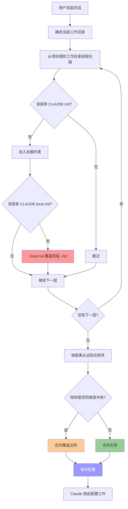

# Claude Code 配置文件加载机制详解

> 搞懂 CLAUDE.md 的优先级，让 AI 在不同目录下自动切换"人格"。

---

## 1. 背景：为什么需要多层配置？

先打个比方。你在一家公司上班：

```
公司有一份《员工手册》          ← 全员通用规则
你的部门有一份《部门规范》       ← 部门特有规则
你自己有一份《个人备忘》         ← 你的私人习惯

当三者冲突时，谁说了算？
答案：离你最近的那个。

  公司手册："统一用钉钉"
  部门规范："我们用飞书"
  个人备忘："我本地测试用微信"

  → 最终你用微信（最近的说了算）
```

Claude Code 的 CLAUDE.md 配置体系，逻辑完全一样：

```
问题                    解决方案
───────────────────    ─────────────────────────
团队规范不统一           根目录 CLAUDE.md（全员共享）
个人习惯被团队覆盖       CLAUDE.local.md（个人私有，不提交 git）
Monorepo 子项目各有技术栈  子目录 CLAUDE.md（模块特定配置）
```

---

## 2. 核心结论：最近原则

### 一句话

> **离当前工作目录最近的配置文件，优先级最高。**

### 优先级排序（从低到高）

```
优先级从低 → 高：

  /CLAUDE.md             ← 最远（团队共享规则）
  /CLAUDE.local.md       ← 同层但更近（个人覆盖）
  /foo/CLAUDE.md         ← 距离更近（子目录规则）
  /foo/CLAUDE.local.md   ← 最近（子目录私有配置）
       ▲
       │
  最终说了算的是这个
```

### "近"的两个维度

用一张图理解：

```
                    优先级高 ▲
                            │
    .local.md  ─────────────────  .md        ← 维度一：类型（私有 > 共享）
                            │
    子目录 /foo/ ───────────────  根目录 /    ← 维度二：距离（近 > 远）
                            │
                    优先级低 ▼
```

| 维度 | 规则 | 原因 |
|------|------|------|
| **距离** | 子目录 > 父目录 | 物理路径上离工作目录更近 |
| **类型** | `.local.md` > `.md` | 私有配置比共享配置更贴近个人意图 |

**综合判断**：距离优先，同层内类型优先。

---

## 3. 加载机制详解

### 扫描路径

> 从项目根目录出发，沿路径**向下**逐层扫描到当前工作目录，越靠近工作目录的文件优先级越高。

```
扫描方向：

  项目根 ──────→ 当前工作目录
  （从这里开始）      （到这里结束）

  只扫"路径上的"目录，不扫旁支
```

### 合并逻辑（两步）

```
Step 1: 同层内 → .local.md 覆盖 .md
Step 2: 跨层间 → 子层覆盖父层
```

### 关键理解：不会向下扫描

```
project/
├── CLAUDE.md          ✅ 在根→工作目录的路径上，会加载
├── foo/
│   ├── CLAUDE.md      ✅ 在路径上，会加载（假设工作目录在 foo/bar/）
│   └── bar/           ← 工作目录在这里
│       └── CLAUDE.md  ❌ 这是工作目录自身，但不会再往下扫
└── other/
    └── CLAUDE.md      ❌ 不在路径上，完全忽略
```

---

## 4. 四种场景图解

### 实验目录结构

```
test-project/                    ← 项目根目录
├── CLAUDE.md                    # 内容："包管理器用 npm"
├── CLAUDE.local.md              # 内容："包管理器用 yarn"
└── foo/
    ├── CLAUDE.md                # 内容："包管理器用 cnpm"
    ├── CLAUDE.local.md          # 内容："包管理器用 pnpm"
    └── bar/                     ← 空目录
```

---

### 场景 1：在根目录工作

**工作目录**：`test-project/`

```
扫描范围：只有根目录这一层

  /CLAUDE.md        → npm     ← 加载（远）
  /CLAUDE.local.md  → yarn    ← 加载（近，覆盖 npm）
  /foo/             → ❌ 不在路径上，跳过
```

| 文件 | 类型 | 内容 | 结果 |
|------|------|------|------|
| `/CLAUDE.md` | 共享 | npm | 被覆盖 |
| `/CLAUDE.local.md` | 私有 | yarn | **最终生效** ✅ |

**最终答案**：`yarn`

> **要点**：`foo/` 下的文件虽然存在，但不在"根→工作目录"的路径上，所以不加载。

---

### 场景 2：在 foo/bar/ 工作（完整四层叠加）

**工作目录**：`test-project/foo/bar/`

```
扫描路径：根 → foo → bar

  根目录层：
    /CLAUDE.md        → npm     ← ①最远
    /CLAUDE.local.md  → yarn    ← ②同层覆盖

  foo 层：
    /foo/CLAUDE.md        → cnpm    ← ③更近，覆盖②
    /foo/CLAUDE.local.md  → pnpm    ← ④最近，覆盖③

  bar 层：
    （空，无配置文件）
```

**覆盖链条**：

```
npm → yarn → cnpm → pnpm
 ↑      ↑      ↑      ↑
最远   近    更近   最近（最终生效）
```

**最终答案**：`pnpm`

---

### 场景 3：在 foo/ 工作

**工作目录**：`test-project/foo/`

结果与场景 2 相同（`pnpm`），因为 `bar/` 没有自己的配置文件，不影响覆盖链。

---

### 场景 4：不同维度的规则不冲突，合并生效

**目录结构**：

```
test-project/
├── CLAUDE.md              # "禁止使用 console.log"
└── foo/
    ├── CLAUDE.md          # "优先使用 TypeScript"
    └── bar/               ← 工作目录
```

| 层级 | 文件 | 规则维度 | 内容 | 结果 |
|------|------|---------|------|------|
| 根 | `/CLAUDE.md` | Lint 规范 | 禁止 console.log | ✅ 生效 |
| foo | `/foo/CLAUDE.md` | 语言选择 | 优先 TypeScript | ✅ 生效 |

**最终答案**：禁止 console.log **+** 优先 TypeScript（两条规则合并）

> **核心规则**：
> - 同维度规则（都是包管理器）→ 近的覆盖远的
> - 不同维度规则（lint 和语言）→ 不冲突，都生效

---

## 5. 流程图



---

## 6. 实际场景最佳实践

### 场景 A：团队协作 + 个人偏好

```
项目根目录/
├── CLAUDE.md              # 团队：npm + 缩进 2 空格 + 禁止 console.log
└── CLAUDE.local.md        # 个人：pnpm（不提交 git）
```

**效果**：

| 你问 Claude | 答案 | 原因 |
|------------|------|------|
| "包管理器用什么？" | pnpm | `.local.md` 更近，覆盖 npm |
| "缩进规则？" | 2 空格 | `.local.md` 没提缩进，远的规则保留 |
| "能用 console.log 吗？" | 不能 | `.local.md` 没提这条，远的规则保留 |

---

### 场景 B：Monorepo 多模块

```
monorepo/
├── CLAUDE.md                    # 全仓库：TypeScript 严格模式
├── frontend/
│   ├── CLAUDE.md                # React 18 + Tailwind
│   └── CLAUDE.local.md          # 个人：开启 React DevTools
└── backend/
    ├── CLAUDE.md                # NestJS + PostgreSQL
    └── CLAUDE.local.md          # 个人：开启 SQL 日志
```

| 工作目录 | 加载文件（按距离远→近） | 最终配置 |
|---------|----------------------|---------|
| `monorepo/` | 根 `.md` | TypeScript 严格模式 |
| `monorepo/frontend/` | 根 `.md` → frontend `.md` → frontend `.local` | TS 严格 + React 18 + Tailwind + DevTools |
| `monorepo/backend/` | 根 `.md` → backend `.md` → backend `.local` | TS 严格 + NestJS + PostgreSQL + SQL 日志 |

> **价值**：切换工作目录时，Claude 自动应用对应模块的配置，无需手动切换。

---

### 场景 C：临时调试

```
项目/
├── CLAUDE.md              # 生产：严格 lint，无调试输出
└── CLAUDE.local.md        # 调试：关闭 lint，verbose 日志
```

`.local.md` 不提交 git，调试完删掉即可，不影响团队。

---

## 7. 文件分工速查表

| 文件 | 放什么 | 提交 git？ | 优先级 |
|------|--------|:---------:|:------:|
| **根/CLAUDE.md** | 团队规范、安全红线、架构原则 | ✅ | 最低 |
| **根/CLAUDE.local.md** | 个人习惯、调试偏好 | ❌ | ↑ |
| **子目录/CLAUDE.md** | 模块技术栈、框架选择 | ✅ | ↑ |
| **子目录/CLAUDE.local.md** | 模块调试配置 | ❌ | 最高 |

### 内容示例

**CLAUDE.md（团队共享）**：

```markdown
# 项目规范
- 编码语言：TypeScript 严格模式
- 包管理器：npm
- 缩进：2 空格
- 禁止：console.log、硬编码 secret
- 测试覆盖率：≥ 80%
```

**CLAUDE.local.md（个人私有）**：

```markdown
# 个人偏好
- 包管理器：pnpm（覆盖团队 npm）
- 调试模式：开启 verbose 日志
- 临时关闭：eslint 部分规则
```

---

## 8. 常见疑问

### Q1：距离近 vs 类型近，谁优先？

当 `子目录/CLAUDE.md` 和 `父目录/CLAUDE.local.md` 冲突时：

```
/CLAUDE.local.md    → "用 yarn"    ← 类型近（.local），但距离远
/foo/CLAUDE.md      → "用 cnpm"    ← 类型远（.md），但距离近
```

**答案：距离优先。** 加载顺序是：

```
根 .md → 根 .local(yarn) → foo .md(cnpm)
                               ↑
                         距离更近，覆盖 yarn
```

最终结果是 `cnpm`。

### Q2：工作目录下的子目录配置会加载吗？

不会。Claude 只扫描"根→工作目录"这条路径，不会扫工作目录的子目录。

### Q3：如果同层只有 .local.md 没有 .md 呢？

正常加载。`.local.md` 不要求 `.md` 必须存在。

---

## 9. 一句话总结

> **最近原则**：从项目根到当前工作目录逐层扫描，离你最近的配置文件说了算——同层内 `.local` 比 `.md` 近，跨层间子目录比父目录近，不同维度的规则不冲突则合并。

---

*参考资料：[官方文档 - CLAUDE.md 加载顺序](https://code.claude.com/docs/en/memory#claude-md-files)*
