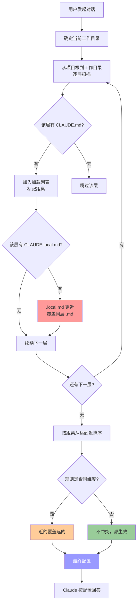

# CLAUDE.md 加载顺序说明

> 本文基于实验验证，总结 Claude Code 多配置文件优先级机制的原理、场景与最佳实践。
[官网CLAUDE.md加载顺序](https://code.claude.com/docs/en/memory#claude-md-files)
---

## 一、核心结论

### 一句话概括

> **离当前工作目录最近的配置文件优先。**

### 优先级排序（从低到高）

```
1. /CLAUDE.md             ← 最远（项目级共享配置）
2. /CLAUDE.local.md       ← 同层更近（覆盖根级 .md）
3. /foo/CLAUDE.md         ← 更近（覆盖根级所有）
4. /foo/CLAUDE.local.md   ← 最近（子目录私有配置，最终生效）
```

### 什么是"近"？

两个维度的"近"：

```
                    更近 ▲
                         │
        .local.md  ────────────  .md    ← 类型近
                         │
        子目录/foo/ ──────────  根目录/   ← 距离近
                         │
                    更远 ▼
```

| 维度 | 谁更"近" | 为什么 |
|------|---------|--------|
| **距离近** | 子目录 > 父目录 | 物理路径上离工作目录更近 |
| **类型近** | `.local.md` > `.md` | 私有配置比共享配置更贴近个人意图 |

**综合判断**：距离近的优先，同层内类型近的优先。

---

## 二、核心机制：最近原则如何工作？

### 加载规则（一句话）

> **从项目根目录出发，沿着路径向下扫描到当前工作目录，越靠近工作目录的文件越"近"，优先级越高。**

### 合并逻辑

```
第 1 步：同层内，.local.md 比 .md 更"近" → .local 覆盖 .md
第 2 步：跨层间，子层比父层更"近" → 子层覆盖父层
```

### ⚠️ 关键理解：什么是"不向下扫描"？

> **Claude 只从根目录扫到当前工作目录这一条路径，不会扫工作目录的子目录。**

```
test-project/
├── CLAUDE.md          ✅ 在路径上，会加载
├── foo/
│   ├── CLAUDE.md      ✅ 在路径上，会加载
│   └── bar/
│       └── CLAUDE.md   不在路径上（工作目录就是 bar，不会往下扫）
```

---

## 三、四种场景详解（最近原则贯穿）

### 实验目录结构（全量文件）

```
test-project/                    ← 项目根目录
├── CLAUDE.md                    # "包管理器用 npm"
├── CLAUDE.local.md              # "包管理器用 yarn"
└── foo/
    ├── CLAUDE.md                # "包管理器用 cnpm"
    ├── CLAUDE.local.md          # "包管理器用 pnpm"
    └── bar/                     ← 空目录，在此发起对话
```

---

### 场景 1：在根目录工作

**工作目录**：`test-project/`

```
根目录/          ← 工作目录在这里
── CLAUDE.md    ← 同层，加载
├── CLAUDE.local.md  ← 同层，更近（.local），优先
└── foo/         ← 在子目录，更远，不加载
```

**实际加载的文件**：

| 加载顺序 | 文件 | 距离 | 内容 | 结果 |
|---------|------|------|------|------|
| 1 | `/CLAUDE.md` | 同层（远） | npm | 生效 |
| 2 | `/CLAUDE.local.md` | 同层（近） | yarn | **更近，覆盖 npm，最终生效** |

**最终答案**：yarn

> ⚠️ **最近原则体现**：`foo/` 下的文件虽然在项目里，但**不在从根到工作目录的路径上**，所以不会加载。最近的只有根层的两个文件。

---

### 场景 2：在子目录 bar/ 工作（完整四层）

**工作目录**：`test-project/foo/bar/`

```
根目录/
├── CLAUDE.md              ← 第 1 层（最远）
── CLAUDE.local.md        ← 第 1 层（同层更近）
└── foo/
    ├── CLAUDE.md          ← 第 2 层（更近）
    ├── CLAUDE.local.md    ← 第 2 层（同层最近）
    ── bar/               ← 工作目录（空，无配置文件）
```

**实际加载的文件**：

| 层级 | 加载顺序 | 文件 | 距离 | 内容 | 结果 |
|------|---------|------|------|------|------|
| 根 | 1 | `/CLAUDE.md` | 最远 | npm | 生效 |
| 根 | 2 | `/CLAUDE.local.md` | 同层近 | yarn | **覆盖 npm** |
| foo | 3 | `/foo/CLAUDE.md` | 更近 | cnpm | **覆盖 yarn** |
| foo | 4 | `/foo/CLAUDE.local.md` | 最近 | pnpm | **最终生效** |

**最终答案**：pnpm

```
最近原则链条：
npm → yarn → cnpm → pnpm
↑     ↑     ↑     ↑
远    近   更近   最近
```

---

### 场景 3：在 foo/ 目录工作

**工作目录**：`test-project/foo/`

```
根目录/
├── CLAUDE.md              ← 第 1 层（最远）
├── CLAUDE.local.md        ← 第 1 层（同层近）
└── foo/                   ← 工作目录
    ├── CLAUDE.md          ← 第 2 层（更近）
    ├── CLAUDE.local.md    ← 第 2 层（同层最近）
    └── bar/               ← 空目录，无配置
```

**实际加载的文件**：

| 层级 | 加载顺序 | 文件 | 距离 | 内容 | 结果 |
|------|---------|------|------|------|------|
| 根 | 1 | `/CLAUDE.md` | 最远 | npm | 生效 |
| 根 | 2 | `/CLAUDE.local.md` | 同层近 | yarn | 覆盖 npm |
| foo | 3 | `/foo/CLAUDE.md` | 更近 | cnpm | 覆盖 yarn |
| foo | 4 | `/foo/CLAUDE.local.md` | 最近 | pnpm | **最终生效** |

**最终答案**：pnpm

> 💡 场景 2 和场景 3 结果相同，因为 `bar/` 没有自己的配置文件。

---

### 场景 4：跨维度合并（不同规则，都生效）

**目录结构**：

```
test-project/
├── CLAUDE.md              # "禁止使用 console.log"  ← 最远
└── foo/
    ├── CLAUDE.md          # "优先使用 TypeScript"  ← 更近
    └── bar/               ← 工作目录
```

**实际加载的文件**：

| 层级 | 文件 | 距离 | 内容 | 结果 |
|------|------|------|------|------|
| 根 | `/CLAUDE.md` | 最远 | 禁止 console.log | ✅ 生效 |
| foo | `/foo/CLAUDE.md` | 更近 | 优先 TypeScript | ✅ 生效 |

**最终答案**：禁止 console.log + 优先 TypeScript

> ⚠️ **最近原则的边界**：
> - **同维度规则**（都是包管理器）→ 近的覆盖远的
> - **不同维度规则**（lint 和语言）→ 不冲突，都生效

---

## 四、最近原则流程图



---

## 五、实际场景 & 文件加载对照

### 场景 A：团队协作 vs 个人偏好

```
项目根目录/                ← 工作目录
├── CLAUDE.md              # 团队：npm + 缩进 2 空格 + 禁止 console.log  ← 远
└── CLAUDE.local.md        # 个人：pnpm                                ← 近
```

**加载分析**：

| 文件 | 距离 | 规则 | 结果 |
|------|------|------|------|
| `CLAUDE.md` | 远 | npm, 缩进, 禁止 console | 缩进 + 禁止 console 生效 |
| `CLAUDE.local.md` | 近 | pnpm | **更近，覆盖 npm** |

- 问"包管理器？" → **pnpm**（local 更近，覆盖）
- 问"编码规范？" → **缩进 2 空格 + 禁止 console.log**（local 没提这些，远的规则保留）

---

### 场景 B：Monorepo 多模块

```
monorepo/                        ← 根
├── CLAUDE.md                    # 全仓库：TypeScript 严格模式  ← 远
├── frontend/                    ← 前端模块
│   ├── CLAUDE.md                # React 18 + Tailwind          ← 近
│   └── CLAUDE.local.md          # 调试：React DevTools         ← 最近
└── backend/                     ← 后端模块
    ├── CLAUDE.md                # NestJS + PostgreSQL          ← 近
    └── CLAUDE.local.md          # 调试：SQL 日志               ← 最近
```

| 工作目录 | 加载的文件（按距离） | 最终生效规则 |
|---------|---------------------|-------------|
| `monorepo/` | 根级 `.md`（唯一） | TypeScript 严格模式 |
| `monorepo/frontend/` | 根 `.md`（远）+ frontend `.md`（近）+ frontend `.local`（最近） | TS 严格模式 + React 18 + Tailwind + DevTools |
| `monorepo/backend/` | 根 `.md`（远）+ backend `.md`（近）+ backend `.local`（最近） | TS 严格模式 + NestJS + PostgreSQL + SQL 日志 |

> 🎯 **最近原则价值**：切换目录时，Claude 自动应用最近的配置，**无需手动切换**。

---

### 场景 C：临时调试

```
项目/
├── CLAUDE.md              # 生产：严格 lint，无调试输出  ← 远
└── CLAUDE.local.md        # 调试：关闭 lint，verbose 日志 ← 近
```

| 工作目录 | 加载的文件 | 最近原则体现 |
|---------|-----------|-------------|
| 任何目录 | `CLAUDE.md` + `CLAUDE.local.md` | local 更近，lint 规则被覆盖 |

> `.local.md` 不会被 git 提交，临时配置不污染团队仓库。

---

## 六、最佳实践

### 文件分工

| 文件 | 内容 | 是否检入 git | "近"的含义 |
|------|------|-------------|-----------|
| **CLAUDE.md**（根） | 团队编码规范、安全红线、架构原则 | ✅ 是 | 最远，基础规则 |
| **CLAUDE.local.md**（根） | 个人编码习惯、调试偏好 | ❌ 否 | 同层更近，个人覆盖 |
| **子目录/CLAUDE.md** | 模块特定规则（技术栈、框架） | ✅ 是 | 更近，模块规则 |
| **子目录/CLAUDE.local.md** | 模块调试配置 | ❌ 否 | 最近，模块个人覆盖 |

### 内容示例

**CLAUDE.md（团队共享）**
```markdown
# 项目规范
- 编码语言：TypeScript 严格模式
- 包管理器：npm
- 缩进：2 空格
- 禁止：console.log、硬编码 secret
- 测试覆盖率：≥80%
```

**CLAUDE.local.md（个人私有）**
```markdown
# 个人偏好
- 调试模式：开启 verbose 日志
- 临时关闭：eslint 部分规则
- 本地路径：自定义工具目录
```

---

## 七、与现有项目结构的契合

当前项目的 `rules/` 目录天然契合此优先级模型：

```
CLAUDE.md                    # 对应 rules/common/（通用规则，最远）
rules/
├── common/                  # 通用原则
├── typescript/              # 可放 typescript/CLAUDE.md（语言特定，更近）
── python/
└── ...
```

可进一步利用：
- 各语言目录下放置对应 `CLAUDE.md` 覆盖通用规则
- `.local.md` 存放个人调试偏好（不提交）

---

## 八、待验证问题

> **距离近 vs 类型近，谁的优先级更高？**

当 `子目录/CLAUDE.md` 和 `父目录/CLAUDE.local.md` 冲突时：

```
/CLAUDE.local.md    → "包管理器用 yarn"    ← 类型近，但距离远
/foo/CLAUDE.md      → "包管理器用 cnpm"    ← 类型远，但距离近
```

根据完整四层实验推断：**距离优先**（子目录 cnpm 胜出），因为加载顺序是：
```
根 .md → 根 .local(yarn) → foo .md(cnpm) → foo .local
                               ↑ 距离更近，覆盖 yarn
```

---

## 一句话总结

> **最近原则** = 从根到当前目录逐层扫描，**离工作目录最近的配置文件说了算**：同层内 `.local` 比 `.md` 近，跨层间子目录比父目录近，不同维度规则不冲突则合并。
