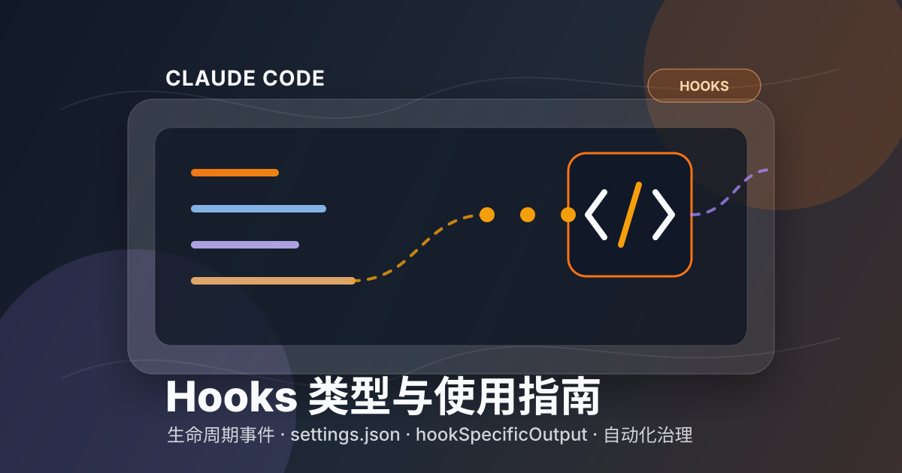
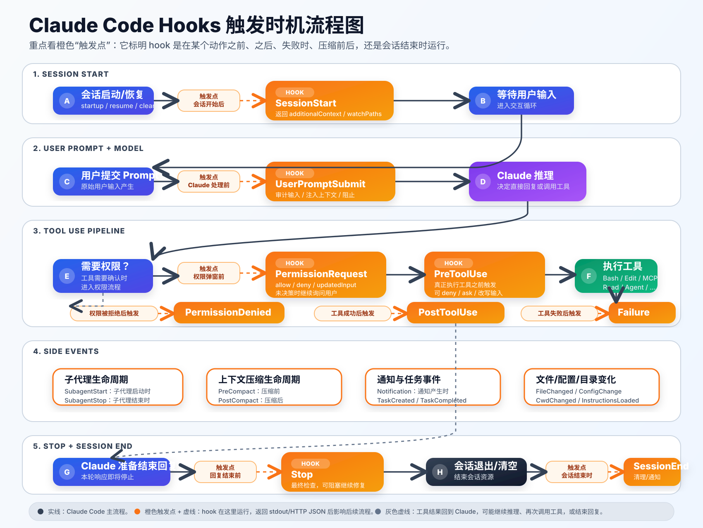

# Claude Code Hooks 类型与使用指南



本文总结 Claude Code / 本仓库恢复版 `claude-code-rev` 中 hooks 的类型、触发时机、典型使用场景、配置方式与注意事项。

Hooks 是 Claude Code 在会话、工具调用、权限、压缩、子代理、任务等生命周期节点执行的自定义动作。它们适合做自动校验、权限治理、日志审计、上下文注入、格式化、通知和资源清理。

## 0. 整体流程图



整体流转可以理解为：会话启动后触发 `SessionStart`；用户提交 prompt 后、Claude 处理前触发 `UserPromptSubmit`；Claude 推理中如果要调用工具，先在权限弹窗前触发 `PermissionRequest`，再在工具真正执行前触发 `PreToolUse`；工具成功后触发 `PostToolUse`，失败后触发 `PostToolUseFailure`，权限被拒绝后触发 `PermissionDenied`；子代理、上下文压缩、通知和任务事件会在各自生命周期点触发；最后在回复结束前触发 `Stop`，会话退出时触发 `SessionEnd`。

### 0.1 源码视角的整体流程

从源码看，所有 hook 最终都会汇聚到统一执行器 `executeHooks(...)` 或非 REPL 场景的 `executeHooksOutsideREPL(...)`：前者用于交互会话内的 hook，后者用于会话结束、配置变化、worktree 等不依赖 REPL UI 的场景。

| 阶段 | 触发动作 | 源码入口 | 构造的 `hook_event_name` | matcher 匹配字段 | hook 输出如何影响流程 |
|---|---|---|---|---|---|
| 会话启动 | 新会话、恢复、清空、compact 后继续 | `executeSessionStartHooks(...)` | `SessionStart` | `source`，值为 `startup/resume/clear/compact` | `additionalContext` 注入 Claude；`initialUserMessage` 可作为初始用户消息；`watchPaths` 注册文件监听 |
| 用户提交输入 | 用户 prompt 提交后、Claude 处理前 | `executeUserPromptSubmitHooks(...)` | `UserPromptSubmit` | 通常无 matcher | `additionalContext` 注入 Claude；退出码 `2` 可阻止处理该 prompt |
| 权限弹窗前 | 工具调用需要权限时 | `executePermissionRequestHooks(...)` | `PermissionRequest` | `tool_name` | `hookSpecificOutput.decision.behavior=allow/deny` 可自动允许或拒绝；`updatedInput` 可改写工具输入 |
| 工具执行前 | 工具真正运行前 | `executePreToolHooks(...)` | `PreToolUse` | `tool_name` | `permissionDecision=allow/deny/ask` 决定是否继续；`updatedInput` 可改写工具输入 |
| 工具成功后 | 工具返回成功结果后 | `executePostToolHooks(...)` | `PostToolUse` | `tool_name` | `additionalContext` 注入后续模型上下文；MCP 工具可用 `updatedMCPToolOutput` 改写输出 |
| 工具失败后 | 工具执行失败、超时或中断后 | `executePostToolUseFailureHooks(...)` | `PostToolUseFailure` | `tool_name` | 可把诊断信息作为反馈给模型，辅助下一步修复 |
| 权限拒绝后 | 权限被自动分类器或流程拒绝后 | `executePermissionDeniedHooks(...)` | `PermissionDenied` | `tool_name` | `retry: true` 表示模型可以换方式重试 |
| 子代理结束前 | 子代理即将结束响应 | `executeStopHooks(..., subagentId)` | `SubagentStop` | `agent_type` | 阻塞结果会反馈给子代理，让子代理继续修正 |
| 主响应结束前 | Claude 本轮回复即将结束 | `executeStopHooks(...)` | `Stop` | 通常无 matcher | 退出码 `2` 或 block 决策会把反馈给模型并继续对话 |
| 会话结束 | 退出、清空、logout 等 | `executeSessionEndHooks(...)` | `SessionEnd` | `reason` | 不再注入模型；失败信息写 stderr，随后清理 session hooks |
| 配置变化 | settings、skills、policy 等变化 | `executeConfigChangeHooks(...)` | `ConfigChange` | `source` | 可审计/阻止普通配置变化；policy settings 的阻塞结果会被忽略 |
| worktree 创建 | 创建隔离 worktree | `WorktreeCreate` outside-REPL 流程 | `WorktreeCreate` | 通常无 matcher | command stdout 或 `hookSpecificOutput.worktreePath` 必须返回 worktree 路径 |

统一执行器内部流程如下：

1. 先检查 hook 是否全局禁用，或是否处于 `CLAUDE_CODE_SIMPLE` 简化模式；满足条件则直接跳过。
2. 在交互模式下检查 workspace trust；未信任工作区时跳过 hook，避免项目 hook 直接形成远程代码执行入口。
3. 通过 `getMatchingHooks(...)` 按 `hook_event_name` 和 matcher 找到匹配配置；matcher 字段由事件元数据决定，例如工具类事件匹配 `tool_name`，`SessionStart` 匹配 `source`。
4. 把 hook 输入 JSON 序列化后传给每个匹配 hook；同一事件匹配到的多个 hook 会并行执行，并各自应用 timeout。
5. 根据 hook 类型选择执行方式：`command` 走本地命令 stdin/stdout，`prompt` 走模型判断，`agent` 启动代理，`http` POST 到外部服务；`callback/function` 主要用于内部或会话注册机制。
6. 解析输出：command hook 的 stdout 如果不是 `{` 开头，就按普通文本处理；如果是 JSON，则用 hook 输出 schema 校验；HTTP hook 必须返回 JSON。
7. `processHookJSONOutput(...)` 将通用字段和 `hookSpecificOutput` 转成内部结果，例如 `permissionBehavior`、`blockingError`、`additionalContext`、`updatedInput`、`watchPaths` 等。
8. 调用方根据聚合结果决定下一步：继续执行工具、拒绝权限、把上下文注入模型、让模型继续修复、注册文件监听、或在 outside-REPL 场景中返回给调用者。

关键源码位置：

| 文件 | 关键位置 | 说明 |
|---|---|---|
| `src/types/hooks.ts` | `syncHookResponseSchema` | 定义 `hookSpecificOutput` 的合法 JSON 结构，包括 `SessionStart`、`PermissionRequest`、`WorktreeCreate` 等 |
| `src/utils/hooks.ts` | `parseHookOutput(...)` | command hook stdout 的 JSON/普通文本解析逻辑 |
| `src/utils/hooks.ts` | `processHookJSONOutput(...)` | 把 hook JSON 输出转换成内部执行结果 |
| `src/utils/hooks.ts` | `executeHooks(...)` | REPL 内统一 hook 执行器，负责 trust 检查、匹配、并行执行和进度消息 |
| `src/utils/hooks.ts` | `executeHooksOutsideREPL(...)` | 非 REPL 场景执行器，用于 `SessionEnd`、`ConfigChange`、`WorktreeCreate` 等 |
| `src/utils/hooks.ts` | `executeSessionStartHooks(...)` | 构造 `SessionStart` 输入，matcher 使用 `source` |
| `src/utils/hooks.ts` | `executeUserPromptSubmitHooks(...)` | 构造 `UserPromptSubmit` 输入，包含原始 `prompt` |
| `src/utils/hooks.ts` | `executePreToolHooks(...)` | 构造 `PreToolUse` 输入，包含 `tool_name`、`tool_input`、`tool_use_id` |
| `src/utils/hooks.ts` | `executePostToolHooks(...)` | 构造 `PostToolUse` 输入，额外包含 `tool_response` |
| `src/utils/hooks.ts` | `executePermissionRequestHooks(...)` | 构造 `PermissionRequest` 输入，包含权限建议 `permission_suggestions` |
| `src/utils/hooks/hooksConfigManager.ts` | `getHookEventMetadata(...)` | 定义每类 hook 的说明、matcher 字段和值域 |
| `src/utils/hooks/hooksConfigManager.ts` | `groupHooksByEventAndMatcher(...)` | 将 settings、插件和注册 hook 按事件与 matcher 分组 |

## 1. 配置位置

| 作用域 | 配置文件或来源 | 适用场景 | 是否建议提交到仓库 |
|---|---|---|---|
| 用户级 | `~/.claude/settings.json` | 个人通用习惯，例如所有项目都禁止危险 Bash 命令 | 否 |
| 项目级 | `.claude/settings.json` | 团队共享规则，例如项目统一 formatter、lint、测试钩子 | 是 |
| 项目本地级 | `.claude/settings.local.json` | 个人在当前项目的本地配置，例如本机路径、本地通知脚本 | 否 |
| 插件级 | `~/.claude/plugins/*/hooks/hooks.json` | 由插件提供的通用 hook 能力 | 否 |
| 会话级 | 运行时内存注册 | 临时 hook，随会话结束清除 | 否 |

基础配置结构：

```json
{
  "hooks": {
    "PreToolUse": [
      {
        "matcher": "Bash|Write|Edit",
        "hooks": [
          {
            "type": "command",
            "command": "python3 .claude/hooks/check.py",
            "timeout": 30
          }
        ]
      }
    ]
  }
}
```

## 2. Hook 执行类型

Hook 事件描述“什么时候触发”，hook 执行类型描述“触发后用什么方式执行”。

| 执行类型      | 关键字段                                                                                 | 什么时候使用                          | 如何使用                                                              | 注意事项                                  |
| --------- | ------------------------------------------------------------------------------------ | ------------------------------- | ----------------------------------------------------------------- | ------------------------------------- |
| `command` | `command`, `shell`, `timeout`, `statusMessage`, `once`, `async`, `asyncRewake`, `if` | 需要执行本地脚本或 shell 命令时；最常用         | 写一个脚本从 `stdin` 读取 JSON，输出文本或 JSON，再在 `settings.json` 配置 `command` | hook 可执行任意命令，只运行可信脚本；建议设置合理 `timeout` |
| `prompt`  | `prompt`, `model`, `timeout`, `statusMessage`, `once`, `if`                          | 需要用模型判断某个事件是否合规，或生成简短建议         | 配置 prompt，让 Claude Code 把 hook 输入交给模型分析                           | 适合判断和文本分析，不适合强制性安全边界                  |
| `agent`   | `prompt`, `model`, `timeout`, `statusMessage`, `once`, `if`                          | 需要启动代理做更完整的验证或检查                | 配置 agent prompt，要求代理审查输入、输出结论                                     | 成本和延迟更高；适合较重的检查                       |
| `http`    | `url`, `headers`, `allowedEnvVars`, `timeout`, `statusMessage`, `once`, `if`         | 需要把 hook 事件发送到外部服务，例如审计、通知、策略引擎 | Claude Code 向 `url` POST hook 输入 JSON，服务返回 JSON                   | HTTP hook 必须返回 JSON；不要把敏感信息发到不可信服务    |

`callback` 和 `function` 类型属于程序内或会话内注册机制，不适合直接写入持久化 `settings.json`。

## 3. Hook 事件类型总表

| Hook 类型 | 触发时机 | 什么时候使用 | 如何使用 | 常见 matcher |
|---|---|---|---|---|
| `PreToolUse` | Claude 准备调用工具之前 | 阻止危险命令、限制文件写入范围、校验工具输入、改写工具输入 | 配置在 `hooks.PreToolUse` 下，按工具名匹配；脚本读取 `tool_name` 和 `tool_input`，必要时返回 `permissionDecision` 或 `updatedInput` | 工具名，例如 `Bash`, `Write`, `Edit`, `Read` |
| `PostToolUse` | 工具调用成功之后 | 自动格式化、运行 lint/test、记录工具结果、补充上下文、处理 MCP 工具输出 | 配置在 `hooks.PostToolUse` 下；脚本读取 `tool_response` 并返回普通输出或结构化 JSON | 工具名 |
| `PostToolUseFailure` | 工具调用失败之后 | 收集失败诊断、记录错误、提示修复建议 | 配置在 `hooks.PostToolUseFailure` 下；脚本读取 `error` 字段 | 工具名 |
| `PermissionRequest` | Claude Code 需要权限决策时 | 自动批准低风险命令、拒绝高风险命令、改写工具输入、接入组织策略 | 配置在 `hooks.PermissionRequest` 下，返回 `hookSpecificOutput.decision.behavior` 为 `allow` 或 `deny`，可附带 `updatedInput` | 工具名 |
| `PermissionDenied` | 工具权限被拒绝后 | 记录拒绝原因、通知用户、决定是否引导换方案 | 配置在 `hooks.PermissionDenied` 下，读取被拒绝的工具和原因 | 工具名 |
| `Notification` | Claude Code 发出通知时 | 转发到桌面、Slack、企业 IM、日志系统 | 配置在 `hooks.Notification` 下；按通知类型匹配 | `notification_type` |
| `UserPromptSubmit` | 用户提交 prompt 后、Claude 处理前 | 注入项目上下文、审计用户输入、阻止违规请求、补充团队规则 | 配置在 `hooks.UserPromptSubmit` 下；返回 `additionalContext` 可给模型增加上下文 | 通常不按工具匹配 |
| `SessionStart` | 会话开始、恢复、清空后重新进入等场景 | 加载项目上下文、设置 watch paths、输出初始化提示 | 配置在 `hooks.SessionStart` 下；可返回 `additionalContext`, `initialUserMessage`, `watchPaths` | `source` |
| `SessionEnd` | 会话结束、清空或退出时 | 清理资源、保存状态、发送结束通知 | 配置在 `hooks.SessionEnd` 下；脚本应很快完成 | `reason` |
| `Stop` | Claude 完成一次响应、即将停止时 | 最终质量检查、检查待办未完成项、要求 Claude 继续修复 | 配置在 `hooks.Stop` 下；返回阻塞结果可促使继续处理 | 通常无 matcher |
| `StopFailure` | Stop hook 或停止流程失败时 | 记录停止失败、诊断异常 | 配置在 `hooks.StopFailure` 下，读取错误信息 | `error` |
| `SubagentStart` | 子代理启动时 | 给子代理注入上下文、记录代理开始执行 | 配置在 `hooks.SubagentStart` 下 | `agent_type` |
| `SubagentStop` | 子代理完成时 | 校验代理输出、收集报告、阻止不合格结果进入主流程 | 配置在 `hooks.SubagentStop` 下 | `agent_type` |
| `PreCompact` | 上下文压缩前 | 保存关键状态、导出中间结论、阻止不合适的压缩 | 配置在 `hooks.PreCompact` 下 | `trigger` |
| `PostCompact` | 上下文压缩后 | 恢复关键上下文、重新注入摘要或提醒 | 配置在 `hooks.PostCompact` 下 | `trigger` |
| `Setup` | 初始化或 setup 流程触发时 | 初始化环境、准备上下文、执行一次性设置 | 配置在 `hooks.Setup` 下 | `trigger` |
| `TeammateIdle` | 协作 agent 或 teammate 空闲时 | 自动分派任务、提醒、状态检查 | 配置在 `hooks.TeammateIdle` 下 | 通常无 matcher |
| `TaskCreated` | 任务创建时 | 记录任务、同步到外部系统、通知协作方 | 配置在 `hooks.TaskCreated` 下 | 通常无 matcher |
| `TaskCompleted` | 任务完成时 | 结果校验、归档、通知、触发后续流程 | 配置在 `hooks.TaskCompleted` 下 | 通常无 matcher |
| `Elicitation` | MCP elicitation 请求发起时 | 自动接受、拒绝或取消 MCP 服务提出的问题 | 配置在 `hooks.Elicitation` 下 | `mcp_server_name` |
| `ElicitationResult` | MCP elicitation 返回结果时 | 校验返回内容、审计用户/系统响应 | 配置在 `hooks.ElicitationResult` 下 | `mcp_server_name` |
| `ConfigChange` | 配置发生变化时 | 刷新缓存、记录配置变更、重新加载策略 | 配置在 `hooks.ConfigChange` 下 | `source` |
| `WorktreeCreate` | 创建 worktree 时 | 接管或参与 worktree 创建，并在返回路径前完成必要初始化 | 配置在 `hooks.WorktreeCreate` 下；必须通过 stdout 或 `hookSpecificOutput.worktreePath` 返回非空 worktree 路径 | 通常无 matcher |
| `WorktreeRemove` | 删除 worktree 时 | 清理资源、释放锁、删除临时文件 | 配置在 `hooks.WorktreeRemove` 下 | 通常无 matcher |
| `InstructionsLoaded` | 指令文件加载完成后 | 审计或追加说明上下文、提示冲突规则 | 配置在 `hooks.InstructionsLoaded` 下 | `load_reason` |
| `CwdChanged` | 当前工作目录变化时 | 更新路径相关环境、刷新项目上下文 | 配置在 `hooks.CwdChanged` 下 | 通常无 matcher |
| `FileChanged` | 被监听的文件变化时 | 自动刷新上下文、重新加载配置或规则 | 先通过 `SessionStart` 返回 `watchPaths`，再配置 `FileChanged` 处理变更 | 文件 basename |

## 4. 常见目标与推荐 hook

| 目标             | 推荐 hook              | 推荐 matcher   | 典型做法                                                                            |                 |                                                    |
| -------------- | -------------------- | ------------ | ------------------------------------------------------------------------------- | --------------- | -------------------------------------------------- |
| 阻止危险 Bash 命令   | `PreToolUse`         | `Bash`       | 读取 `tool_input.command`，命中 `rm -rf`, `git reset --hard`, `curl                  | sh` 等规则时返回 deny |                                                    |
| 限制只能改某些目录      | `PreToolUse`         | `Write       | Edit                                                                            | MultiEdit`      | 检查 `file_path` 是否在允许目录内，不符合则阻塞                     |
| 编辑后自动格式化       | `PostToolUse`        | `Write       | Edit                                                                            | MultiEdit`      | 根据文件扩展名运行 formatter，例如 prettier、ruff、gofmt、rustfmt |
| 工具失败后自动诊断      | `PostToolUseFailure` | `Bash        | Read                                                                            | Edit`           | 记录 `error` 并输出下一步建议                                |
| 自动批准低风险只读命令    | `PermissionRequest`  | `Bash`       | 对 `git status`, `ls`, `pwd` 等返回 `hookSpecificOutput.decision.behavior: "allow"` |                 |                                                    |
| 用户输入后补充上下文     | `UserPromptSubmit`   | 无            | 返回 `additionalContext`，例如项目当前规范或安全边界                                            |                 |                                                    |
| 会话启动时加载项目信息    | `SessionStart`       | `source`     | 返回项目说明、默认任务提醒、需要监听的文件路径                                                         |                 |                                                    |
| 响应结束前质量门禁      | `Stop`               | 无            | 检查是否运行测试、是否完成待办；不满足则阻塞并说明原因                                                     |                 |                                                    |
| 子代理完成后校验       | `SubagentStop`       | `agent_type` | 检查代理输出是否包含必需字段或是否发现高危问题                                                         |                 |                                                    |
| 上下文压缩前保存状态     | `PreCompact`         | `trigger`    | 把关键任务状态写入文件或外部系统                                                                |                 |                                                    |
| 任务完成后通知        | `TaskCompleted`      | 无            | 发桌面通知、Webhook 或企业 IM 消息                                                         |                 |                                                    |
| 接管 worktree 创建 | `WorktreeCreate`     | 无            | 创建或初始化 worktree 后，返回最终 worktree 路径                                              |                 |                                                    |

## 5. Hook 输入协议

Claude Code 会把结构化 JSON 写入 hook 进程的 `stdin`。

通用字段：

| 字段 | 类型 | 含义 |
|---|---|---|
| `session_id` | string | 当前会话 ID |
| `transcript_path` | string | 当前 transcript 文件路径 |
| `cwd` | string | 当前工作目录 |
| `permission_mode` | string? | 当前权限模式，可能不存在 |
| `agent_id` | string? | 子代理 ID，主线程通常不存在 |
| `agent_type` | string? | agent 类型，可能不存在 |
| `hook_event_name` | string | 当前 hook 事件名 |

工具相关 hook 额外字段：

| 字段 | 出现于 | 含义 |
|---|---|---|
| `tool_name` | `PreToolUse`, `PostToolUse`, `PostToolUseFailure`, `PermissionRequest`, `PermissionDenied` | 工具名 |
| `tool_input` | 工具相关 hook | 工具输入 |
| `tool_response` | `PostToolUse` | 工具成功输出 |
| `error` | 失败类事件 | 错误信息 |

示例脚本读取输入：

```python
#!/usr/bin/env python3
import json
import sys

payload = json.load(sys.stdin)
print(json.dumps({"suppressOutput": True}))
```

## 6. Hook 输出协议

`command` hook 的 `stdout` 如果去掉空白后以 `{` 开头，会被当成 JSON 解析；否则按普通文本处理。`http` hook 必须返回 JSON。

通用输出字段：

| 字段 | 类型 | 作用 |
|---|---|---|
| `continue` | boolean | `false` 表示阻止 Claude 继续 |
| `suppressOutput` | boolean | 是否隐藏 hook stdout |
| `stopReason` | string | `continue: false` 时展示的停止原因 |
| `decision` | string | 常见值为 `approve` 或 `block` |
| `reason` | string | 决策原因 |
| `systemMessage` | string | 展示给用户的系统消息或警告 |
| `hookSpecificOutput` | object | 针对具体 hook 的结构化输出 |

常用 `hookSpecificOutput`：

| Hook | 可用字段 | 用法 |
|---|---|---|
| `PreToolUse` | `permissionDecision`, `permissionDecisionReason`, `updatedInput` | 允许、拒绝或改写即将执行的工具输入 |
| `PermissionRequest` | `decision.behavior`, `decision.updatedInput`, `decision.message` | 对权限请求返回允许或拒绝决策 |
| `UserPromptSubmit` | `additionalContext` | 给 Claude 追加上下文 |
| `SessionStart` | `additionalContext`, `initialUserMessage`, `watchPaths` | 初始化会话上下文和文件监听 |
| `PostToolUse` | `updatedMCPToolOutput` | 更新 MCP 工具输出，仅对 MCP 工具有效 |
| `WorktreeCreate` | `worktreePath` | HTTP hook 返回创建好的 worktree 路径；command hook 可直接输出路径 |

权限请求允许示例：

```json
{
  "hookSpecificOutput": {
    "hookEventName": "PermissionRequest",
    "decision": {
      "behavior": "allow",
      "updatedInput": {}
    }
  }
}
```

权限请求拒绝示例：

```json
{
  "hookSpecificOutput": {
    "hookEventName": "PermissionRequest",
    "decision": {
      "behavior": "deny",
      "message": "该命令不允许自动执行"
    }
  }
}
```

阻止危险命令示例：

```json
{
  "hookSpecificOutput": {
    "hookEventName": "PreToolUse",
    "permissionDecision": "deny",
    "permissionDecisionReason": "禁止执行破坏性 rm 命令"
  }
}
```

注入上下文示例：

```json
{
  "hookSpecificOutput": {
    "hookEventName": "UserPromptSubmit",
    "additionalContext": "本项目要求修改代码后运行相关测试。"
  }
}
```

会话启动示例：

```json
{
  "hookSpecificOutput": {
    "hookEventName": "SessionStart",
    "additionalContext": "已加载项目上下文。",
    "initialUserMessage": "请先阅读 README.md 和 AGENTS.md。",
    "watchPaths": ["/absolute/path/to/AGENTS.md"]
  }
}
```

## 7. 退出码语义

| 退出码 | 行为 | 什么时候使用 |
|---|---|---|
| `0` | 成功 | hook 检查通过，或只输出信息 |
| `2` | 阻塞错误，Claude 会收到 hook feedback | 需要明确阻止当前动作或要求 Claude 修正 |
| 其他非零值 | 非阻塞错误，通常展示给用户但不一定阻止流程 | hook 自身失败但不应中断主流程 |

也可以用 JSON 表达阻塞：

```json
{
  "decision": "block",
  "reason": "该命令不允许执行"
}
```

## 8. Matcher 与条件

### 8.1 matcher

`matcher` 用来筛选 hook 是否执行。

| 写法 | 含义 | 示例 |
|---|---|---|
| 省略或 `*` | 匹配全部 | 所有工具调用后都运行日志 hook |
| 精确工具名 | 只匹配单个工具 | `Bash` |
| 管道分隔 | 匹配多个工具 | `Write|Edit|MultiEdit` |
| 正则表达式 | 更灵活的匹配 | `^mcp__.*` |

### 8.2 if 条件

`if` 是更细粒度的工具条件，适用于工具相关事件：

- `PreToolUse`
- `PostToolUse`
- `PostToolUseFailure`
- `PermissionRequest`

示例：

```json
{
  "type": "command",
  "command": "python3 .claude/hooks/check-git.py",
  "if": "Bash(git *)"
}
```

## 9. 配置示例

### 9.1 禁止危险 Bash 命令

`.claude/settings.json`：

```json
{
  "hooks": {
    "PreToolUse": [
      {
        "matcher": "Bash",
        "hooks": [
          {
            "type": "command",
            "command": "python3 .claude/hooks/block-dangerous-bash.py",
            "timeout": 10
          }
        ]
      }
    ]
  }
}
```

`.claude/hooks/block-dangerous-bash.py`：

下面脚本只是最小演示，不能覆盖所有 shell 绕过方式；生产环境更推荐 allowlist、命令解析器或组织级策略引擎。

```python
#!/usr/bin/env python3
import json
import re
import sys

payload = json.load(sys.stdin)
command = payload.get("tool_input", {}).get("command", "")
blocked = [r"\brm\s+-rf\b", r"\bgit\s+reset\s+--hard\b", r"\bgit\s+push\s+--force\b"]

if any(re.search(pattern, command) for pattern in blocked):
    print(json.dumps({
        "hookSpecificOutput": {
            "hookEventName": "PreToolUse",
            "permissionDecision": "deny",
            "permissionDecisionReason": "检测到高风险命令，请先获得用户明确确认。"
        }
    }))
    sys.exit(0)

print(json.dumps({"suppressOutput": True}))
```

### 9.2 编辑后自动格式化

```json
{
  "hooks": {
    "PostToolUse": [
      {
        "matcher": "Write|Edit|MultiEdit",
        "hooks": [
          {
            "type": "command",
            "command": "python3 .claude/hooks/format-changed-file.py",
            "timeout": 60
          }
        ]
      }
    ]
  }
}
```

### 9.3 会话开始时注入项目上下文

`settings.json` 里只配置 hook 什么时候运行、运行什么命令；`hookSpecificOutput` 是该命令执行后输出到 stdout 的 JSON，不是直接嵌在 `settings.json` 里的字段。

`.claude/settings.json`：

```json
{
  "hooks": {
    "SessionStart": [
      {
        "matcher": "startup|resume|clear|compact",
        "hooks": [
          {
            "type": "command",
            "command": "python3 .claude/hooks/session-context.py",
            "timeout": 10
          }
        ]
      }
    ]
  }
}
```

`matcher` 匹配 `source` 字段，可用值如下：

| source | 含义 | 适用场景 |
|---|---|---|
| `startup` | 新会话启动 | 加载项目上下文、初始化提示 |
| `resume` | 恢复旧会话 | 恢复会话状态、提醒历史上下文 |
| `clear` | 清空会话后重新开始 | 重新注入基础规则 |
| `compact` | 压缩上下文后继续 | 重新注入关键摘要或状态 |

SessionStart hook 收到的输入 JSON 结构大致如下：

```json
{
  "session_id": "session-id",
  "transcript_path": "/absolute/path/to/transcript.jsonl",
  "cwd": "/absolute/path/to/project",
  "permission_mode": "default",
  "hook_event_name": "SessionStart",
  "source": "startup",
  "agent_type": "default",
  "model": "claude-sonnet-4-6"
}
```

字段说明：

| 字段 | 类型 | 必填 | 说明 |
|---|---|---|---|
| `session_id` | string | 是 | 当前会话 ID |
| `transcript_path` | string | 是 | 当前 transcript 文件路径 |
| `cwd` | string | 是 | 当前工作目录 |
| `permission_mode` | string | 否 | 当前权限模式 |
| `hook_event_name` | `"SessionStart"` | 是 | 固定为 `SessionStart` |
| `source` | `"startup" \| "resume" \| "clear" \| "compact"` | 是 | SessionStart 的触发来源，也是 matcher 匹配字段 |
| `agent_type` | string | 否 | 当前 agent 类型 |
| `model` | string | 否 | 当前会话使用的模型 |

脚本 stdout 返回的完整 `hookSpecificOutput` JSON 结构：

```json
{
  "hookSpecificOutput": {
    "hookEventName": "SessionStart",
    "additionalContext": "本仓库是 Claude Code 恢复版源码；修改前请优先阅读 README.md。",
    "initialUserMessage": "请先阅读 README.md 和 AGENTS.md，然后再开始任务。",
    "watchPaths": [
      "/absolute/path/to/project/README.md",
      "/absolute/path/to/project/AGENTS.md"
    ]
  }
}
```

`SessionStart.hookSpecificOutput` 字段说明：

| 字段 | 类型 | 必填 | 作用 |
|---|---|---|---|
| `hookEventName` | `"SessionStart"` | 是 | 必须与当前 hook 事件一致，否则会被视为错误输出 |
| `additionalContext` | string | 否 | 注入给 Claude 的额外上下文，适合放项目规则、恢复提示、环境说明 |
| `initialUserMessage` | string | 否 | 作为会话开始时的初始用户消息，适合自动触发启动任务或提醒 |
| `watchPaths` | string[] | 否 | 要监听的绝对路径；文件变化后可触发 `FileChanged` hook |

最小脚本示例：

```python
#!/usr/bin/env python3
import json

print(json.dumps({
    "hookSpecificOutput": {
        "hookEventName": "SessionStart",
        "additionalContext": "本项目要求修改代码后运行相关测试。"
    }
}))
```

### 9.4 用户提交 prompt 后追加规则

```json
{
  "hooks": {
    "UserPromptSubmit": [
      {
        "hooks": [
          {
            "type": "command",
            "command": "python3 .claude/hooks/user-prompt-context.py",
            "timeout": 5
          }
        ]
      }
    ]
  }
}
```

脚本输出：

```json
{
  "hookSpecificOutput": {
    "hookEventName": "UserPromptSubmit",
    "additionalContext": "如果要修改代码，请先检查现有测试和相关实现。"
  }
}
```

## 10. 关键注意事项

| 注意事项 | 说明 | 建议 |
|---|---|---|
| Hooks 能执行任意命令 | `.claude/settings.json` 中的 hook 是代码执行入口 | 只信任可信仓库与可信配置；审查外部 PR 中的 hook 变更 |
| 交互模式可能需要 workspace trust | 未信任工作区时，交互模式下 hook 可能被跳过 | 对安全边界不要只依赖 hook；结合权限模式和人工确认 |
| 同一事件的多个 hook 可能并行执行 | 不应依赖 hook 之间的执行顺序 | 需要顺序时把逻辑放进同一个脚本 |
| 默认超时可能较长 | 工具 hook 默认可能等待较久 | 为每个 hook 显式设置 `timeout` |
| `SessionEnd` 要快速完成 | 结束 hook 默认超时很短 | 只做轻量清理；重任务放到后台或外部队列 |
| stdout JSON 解析敏感 | `stdout.trim()` 以 `{` 开头会按 JSON 解析 | 普通文本不要以 `{` 开头；结构化输出确保合法 JSON |
| HTTP hook 必须返回 JSON | 空响应会按 `{}` 处理，非 JSON 是错误 | 外部服务统一返回 JSON envelope |
| HTTP hook 不适合所有事件 | `SessionStart` / `Setup` 等场景不适合 HTTP hook | 初始化类逻辑优先用 `command` |
| `PreToolUse` 可改写输入 | `updatedInput` 会影响即将执行的工具 | 只做确定、安全、可审计的改写 |
| `PostToolUse` 不应假设能改所有输出 | `updatedMCPToolOutput` 只对 MCP 工具有效 | 普通工具结果用日志或上下文提示处理 |
| `async` hook 后台运行 | 可减少等待，但结果不会同步阻塞当前流程 | 只用于通知、审计、异步归档等非关键路径 |
| `asyncRewake` 会唤醒模型 | 后台 hook 退出码为 `2` 时可注入阻塞反馈 | 谨慎使用，避免噪音或循环唤醒 |
| `once` 只运行一次 | 执行后 hook 会被移除 | 适合一次性初始化，不适合长期策略 |
| shell 可配置 | 支持 `bash` 和 `powershell` | 跨平台项目要明确 shell 与路径差异 |

## 11. 设计建议

| 设计原则 | 推荐做法 |
|---|---|
| 安全优先 | 对破坏性操作使用 `PreToolUse` 或 `PermissionRequest`，但仍保留人工确认 |
| 快速失败 | hook 内部校验失败时输出清晰原因，不要静默失败 |
| 最小权限 | hook 只读取必要字段，只访问必要文件或外部服务 |
| 可观察 | 关键 hook 记录事件、决策和原因，便于排查 |
| 不依赖顺序 | 多个独立 hook 不共享隐式状态 |
| 保持轻量 | 同步 hook 只做快速检查；耗时任务改为异步或外部队列 |
| 配置分层 | 团队规则放项目级，个人偏好放用户级或本地级 |
| 明确边界 | 不把 hook 当作唯一安全机制；配合权限模式、代码审查和测试 |

## 12. 速查表

| 你想做什么 | 首选 hook | 执行类型 | 返回什么 |
|---|---|---|---|
| 阻止命令执行 | `PreToolUse` | `command` | `permissionDecision: "deny"` |
| 自动批准权限 | `PermissionRequest` | `command` | `hookSpecificOutput.decision.behavior: "allow"` |
| 改写工具输入 | `PreToolUse` | `command` | `updatedInput` |
| 编辑后格式化 | `PostToolUse` | `command` | 普通输出或 `suppressOutput` |
| 工具失败后提示 | `PostToolUseFailure` | `command` / `prompt` | 文本建议或系统消息 |
| 增加用户 prompt 上下文 | `UserPromptSubmit` | `command` | `additionalContext` |
| 会话开始加载上下文 | `SessionStart` | `command` | `additionalContext`, `initialUserMessage`, `watchPaths` |
| 响应结束前检查 | `Stop` | `command` / `agent` | `decision: "block"` 或退出码 `2` |
| 通知外部系统 | `Notification` / `TaskCompleted` | `http` / `command` | `{}` 或通知结果 |
| 压缩前保存状态 | `PreCompact` | `command` | 成功状态或阻塞原因 |
| 创建 worktree | `WorktreeCreate` | `command` / `http` | stdout 路径或 `hookSpecificOutput.worktreePath` |

## 13. Hooks 原理说明

Claude Code hooks 的本质是“事件驱动的外部扩展点”：Claude Code 在关键生命周期点构造一份结构化 JSON 输入，找到匹配的 hook 配置，把 JSON 交给外部命令、HTTP 服务、prompt hook 或 agent hook 执行，再把 hook 返回的 JSON 转换成内部控制信号，用来影响后续流程。

### 13.1 原理总览

| 步骤 | 内部动作 | 关键源码 | 说明 |
|---|---|---|---|
| 1 | 生命周期事件发生 | `executeSessionStartHooks`, `executeUserPromptSubmitHooks`, `executePreToolHooks` 等 | 每类 hook 都有一个专门入口负责构造对应输入 |
| 2 | 构造 hook 输入 JSON | `createBaseHookInput(...)` + 各事件字段 | 基础字段包含 `session_id`, `transcript_path`, `cwd`, `hook_event_name` 等 |
| 3 | 找到匹配 hook | `getMatchingHooks(...)` | 按事件名和 matcher 过滤，例如 `tool_name`, `source`, `reason` |
| 4 | 进入统一执行器 | `executeHooks(...)` / `executeHooksOutsideREPL(...)` | REPL 内走 `executeHooks`，会话结束等外部场景走 `executeHooksOutsideREPL` |
| 5 | 安全与开关检查 | `shouldDisableAllHooksIncludingManaged`, `shouldSkipHookDueToTrust` | 简化模式、禁用配置、未信任工作区都会跳过 hook |
| 6 | 并行执行 hook | `matchingHooks.map(...)` | 同一事件匹配到的多个 hook 并行运行，各自有 timeout |
| 7 | 解析 hook 输出 | `parseHookOutput(...)`, `parseHttpHookOutput(...)` | command stdout 以 `{` 开头才按 JSON 解析；HTTP 必须返回 JSON |
| 8 | 转换为内部结果 | `processHookJSONOutput(...)` | 转成 `permissionBehavior`, `blockingError`, `additionalContext`, `updatedInput` 等 |
| 9 | 调用方消费结果 | 各 hook 入口的调用方 | 决定继续、阻塞、注入上下文、改写输入、注册监听或清理资源 |

### 13.2 配置如何被加载和匹配

Hooks 配置最终会被按“事件 + matcher”分组。源码里的 `groupHooksByEventAndMatcher(...)` 会把 settings 文件、插件 hook、运行时注册 hook 合并到统一结构中。

| 来源 | 示例 | 原理 |
|---|---|---|
| 用户 settings | `~/.claude/settings.json` | 用户级通用 hook |
| 项目 settings | `.claude/settings.json` | 项目共享 hook |
| 本地 settings | `.claude/settings.local.json` | 当前机器私有 hook |
| 插件 hook | `~/.claude/plugins/*/hooks/hooks.json` | 插件提供的 hook |
| 内部注册 hook | callback/function | Claude Code 内部或会话运行时注册 |

matcher 不是固定匹配同一个字段，而是由 hook 事件元数据决定：

| Hook 类型 | matcher 实际匹配字段 | 例子 |
|---|---|---|
| `PreToolUse` | `tool_name` | `Bash`, `Write`, `Edit` |
| `PostToolUse` | `tool_name` | `Bash`, `Read`, `mcp__xxx` |
| `PermissionRequest` | `tool_name` | `Bash` |
| `SessionStart` | `source` | `startup`, `resume`, `clear`, `compact` |
| `SessionEnd` | `reason` | `clear`, `logout`, `prompt_input_exit`, `other` |
| `Notification` | `notification_type` | `permission_prompt`, `idle_prompt` |
| `PreCompact` / `PostCompact` | `trigger` | `manual`, `auto` |
| `ConfigChange` | `source` | `user_settings`, `project_settings`, `local_settings` |
| `InstructionsLoaded` | `load_reason` | `session_start`, `include`, `compact` |

### 13.3 输入 JSON 的生成原理

每个 hook 入口都会先调用基础输入构造逻辑，再追加事件自己的字段。

例如 `SessionStart`：

```json
{
  "session_id": "...",
  "transcript_path": "...",
  "cwd": "...",
  "hook_event_name": "SessionStart",
  "source": "startup",
  "agent_type": "default",
  "model": "claude-sonnet-4-6"
}
```

例如 `PreToolUse`：

```json
{
  "session_id": "...",
  "transcript_path": "...",
  "cwd": "...",
  "permission_mode": "default",
  "hook_event_name": "PreToolUse",
  "tool_name": "Bash",
  "tool_input": {
    "command": "git status"
  },
  "tool_use_id": "..."
}
```

这也是为什么 hook 脚本通常要从 `stdin` 读取 JSON：Claude Code 会把上面的结构化输入直接写入 hook 进程。

### 13.4 输出 JSON 的解析原理

command hook 的 stdout 有两种模式：

| stdout 形式 | 处理方式 |
|---|---|
| 不以 `{` 开头 | 按普通文本处理，通常作为上下文或展示信息 |
| 以 `{` 开头 | 按 JSON 解析，并用 hook 输出 schema 校验 |

HTTP hook 更严格：响应体必须是 JSON；空响应会按 `{}` 处理，非 JSON 会被视为错误。

合法 JSON 的核心结构是：

```json
{
  "continue": true,
  "suppressOutput": true,
  "systemMessage": "可选提示",
  "hookSpecificOutput": {
    "hookEventName": "SessionStart"
  }
}
```

`hookSpecificOutput.hookEventName` 必须和当前事件一致。源码里会校验这一点，如果当前执行的是 `SessionStart`，却返回了 `PreToolUse`，会被判定为错误输出。

### 13.5 hookSpecificOutput 如何改变流程

| hookSpecificOutput | 内部结果 | 后续影响 |
|---|---|---|
| `additionalContext` | `result.additionalContext` | 注入 Claude 后续上下文 |
| `initialUserMessage` | `result.initialUserMessage` | 会话开始时追加初始用户消息 |
| `watchPaths` | `result.watchPaths` | 注册文件监听，后续触发 `FileChanged` |
| `permissionDecision: "deny"` | `result.permissionBehavior = "deny"` + `blockingError` | 阻止工具执行 |
| `permissionDecision: "ask"` | `result.permissionBehavior = "ask"` | 继续走人工确认 |
| `updatedInput` | `result.updatedInput` | 改写即将执行的工具输入 |
| `PermissionRequest.decision.behavior="allow"` | `permissionRequestResult` + `permissionBehavior="allow"` | 自动允许权限请求 |
| `PermissionRequest.decision.behavior="deny"` | `permissionRequestResult` + `permissionBehavior="deny"` | 自动拒绝权限请求 |
| `updatedMCPToolOutput` | `result.updatedMCPToolOutput` | 改写 MCP 工具输出 |
| `retry: true` | `result.retry` | 权限拒绝后允许模型重试 |
| `worktreePath` | outside-REPL result output | `WorktreeCreate` 返回创建好的 worktree 路径 |

### 13.6 为什么 settings.json 里没有 hookSpecificOutput

`settings.json` 只描述“什么时候运行什么 hook”：

```json
{
  "hooks": {
    "SessionStart": [
      {
        "matcher": "startup",
        "hooks": [
          {
            "type": "command",
            "command": "python3 .claude/hooks/session-context.py"
          }
        ]
      }
    ]
  }
}
```

`hookSpecificOutput` 是 hook 运行后的返回值，应该由 `session-context.py` 输出到 stdout：

```json
{
  "hookSpecificOutput": {
    "hookEventName": "SessionStart",
    "additionalContext": "加载项目上下文完成。"
  }
}
```

所以二者关系是：

```text
settings.json 配置 hook 命令
        ↓
Claude Code 在事件发生时执行该命令
        ↓
命令从 stdin 读取 hook 输入 JSON
        ↓
命令向 stdout 输出 hookSpecificOutput JSON
        ↓
Claude Code 解析输出并影响后续流程
```

### 13.7 REPL 内 hook 与 outside-REPL hook 的区别

| 执行器 | 适用场景 | 特点 |
|---|---|---|
| `executeHooks(...)` | 交互会话内，例如 `PreToolUse`, `PostToolUse`, `UserPromptSubmit`, `Stop` | 会产生日志/进度消息，结果可反馈给模型或用户 |
| `executeHooksOutsideREPL(...)` | 会话结束、配置变化、worktree 创建等 | 不依赖 REPL UI，通常返回结果给调用方处理 |

典型例子：

- `SessionEnd` 使用 outside-REPL；如果 hook 失败，会把错误写到 stderr。
- `ConfigChange` 使用 outside-REPL；普通配置可以被阻止，但 policy settings 的阻止结果会被忽略。
- `WorktreeCreate` 使用 outside-REPL；必须返回 worktree 路径，否则创建流程无法继续。

### 13.8 安全模型

Hooks 是强能力扩展点，本质上允许项目配置触发本地命令或外部请求，所以源码里有几层保护：

| 保护点 | 原理 |
|---|---|
| 简化模式跳过 hook | `CLAUDE_CODE_SIMPLE` 为真时，hook 执行器直接返回 |
| 全局禁用 | managed setting 可以禁用所有 hook |
| workspace trust | 交互模式下未信任工作区时跳过 hook，避免项目级 hook 自动执行任意命令 |
| timeout | 每个 hook 可配置 timeout，避免无限阻塞 |
| schema 校验 | JSON 输出必须符合 `syncHookResponseSchema` / `hookJSONOutputSchema` |
| 事件名校验 | `hookSpecificOutput.hookEventName` 必须等于当前 hook 事件 |

因此，hooks 适合做自动化治理和上下文增强，但不应该作为唯一安全边界。高风险动作仍应配合权限模式、人工确认、代码审查和最小权限原则。

## 14. 参考文献

| 名称 | 地址 | 说明 |
|---|---|---|
| `claude-code-rev` | https://github.com/kunge2013/claude-code-rev.git | 本文源码分析参考的 Claude Code 恢复版仓库 |
