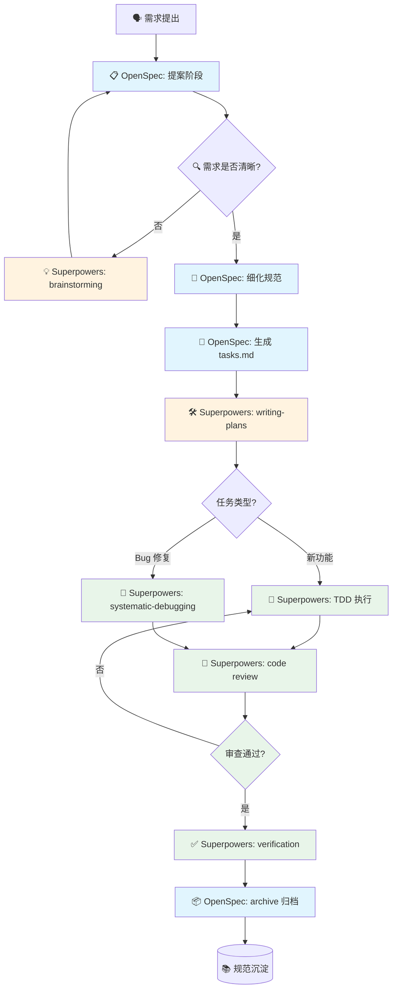

AI 编程工具层出不穷，但真正的问题不是"AI 能不能写代码"，而是"如何让 AI 按照软件工程的标准流程开发"。2026 年，两个开源项目——Superpowers 和 OpenSpec——形成了一套被业内称为"黄金搭档"的开发范式。

> **一句话**：这两个工具合在一起，就是让 AI 先想清楚再动手，做完再检查，改完有记录。

---

## 1\. 背景：AI 编程的核心困境

先打个比方。你让一个能力超强的实习生写代码——他写得很快，但有几个毛病：

```
你："帮我做个用户管理功能"
实习生（秒回）："好嘞！"  ← 直接开始写代码

三天后：
  ✅ 代码写完了
  ❌ 密码明文存储（安全隐患）
  ❌ 没有测试（不知道能不能跑）
  ❌ 改了三个版本，为什么改全忘了
  ❌ 需求理解偏了，你要的是手机号登录，他做了邮箱登录
```

很多团队引入 AI 编程后反而更累了，根本原因就四个：

```
问题             表现                   后果
───────────    ─────────────────────   ─────────────────
需求模糊    你说"用户管理"，AI 想的是邮箱登录    做出来的不是你想要的
执行失控    AI 上来就写代码，不写测试不审查       代码能跑但质量堪忧
变更不可追溯  改了很多版，没人记得为什么改          后来人不敢动这段代码
质量不稳定  今天生成的好，明天生成的差            心里没底
```

这时候需要的不只是"更强的 AI"，而是 **规范约束 + 执行流程**——也就是 **先立规矩，再干活**。

---

## 2\. Superpowers：让 AI 学会"怎么做"

### 2.1 是什么

打个比方：Superpowers 就是给 AI 请了个**项目经理**，专门盯着它别乱来。

```
没有 Superpowers：          有了 Superpowers：
┌──────────────┐           ┌──────────────┐
│  你：做个功能   │           │  你：做个功能   │
│              │           │              │
│  AI：写写写... │           │  AI：等等，我先  │
│  代码出来了     │           │    ①问清楚需求   │
│  质量？看运气   │           │    ②拆成小任务   │
└──────────────┘           │    ③先写测试    │
                           │    ④再写代码    │
                           │    ⑤互相审查    │
                           │    ⑥全部验证    │
                           └──────────────┘
```

它的核心理念就一句话：

> **不是让 AI 多会写代码，而是尽量让它少在错误的时机写代码。**

安装方式（Claude Code）：

```
/plugin install superpowers@claude-plugins-official
```

### 2.2 核心技能（Skills）

Superpowers 给 AI 配了 8 个"超能力"，每个对应开发流程中的一个环节：

```
完整技能图谱：

  ┌─────────────────────────────────────────────────┐
  │              开发全流程                           │
  │                                                  │
  │  ① 问需求  →  ② 拆任务  →  ③ 多人干  →  ④ 先测试 │
  │  brainstorm   writing    subagent    TDD          │
  │             -plans      -driven     -driven       │
  │                                      ↓            │
  │  ⑧ 收尾归档 ←  ⑦ 全部验证 ←  ⑥ 审查代码 ←  ⑤ 写代码│
  │  finishing   verification code-review  subagent   │
  │  -a-branch   -before-   -code      -driven        │
  │              completion                          │
  └─────────────────────────────────────────────────┘

  还有个隐藏技能：
  ⑨ systematic-debugging —— 专门用来查 Bug 的"四步诊断法"
```

| 技能                               | 白话解释                | 对应环节 |
| -------------------------------- | ------------------- | ---- |
| `brainstorming`                  | 像产品经理一样追问你，把模糊需求变清晰 | 需求阶段 |
| `writing-plans`                  | 把大任务拆成 2-5 分钟的小步骤   | 计划阶段 |
| `subagent-driven-development`    | 派多个 AI 并行干活，互相检查    | 开发阶段 |
| `test-driven-development`        | 先写测试再写代码，测试不过不写代码   | 开发阶段 |
| `systematic-debugging`           | 四步查 Bug：复现→定位→根因→修复 | 调试阶段 |
| `requesting-code-review`         | 写完代码自动找人审查          | 审查阶段 |
| `verification-before-completion` | 交活前全部跑一遍，一个都不能少     | 验证阶段 |
| `finishing-a-development-branch` | 提交代码、写 PR、清理环境      | 收尾阶段 |

### 2.3 典型工作流

```
正常流程：

你："做个登录功能"

  brainstorming           writing-plans         TDD             code-review
  ┌──────────┐           ┌──────────┐         ┌──────────┐    ┌──────────┐
  │ AI："等   │    →      │ AI：拆成  │    →    │ AI：先写  │ →  │ AI：审查  │
  │ 等，你要  │           │ 4步：     │         │ 测试 →    │    │ 代码 →    │
  │ 什么登录  │           │ 1.路由    │         │ 写代码 →  │    │ 修复 →    │
  │ 方式？"   │           │ 2.验证    │         │ 重构      │    │ 再审查    │
  └──────────┘           │ 3.服务    │         └──────────┘    └──────────┘
                         │ 4.测试    │
                         └──────────┘
```

当你让 AI 开发功能时，它不会立刻敲代码，而是先当产品经理、再当架构师、最后才当程序员。

---

## 3\. OpenSpec：让 AI 知道"做什么"

### 3.1 是什么

打个比方：OpenSpec 就是给项目建了个**需求档案库**，每一步改了什么、为什么改、改成什么样，全记下来。

```
没有 OpenSpec：              有了 OpenSpec：
┌──────────────────┐        ┌──────────────────┐
│  你："加个登录"    │        │  你："加个登录"   │
│                  │        │                  │
│  AI：做好了       │        │  AI：先写个提案    │
│  你：改一下吧     │        │  ┌────────────┐  │
│  AI：改好了       │        │  │ proposal   │  │
│  你：上次改的啥？  │        │  │ specs      │  │
│  AI：忘了         │        │  │ design     │  │
│  你：……          │        │  │ tasks      │  │
└──────────────────┘        │  └────────────┘  │
                            │                  │
                            │  三个月后：       │
                            │  翻开档案，一清二楚 │
                            └──────────────────┘
```

核心理念：

> 在写第一行代码之前，先把"要做什么"和"为什么做"用结构化的方式写清楚。

安装方式：

```bash
npm install -g @fission-ai/openspec@latest
```

### 3.2 目录结构（项目的"病历本"）

```
openspec/
│
├── specs/                    ← "当前系统的标准是什么"
│   ├── auth/spec.md         ←   认证规范（已归档的）
│   ├── order/spec.md        ←   订单规范（已归档的）
│   └── ...
│
├── changes/                  ← "正在改什么"
│   └── add-login/           ←   本次变更：添加登录
│       ├── proposal.md      ←     为什么要做、做什么
│       ├── design.md        ←     技术方案
│       ├── specs/           ←     新的/改的规范草案
│       └── tasks.md         ←     具体干活的步骤
│
└── config.yaml              ← "项目的基本信息"
                              （技术栈、架构约束等）
```

> **理解关键**：`specs/` 是"已确定的标准"，`changes/` 是"正在进行的改动"。改完归档后，`changes/` 里的内容会合并进 `specs/`。

### 3.3 核心工作流（三个命令走天下）

```
你的一天：

  /opsx:propose          /opsx:apply           /opsx:archive
  ┌───────────┐         ┌───────────┐         ┌───────────┐
  │ "我要      │    →    │ "按提案     │    →    │ "改完了，   │
  │  加个功能"  │         │  干活吧"    │         │  归档吧"    │
  │           │         │           │         │           │
  │ 生成：     │         │ AI 按       │         │ 变更移入    │
  │ 提案+规范  │         │ tasks.md   │         │ 历史档案    │
  │ +设计+任务 │         │ 逐步实现    │         │ 规范更新    │
  └───────────┘         └───────────┘         └───────────┘
```

| 命令 | 白话 | 什么时候用 |
| --- | --- | --- |
| `/opsx:propose` | "我要改个东西，帮我写清楚改什么、怎么改" | 开始新变更前 |
| `/opsx:apply` | "提案批准了，按任务清单干活吧" | 开始编码前 |
| `/opsx:archive` | "活干完了，把变更记录存到档案里" | 开发完成后 |

---

## 4\. 黄金搭档：互补而非冲突

### 4.1 定位互补

用一个盖房子的比喻：

```
┌──────────────────────────────────────────────────────────┐
│                    盖一栋房子                              │
│                                                          │
│  OpenSpec = 建筑师                                        │
│    · 画蓝图（需求长什么样）                                 │
│    · 写材料清单（需要哪些能力）                             │
│    · 记录每次改建的原因（为什么加这堵墙）                     │
│                                                          │
│  Superpowers = 施工队长                                    │
│    · 追问"这墙多厚？这梁多粗？"（brainstorming）             │
│    · 拆成每天干活的清单（writing-plans）                    │
│    · 派人干活 + 派人检查（subagent + review）               │
│    · 验收：水电、结构、装修全部过关才交钥匙（verification）    │
│                                                          │
│  两者缺一不可：                                            │
│    只有建筑师 → 图纸画得再好，没人会盖                       │
│    只有施工队长 → 盖得再快，可能盖错方向                     │
└──────────────────────────────────────────────────────────┘
```

| 工具 | 一句话 | 解决的问题 | 核心能力 |
| --- | --- | --- | --- |
| **OpenSpec** | 管"做什么" | 需求模糊、变更不可追溯 | 提案管理、规范沉淀、变更追踪 |
| **Superpowers** | 管"怎么做" | 执行失控、质量低下 | 头脑风暴、TDD、代码审查、自动化验证 |

### 4.2 工作流闭环

```
一个完整的开发周期：

  📋 OpenSpec 定方向                    🛠️ Superpowers 保执行
  ┌────────────────────┐               ┌────────────────────┐
  │ /opsx:propose      │               │ brainstorming      │
  │   → 发起提案        │────输出────────→   → 追问需求        │
  │ specs/             │  结构化的       │ writing-plans      │
  │   → 细化需求        │────上下文───────→   → 拆任务         │
  │ tasks.md           │               │ TDD                │
  │   → 任务清单        │               │   → 测试先行        │
  └────────────────────┘               │ code-review        │
                                       │   → 代码审查        │
                                       │ verification       │
                                       │   → 全部验证        │
                                       └─────────┬──────────┘
                                                 │
                                       📦 OpenSpec 管结果
                                       ┌─────────▼──────────┐
                                       │ /opsx:archive      │
                                       │   → 归档变更        │
                                       │   → 更新规范        │
                                       │   → 知识沉淀        │
                                       └────────────────────┘
```

### 4.3 一句话总结

```
OpenSpec  → "做什么" → 确保需求清晰、变更可追溯
Superpowers → "怎么做" → 保证执行规范、质量可靠

两者加起来 = "想清楚 → 做正确 → 做验证 → 留记录"
```

---

## 5\. 使用说明与完整流程

### 5.1 一句话定位

| 工具              | 一句话     | 类比       | 没有它会怎样      |
| --------------- | ------- | -------- | ----------- |
| **OpenSpec**    | 定义"做什么" | 建筑师的蓝图   | 干着干着忘了最初要干啥 |
| **Superpowers** | 保障"怎么做" | 施工队的 SOP | 干得快但漏洞百出    |

### 5.2 互补关系总览

```
数据的流动：

  ┌─────────────────────────────────┐
  │    OpenSpec（What - 做什么）      │
  │                                 │
  │  提案 → 规范 → 设计 → 任务清单    │
  └──────────────┬──────────────────┘
                 │
                 │ 产出：proposal.md + specs + design.md + tasks.md
                 │ 含义："我们要建个两层的房子，这是图纸和材料清单"
                 ▼
  ┌─────────────────────────────────┐
  │    Superpowers（How - 怎么做）     │
  │                                 │
  │  追问 → 计划 → TDD → 审查 → 验证  │
  └──────────────┬──────────────────┘
                 │
                 │ 产出：代码 + 测试 + 审查报告
                 │ 含义："房子盖好了，水电验收通过"
                 ▼
  ┌─────────────────────────────────┐
  │    OpenSpec（Archive - 归档）     │
  │                                 │
  │  验证通过 → 合并规范 → 归档变更    │
  │                                 │
  │  结果：项目档案更新，下次改知道    │
  │        这堵墙是什么时候加的        │
  └─────────────────────────────────┘
```

### 5.3 完整流程与阶段 Skill 映射

下面用"从零开发一个功能"做例子，看每一步该用什么工具。

#### 阶段总览流程图



> **图例**：🔵 OpenSpec 阶段 | 🟠 Superpowers 规划阶段 | 🟢 Superpowers 执行阶段

#### 逐阶段详细说明

用一句话概括每个阶段：

```
阶段 1-3（想清楚）：       阶段 4-9（做正确）：       阶段 10（留记录）：
┌─────────────────┐       ┌─────────────────┐       ┌─────────────────┐
│ 1.需求澄清       │       │ 4.实施计划       │       │ 10.归档沉淀      │
│   "到底要干啥"   │       │   "先干啥后干啥"  │       │   "改了什么存好"  │
│ 2.规范定义       │  →    │ 5.开发执行       │  →    │                 │
│   "干成什么样"   │       │   "动手干活"     │       │  /opsx:archive  │
│ 3.任务拆解       │       │ 6.测试驱动       │       │  规范合并存档     │
│   "怎么一步步干"  │       │   "先测后写"     │       └─────────────────┘
└─────────────────┘       │ 7.代码审查       │
  OpenSpec 主导            │   "互相检查"     │
                          │ 8.验证收敛       │
                          │   "全部跑一遍"   │
                          │ 9.分支收尾       │
                          │   "交活"        │
                          └─────────────────┘
                            Superpowers 主导
```

| #      | 阶段       | 主导工具                   | 用什么                               | 产出物                      | 白话解释                              |
| ------ | -------- | ---------------------- | --------------------------------- | ------------------------ | --------------------------------- |
| **1**  | **需求澄清** | OpenSpec + Superpowers | `/opsx:propose` + `brainstorming` | `proposal.md` 草案         | AI 追问你："你说的登录，是手机号还是邮箱？要验证码吗？"    |
| **2**  | **规范定义** | OpenSpec               | `/opsx:propose`（继续）               | `specs/*.md`、`design.md` | 把需求写成"Given/When/Then"格式，明确验收标准   |
| **3**  | **任务拆解** | OpenSpec               | `/opsx:propose`（完成）               | `tasks.md`               | 把大任务拆成小步骤，标注哪个先做哪个后做              |
| **4**  | **实施计划** | Superpowers            | `writing-plans`                   | 详细实施计划                   | 把 tasks.md 再拆成 2-5 分钟的小活，标清楚改哪个文件 |
| **5**  | **开发执行** | Superpowers            | `subagent-driven-development`     | 代码实现                     | 派多个 AI 并行干活，一个写一个审                |
| **6**  | **测试驱动** | Superpowers            | `test-driven-development`         | 测试 + 代码                  | 先写测试（必须失败）→ 写代码让测试通过 → 优化代码       |
| **7**  | **代码审查** | Superpowers            | `requesting-code-review`          | 审查意见                     | AI 自己审查自己的代码：安全吗？性能好吗？好维护吗？       |
| **8**  | **验证收敛** | Superpowers            | `verification-before-completion`  | 验证报告                     | 交活前跑一遍：测试、lint、类型检查，全过才行          |
| **9**  | **分支收尾** | Superpowers            | `finishing-a-development-branch`  | 合并请求                     | 提交代码、写 PR 描述、确认 CI 全绿             |
| **10** | **归档沉淀** | OpenSpec               | `/opsx:archive`                   | 合并后的主 Spec               | 把这次改的内容合并到项目的"标准文档"里              |

### 5.4 三大典型场景流程

#### 场景 A：简单功能迭代（如"添加用户登录"）

```
用户："我想要添加一个用户登录功能"

  Phase 1: 想清楚（OpenSpec 画蓝图）
  ┌─────────────────────────────────────┐
  │ /opsx:propose "添加用户登录功能"      │
  │                                     │
  │ AI 追问（brainstorming）：             │
  │   · 支持哪些登录方式？                │
  │   · 需要 OAuth 吗？                 │
  │   · 密码怎么存？                    │
  │                                     │
  │ 产出：                               │
  │   · proposal.md（为什么要做）         │
  │   · specs/auth/spec.md（要干成啥样）  │
  │   · tasks.md（分几步干）              │
  └──────────────────┬──────────────────┘
                     ▼
  Phase 2: 做正确（Superpowers 施工）
  ┌─────────────────────────────────────┐
  │ writing-plans：拆成 4 步              │
  │   ① 路由 → ② 验证 → ③ 服务 → ④ 测试  │
  │                                     │
  │ TDD：每个任务先写测试，再写实现        │
  │                                     │
  │ code-review：重点查安全               │
  │   · 密码哈希了吗？                   │
  │   · JWT 签名对吗？                  │
  │   · CSRF 防护有了吗？               │
  │                                     │
  │ verification：全部测试通过才交活       │
  └──────────────────┬──────────────────┘
                     ▼
  Phase 3: 留记录（OpenSpec 归档）
  ┌─────────────────────────────────────┐
  │ /opsx:archive                        │
  │                                     │
  │ 把 auth 规范合并到主档案：             │
  │   openspec/specs/auth/spec.md        │
  │                                     │
  │ 以后谁改登录功能，先看这个档案          │
  └─────────────────────────────────────┘
```

#### 场景 B：复杂跨服务开发（如"订单 → 支付 → 库存"联动）

```
  Phase 1: 蓝图先行（OpenSpec 重投入）
  ┌─────────────────────────────────────┐
  │ /opsx:propose "订单支付与库存联动"     │
  │                                     │
  │ 产出多份规范：                        │
  │   · specs/order/   → 订单状态机       │
  │   · specs/payment/ → 支付流程        │
  │   · specs/inventory/ → 库存扣减      │
  │   · design.md      → 跨服务数据流图   │
  │   · tasks.md       → 按依赖排序       │
  │                      库存 → 订单 → 支付│
  └──────────────────┬──────────────────┘
                     ▼
  Phase 2: 多 Agent 并行（Superpowers 重执行）
  ┌─────────────────────────────────────┐
  │ 派 3 个 Agent 并行干活：               │
  │                                     │
  │  Agent-A（库存服务）                  │
  │    TDD → review ✓                    │
  │         ↑ 依赖                        │
  │  Agent-B（订单服务）                  │
  │    TDD → review ✓                    │
  │         ↑ 依赖                        │
  │  Agent-C（支付服务）                  │
  │    TDD → review ✓                    │
  │                                     │
  │ 最后：集成测试跑一遍全链路              │
  └──────────────────┬──────────────────┘
                     ▼
  Phase 3: 三份归档（OpenSpec 收尾）
  ┌─────────────────────────────────────┐
  │ /opsx:archive                        │
  │                                     │
  │ 三份 spec 合并到主档案：               │
  │   openspec/specs/order/              │
  │   openspec/specs/payment/            │
  │   openspec/specs/inventory/          │
  └─────────────────────────────────────┘
```

#### 场景 C：Bug 修复（如"并发下单超卖"）

```
  Phase 1: 查 Bug（Superpowers 主导，先干活）
  ┌─────────────────────────────────────┐
  │ systematic-debugging 四步诊断：       │
  │                                     │
  │  ① 复现 → 写个并发测试，能重现超卖      │
  │  ② 定位 → 发现库存扣减不是原子操作      │
  │  ③ 根因 → 缺少并发控制                │
  │  ④ 修复 → 加分布式锁 / 乐观锁         │
  │                                     │
  │ TDD 保障：                           │
  │   先写并发测试（RED：超卖了 ❌）       │
  │   → 修复代码                         │
  │   → 测试通过（GREEN：不超卖了 ✅）     │
  └──────────────────┬──────────────────┘
                     ▼
  Phase 2: 补记录（OpenSpec 事后归档）
  ┌─────────────────────────────────────┐
  │ /opsx:propose "修复并发超卖 Bug"      │
  │                                     │
  │ 补充档案：                           │
  │   · specs/inventory/ 增加并发安全场景 │
  │   · design.md 记录根因和修复方案      │
  │                                     │
  │ /opsx:archive → 更新库存规范          │
  │                                     │
  │ 下次有人遇到类似问题，一查档案就知道    │
  └─────────────────────────────────────┘
```

### 5.5 Skill 速查表

遇到问题不知道用什么？查这张表：

```
你需要……                           就用这个
────────────                      ────────────────
"我不确定到底要做什么"        →       brainstorming（追问需求）
"我要开始一个新功能"          →       /opsx:propose（写提案）
"这个功能到底长什么样"         →       specs/*.md（看规范）
"先干啥后干啥"               →       tasks.md（看任务清单）
"把大任务拆小点"             →       writing-plans（拆步骤）
"派多个人一起干"             →       subagent-driven-development
"先写测试再写代码"           →       test-driven-development
"出 Bug 了怎么办"            →       systematic-debugging（四步诊断）
"写完代码谁来检查"           →       requesting-code-review
"交活前要干什么"             →       verification-before-completion
"活干完了怎么收尾"           →       finishing-a-development-branch
"把变更记录存到档案里"       →       /opsx:archive
"检查规范写得对不对"         →       /opsx:verify 或 openspec validate
"我只想看代码不想写"         →       /opsx:explore（探索模式）
```

---

## 6\. 使用说明发散：七大场景完整流程

以第 5 节的"使用说明"为核心，下面是七种常见开发场景的完整流程。

每个场景都回答三个问题：
1. **什么时候用 OpenSpec？**（想清楚阶段）
2. **什么时候用 Superpowers？**（做正确阶段）
3. **两者怎么切换？**（什么时候交棒）

### 场景 1：绿色项目从零搭建（Greenfield）

> **触发条件**：新项目启动，没有任何现有代码和规范。
> **一句话**：先画蓝图，再按图施工。

```
          时间线 →
  ┌──────────────────────────────────────────────────────┐
  │                                                      │
  │  ██████████  OpenSpec 主导                            │
  │  画蓝图：领域建模、架构设计、能力拆分                    │
  │                                                      │
  │             ████████████████  Superpowers 主导         │
  │             按图施工：搭骨架、写测试、逐个实现            │
  │                                                      │
  │                                ████  OpenSpec 收尾     │
  │                                归档：建立规范基线       │
  │                                                      │
  │  时间占比：OpenSpec 40% | Superpowers 60%             │
  └──────────────────────────────────────────────────────┘

  Step 1: 画蓝图（OpenSpec 重投入）
  ┌──────────────────────────────────────┐
  │ /opsx:propose "构建 XX 系统 MVP"      │
  │                                      │
  │ 产出全套规划文档：                     │
  │   · proposal.md  → 为什么做            │
  │   · design.md    → 怎么设计           │
  │   · specs/       → 每个能力要干成啥样  │
  │   · tasks.md     → 分几步干           │
  └──────────────────┬───────────────────┘
                     ▼
  Step 2: 搭骨架（Superpowers 介入）
  ┌──────────────────────────────────────┐
  │ writing-plans：从 tasks.md 取首批任务  │
  │ subagent-driven：                     │
  │   Agent-A 建项目骨架                   │
  │   Agent-B 写基础测试                   │
  │ TDD：核心领域模型先测试、再实现、再重构  │
  └──────────────────┬───────────────────┘
                     ▼
  Step 3: 逐模块迭代（两者交替）
  ┌──────────────────────────────────────┐
  │ 每个任务循环：                        │
  │   ① 读 spec（看要求）                 │
  │   ② 写测试（TDD）                    │
  │   ③ 写实现                          │
  │   ④ 审查（review）                  │
  │   ⑤ 验证（全跑一遍）                  │
  │ 循环直到 tasks.md 全部完成             │
  └──────────────────┬───────────────────┘
                     ▼
  Step 4: 归档沉淀（OpenSpec 收尾）
  ┌──────────────────────────────────────┐
  │ /opsx:verify：验证代码和规范一致       │
  │ /opsx:archive：所有变更合并到主档案     │
  │                                      │
  │ 项目从此有了一份完整的规范基线          │
  └──────────────────────────────────────┘
```

---

### 场景 2：存量代码重构（Brownfield Refactoring）

> **触发条件**：现有代码需要重构（拆分大文件、改架构、换框架），行为不变但结构变化。
> **一句话**：先看明白再改，改完行为不能变。

```
          时间线 →
  ┌──────────────────────────────────────────────────────┐
  │                                                      │
  │  ██████  OpenSpec 探索                                │
  │  先理解现有代码长什么样                                │
  │                                                      │
  │        ██████  OpenSpec 定义目标                       │
  │        定义"改完后长什么样"                            │
  │                                                      │
  │               █████████████  Superpowers 安全重构       │
  │               保活测试护航，每步可回滚                  │
  │                                                      │
  │                                ████  OpenSpec 更新     │
  │                                规范反映新架构           │
  │                                                      │
  │  时间占比：OpenSpec 30% | Superpowers 70%             │
  └──────────────────────────────────────────────────────┘

  Step 1: 看明白（OpenSpec explore）
  ┌──────────────────────────────────────┐
  │ /opsx:explore                        │
  │                                      │
  │ AI 分析现有代码：                      │
  │   · 现在的架构长什么样？               │
  │   · 哪里有循环依赖？                  │
  │   · 哪里是大泥球？                   │
  │                                      │
  │ 产出：当前状态评估报告                 │
  └──────────────────┬───────────────────┘
                     ▼
  Step 2: 定目标（OpenSpec propose）
  ┌──────────────────────────────────────┐
  │ /opsx:propose "重构 XX 模块为分层架构" │
  │                                      │
  │ 关键：spec 定义的是"行为不变"          │
  │ 也就是说：改前改后，对外表现一模一样    │
  │                                      │
  │ tasks.md 按安全顺序排列：              │
  │   先建新的 → 再迁旧的 → 最后删老的     │
  └──────────────────┬───────────────────┘
                     ▼
  Step 3: 安全重构（Superpowers 保障）
  ┌──────────────────────────────────────┐
  │ TDD：先写"行为保活测试"               │
  │   → 确保重构前后行为一致              │
  │                                      │
  │ 每步都是可回滚的原子操作：             │
  │   ① 提取接口 → 测试通过 ✓            │
  │   ② 迁移实现 → 测试通过 ✓            │
  │   ③ 删除旧代码 → 测试通过 ✓          │
  └──────────────────┬───────────────────┘
                     ▼
  Step 4: 更新规范（OpenSpec archive）
  ┌──────────────────────────────────────┐
  │ /opsx:archive                        │
  │                                      │
  │ 旧架构的 spec → 标记 REMOVED          │
  │ 新架构的 spec → 标记 ADDED            │
  └──────────────────────────────────────┘
```

---

### 场景 3：紧急 Hotfix（线上故障修复）

> **触发条件**：线上 bug 需要立即修复，没时间走完整流程。
> **一句话**：先救火，再补记录。

```
          时间线 →
  ┌──────────────────────────────────────────────────────┐
  │                                                      │
  │  ███████████████████████████  修复阶段（紧急）          │
  │  Superpowers 95% 主导                                │
  │  快速诊断 → 修复 → 验证 → 发布                        │
  │                                                      │
  │                                     ████ 事后补录阶段   │
  │                                     OpenSpec 100%     │
  │                                     补档案、防再犯       │
  │                                                      │
  └──────────────────────────────────────────────────────┘

  Step 1: 快速救火（Superpowers 全速）
  ┌──────────────────────────────────────┐
  │ systematic-debugging 四步诊断：       │
  │                                      │
  │  ① 复现 → 根据报错写复现测试           │
  │  ② 定位 → 二分法缩小范围              │
  │  ③ 根因 → 找到出错的代码行            │
  │  ④ 修复 → 最小改动修好它              │
  │                                      │
  │ 验证发布：                            │
  │   · 全部现有测试跑一遍（无回归）       │
  │   · 复现测试通过（bug 修好了）         │
  │   · hotfix 分支合并 → 发布            │
  └──────────────────┬───────────────────┘
                     ▼
  Step 2: 事后补录（OpenSpec 归档，别忘了！）
  ┌──────────────────────────────────────┐
  │ /opsx:propose "Hotfix: XX 故障修复"   │
  │                                      │
  │ 补上档案：                            │
  │   · 故障现象是什么                    │
  │   · 影响了哪些用户                    │
  │   · 根因是什么                       │
  │   · 怎么修的                        │
  │   · spec 补充边界场景（防止再犯）      │
  │                                      │
  │ ⚠️ 关键：事后必须补录，否则知识白丢了  │
  └──────────────────────────────────────┘
```

---

### 场景 4：API 破坏性变更（Breaking Change）

> **触发条件**：需要修改已有 API 的签名、行为或删除接口，影响下游消费者。
> **一句话**：改接口就像修桥——得先搭新桥，再撤旧桥。

```
          时间线 →
  ┌──────────────────────────────────────────────────────┐
  │                                                      │
  │  ████████████  OpenSpec：影响分析 + 迁移策略           │
  │  谁在用？怎么迁移？                                   │
  │                                                      │
  │                █████████████  Superpowers：双版本并行   │
  │                新版本 + 迁移调用方                     │
  │                                                      │
  │                                   ██████ 灰度切换 + 归档│
  │                                   1% → 100% → 撤旧桥   │
  │                                                      │
  │  时间占比：OpenSpec 50% | Superpowers 50%             │
  └──────────────────────────────────────────────────────┘

  Step 1: 影响分析（OpenSpec）
  ┌──────────────────────────────────────┐
  │ /opsx:explore：谁在调这个 API？       │
  │ /opsx:propose "API 变更: v1 → v2"    │
  │                                      │
  │ 关键文档：                           │
  │   · proposal.md → 为什么要改          │
  │   · specs/      → 标注 BREAKING      │
  │   · design.md   → 兼容策略           │
  │                   (版本共存/灰度/切换) │
  │   · tasks.md    → 先建新 → 再迁移    │
  │                   → 最后删旧          │
  └──────────────────┬───────────────────┘
                     ▼
  Step 2: 双版本并行（Superpowers）
  ┌──────────────────────────────────────┐
  │ subagent-driven：                    │
  │   Agent-A → 实现新版 API              │
  │   Agent-B → 迁移内部调用方            │
  │                                      │
  │ TDD：新版测试和旧版测试并存           │
  │                                      │
  │ code-review：重点查兼容性             │
  └──────────────────┬───────────────────┘
                     ▼
  Step 3: 灰度切换（两者配合）
  ┌──────────────────────────────────────┐
  │ 验证：新旧版本同时通过测试             │
  │ 上线：灰度 1% → 10% → 50% → 100%     │
  │ 每步监控错误率和性能                  │
  │                                      │
  │ /opsx:archive：旧版本 spec 标记      │
  │   REMOVED                            │
  └──────────────────────────────────────┘
```

---

### 场景 5：技术债清理

> **触发条件**：代码库积累了大量技术债，需要系统性清理。
> **一句话**：先盘点再清理，有测试保护才能动刀。

```
          时间线 →
  ┌──────────────────────────────────────────────────────┐
  │                                                      │
  │  ██████  OpenSpec：盘点 + 计划                        │
  │  找出所有技术债，排优先级                             │
  │                                                      │
  │         ████████████████  Superpowers：批量清理        │
  │         每步有测试保护，并行推进                       │
  │                                                      │
  │                                ████  OpenSpec：固化规范 │
  │                                建立 lint 防再生        │
  │                                                      │
  │  时间占比：OpenSpec 25% | Superpowers 75%             │
  └──────────────────────────────────────────────────────┘

  Step 1: 盘点（OpenSpec explore）
  ┌──────────────────────────────────────┐
  │ /opsx:explore：扫描代码库             │
  │                                      │
  │ 识别技术债：                         │
  │   · 死代码（没人调用的函数）           │
  │   · 重复逻辑（复制粘贴的代码）         │
  │   · 风格不统一（命名混乱）             │
  │   · 缺失测试                         │
  │                                      │
  │ 产出：技术债清单（按严重程度排序）      │
  └──────────────────┬───────────────────┘
                     ▼
  Step 2: 定计划（OpenSpec propose）
  ┌──────────────────────────────────────┐
  │ /opsx:propose "技术债清理 Sprint"     │
  │                                      │
  │ tasks.md 按安全级别排序：             │
  │   ① 删除死代码（最安全）              │
  │   ② 消除重复（需要测试保护）           │
  │   ③ 统一风格（工具自动处理）           │
  └──────────────────┬───────────────────┘
                     ▼
  Step 3: 批量清理（Superpowers）
  ┌──────────────────────────────────────┐
  │ 每类清理任务循环：                    │
  │   writing-plans：拆成小步骤           │
  │   TDD：确保有测试覆盖再动刀           │
  │   verification：每步验证行为不变       │
  │   subagent-driven：多任务并行         │
  └──────────────────┬───────────────────┘
                     ▼
  Step 4: 固化规范（OpenSpec archive）
  ┌──────────────────────────────────────┐
  │ /opsx:archive：补充之前缺失的规范     │
  │                                      │
  │ 建立 lint 规则，防止技术债再生         │
  └──────────────────────────────────────┘
```

---

### 场景 6：性能优化

> **触发条件**：系统性能不达标（SLO 告警、用户反馈慢）。
> **一句话**：先测基线再优化，没数据不瞎猜。

```
          时间线 →
  ┌──────────────────────────────────────────────────────┐
  │                                                      │
  │  ████████  OpenSpec + Superpowers：性能基线            │
  │  先测出当前数据，找到瓶颈                              │
  │                                                      │
  │           ██████  OpenSpec：定义优化目标               │
  │           当前多少 → 目标多少                         │
  │                                                      │
  │                  ████████████  Superpowers：逐项优化    │
  │                  每项优化都有前后对比                   │
  │                                                      │
  │                                  ████  OpenSpec：归档  │
  │                                  新基线 + CI 回归      │
  │                                                      │
  │  时间占比：OpenSpec 35% | Superpowers 65%             │
  └──────────────────────────────────────────────────────┘

  Step 1: 测基线（OpenSpec + Superpowers）
  ┌──────────────────────────────────────┐
  │ /opsx:explore：分析性能数据           │
  │ systematic-debugging：定位最慢的路径  │
  │                                      │
  │ 产出性能基准测试：                    │
  │   · 当前 p50 = 30ms                  │
  │   · 当前 p99 = 200ms（不达标 ❌）     │
  │   · 当前 p999 = 500ms                │
  └──────────────────┬───────────────────┘
                     ▼
  Step 2: 定目标（OpenSpec propose）
  ┌──────────────────────────────────────┐
  │ /opsx:propose "性能优化: p99 < 50ms" │
  │                                      │
  │ proposal.md：                        │
  │   · 当前基线 → 目标值 → 优化策略      │
  │ specs/：更新 SLO 指标                │
  │ tasks.md：缓存 → 查询优化 → 异步化    │
  └──────────────────┬───────────────────┘
                     ▼
  Step 3: 逐项优化（Superpowers）
  ┌──────────────────────────────────────┐
  │ 每项优化循环：                        │
  │   TDD：先写性能测试（RED：不达标）     │
  │   → 实施优化                         │
  │   → 测试通过（GREEN：达标）           │
  │   → code-review：检查副作用           │
  │   → verification：回归测试 + 对比     │
  │                                      │
  │ 结果：p99 从 200ms → 40ms ✅         │
  └──────────────────┬───────────────────┘
                     ▼
  Step 4: 归档基线（OpenSpec archive）
  ┌──────────────────────────────────────┐
  │ /opsx:archive：更新 SLO spec          │
  │                                      │
  │ 建立性能回归 CI 检查                  │
  │   → 以后每次提交自动验证性能不倒退     │
  └──────────────────────────────────────┘
```

---

### 场景 7：技术迁移（框架/语言/数据库切换）

> **触发条件**：需要将系统从 A 技术栈迁移到 B 技术栈。
> **一句话**：spec 只关心"行为不变"，不关心"用什么实现"。

```
          时间线 →
  ┌──────────────────────────────────────────────────────┐
  │                                                      │
  │  ██████████████  OpenSpec：提取行为契约                │
  │  把"不变的东西"全记下来                                │
  │                                                      │
  │                 █████████████  Superpowers：并行实现   │
  │                 新系统 + 对比测试                      │
  │                                                      │
  │                                  ████████ 渐进切换     │
  │                                  1% → 100% → 撤旧系统  │
  │                                                      │
  │  时间占比：OpenSpec 45% | Superpowers 55%             │
  └──────────────────────────────────────────────────────┘

  Step 1: 提取契约（OpenSpec 重投入）
  ┌──────────────────────────────────────┐
  │ /opsx:explore：现有系统有哪些外部行为  │
  │                                      │
  │ 提取"不变的东西"：                    │
  │   · API 契约（请求/响应格式）          │
  │   · 数据模型                         │
  │   · 错误码                           │
  │   · SLO 指标                        │
  │                                      │
  │ /opsx:propose "技术迁移: A → B"      │
  │   · design.md：绞杀者模式 / 双写      │
  │   · tasks.md：按模块优先级排列        │
  └──────────────────┬───────────────────┘
                     ▼
  Step 2: 并行实现（Superpowers）
  ┌──────────────────────────────────────┐
  │ subagent-driven：                    │
  │   Agent-A → 新系统实现（严格按 spec） │
  │   Agent-B → 对比测试（新旧行为一致）  │
  │                                      │
  │ TDD：每个模块                          │
  │   先写行为测试 → 新实现 → 对比通过    │
  │                                      │
  │ code-review：新实现完全符合 spec 契约 │
  └──────────────────┬───────────────────┘
                     ▼
  Step 3: 渐进切换
  ┌──────────────────────────────────────┐
  │ 对比测试 100% 通过后：                │
  │   灰度：1% → 10% → 50% → 100%        │
  │   每步监控错误率和性能                │
  └──────────────────┬───────────────────┘
                     ▼
  Step 4: 旧系统退役（OpenSpec archive）
  ┌──────────────────────────────────────┐
  │ /opsx:archive                        │
  │   旧技术栈 spec 标记 REMOVED          │
  │   删除旧代码，迁移完成                │
  └──────────────────────────────────────┘
```

---

### 场景选择决策树

面对一个任务不知道走哪个流程？看这张图：

```
                    你接到一个任务
                         │
              ┌──────────┴──────────┐
              ▼                     ▼
         新东西？               改老东西？
              │                     │
        ┌─────┴─────┐         ┌─────┴─────────┐
        ▼           ▼         ▼               ▼
   简单小功能    复杂大功能   行为不变       行为要变
        │           │       （重构/清理）    （改接口/加功能）
        │           │         │               │
        ▼           ▼         ▼               ▼
   场景 1 简化    场景 1    场景 2/5        场景 4/6/7
   (少写文档)   (全套流程)  (重构/清理)     (变更/优化/迁移)
                              │
                    ┌─────────┴─────────┐
                    ▼                   ▼
               改架构/拆分           删死代码/统一风格
               场景 2                场景 5

                    ┌─────────────────────────┐
                    ▼                         ▼
               线上出 Bug 了              性能不达标
               场景 3（先修后补）         场景 6（基线→优化）
```

### 各场景工具占比对比

| 场景 | OpenSpec 占比 | Superpowers 占比 | 一句话概括 |
|------|:---:|:---:|---------|
| 1. 绿色项目从零搭建 | 40% | 60% | 蓝图先画好，按图施工 |
| 2. 存量代码重构 | 30% | 70% | 先看明白再改，行为不能变 |
| 3. 紧急 Hotfix | 5% → 事后 100% | 95% | 先救火，回头补档案 |
| 4. API 破坏性变更 | 50% | 50% | 先搭新桥再撤旧桥 |
| 5. 技术债清理 | 25% | 75% | 有测试保护才动刀 |
| 6. 性能优化 | 35% | 65% | 没基线不瞎猜 |
| 7. 技术迁移 | 45% | 55% | 行为契约和技术实现分开看 |

---

## 7\. 支持的平台

两个工具都支持主流的 AI 编程工具：

| 工具 | Superpowers 怎么装 | OpenSpec 怎么用 |
| --- | --- | --- |
| Claude Code | 插件市场一键安装 | 自动生成 `.claude/` 配置 |
| Cursor | 插件市场安装 | 自动生成 `.cursor/` 配置 |
| Codex/OpenCode | Fetch 安装 | 原生支持 |
| Gemini CLI | 扩展安装 | 集成支持 |

---

## 8\. 相关工具对比

AI 编程规范驱动开发领域还有其他玩家：

| 工具 | 特点 | 和本文两个工具的关系 |
| --- | --- | --- |
| **Spec-Kit** | GitHub 官方出品，规范可执行化，82.5K Stars | 侧重规范执行化，与 OpenSpec 理念相近 |
| **Kiro** | 强调编辑器深度集成 | 侧重编辑器集成，与工作流插件定位不同 |

三者与 Superpowers 的关系：都是 AI 编程工作流规范的一部分，各有侧重。

---

## 9\. 总结

2026 年的 AI 编程，不再是"拼模型参数"，而是"拼工程化能力"。

用一句大白话总结：

```
OpenSpec = 想清楚（Spec）
  · 要做什么？
  · 为什么做？
  · 做成什么样？
  · 改了什么要记下来

Superpowers = 做正确（Do）
  · 先追问需求
  · 再拆成小任务
  · 测试先行
  · 写完审查
  · 交活前全部验证

两者加起来 = "规划 → 执行 → 验证 → 归档"的完整闭环
```

如果你正在使用 Claude Code 或其他 AI 编程工具，建议同时安装这两个工具——它们会彻底改变你与 AI 的协作方式。

**参考链接：**